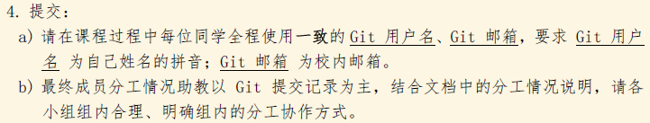
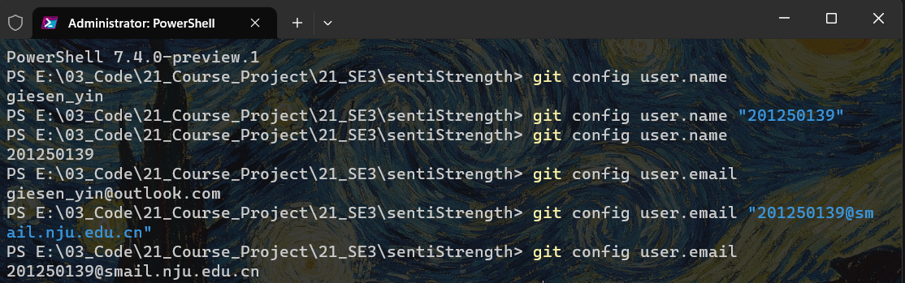
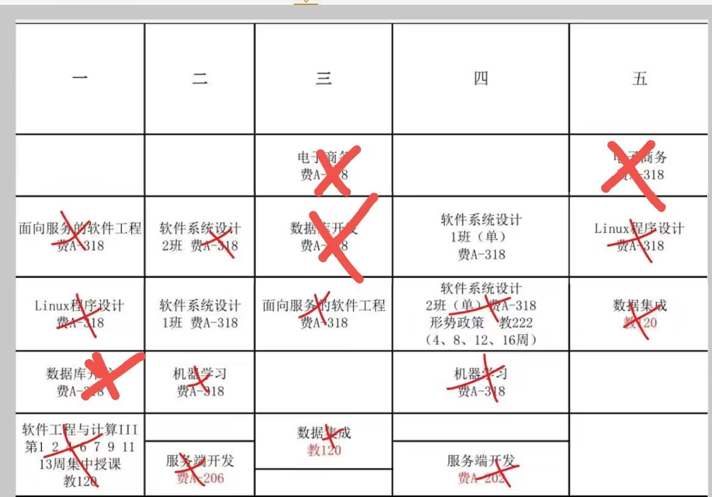

# 第一次会议纪要-项目启动

第一次会议纪要，暨软工3项目整体规划和规格说明书

时间与地点：2023-2-15 20:50 - 21:20 费B5楼

目标：达成共识，确认项目开发约束等。


为啥写这个：做项目，我们是认真的！

[TOC]

## 1 评分标准和项目说明

### 1-1 老师的要求

#### 1、评分标准

系统各阶段迭代产物（60%）：可能需要最后调分，总体占百分之60；

软件工程过程产物（30%）：提交文档及其他，个人/团队全部记录在gitlab上（个人⼯作评估根据个⼈对产物的贡献）；

其他过程（10%）：Presentation。

#### 2、老师与助教的联系方式

Instructor

- 刘嘉liujia@nju.edu.cn
- 房春荣fangchunrong@nju.edu.cn
- 匡宏宇khy@nju.edu.cn

Assistant

- 葛修婷DG20320002 DG20320002@smail.nju.edu.cn
- 刘佳玮DG21320006 DG21320006@smail.nju.edu.cn
- 孙可⼼602022320008 602022320008@smail.nju.edu.cn
- 梁艳玲602022000029 602022000029@smail.nju.edu.cn
- 郝晓冬MF21320054 MF21320054@smail.nju.edu.cn
- 刘关迪MF21320099 MF21320099@smail.nju.edu.cn

我们有问题不摆烂，先查论坛再讨论最后问助教/老师！

#### 3、迭代内容

1. 阅读、标注和部署/使用开源软件（JavaDoc，代码-需求矩阵）
2. 分析、维护开源软件（Run数据集，纠正代码缺陷）
3. 维护开源软件（完善、扩充开源软件的功能）

#### 4、规定时间线

见目标文档中。

迭代1

- Week 1：2.13授课发布作业要求；团队与沟通（刘嘉）
- Week 1：2.17晚23:59，组队信息提交
- Week 4：3.10晚23:59，迭代1阶段提交截⽌

迭代2

- Week 4：3.6授课课程相关工具；软工文本情绪分析（匡宏宇）
- Week 6：3.20授课迭代1阶段总结；测试与维护（房春荣）
- Week 7：3.27课堂迭代2中期检查&分组答疑
- Week 9：4.14晚23:59，迭代2阶段提交截止

迭代3

- Week 9：4.10授课迭代3项目及检查要求，产品思维基础（刘嘉）
- Week 11：4.24课堂迭代2检查（分组）
- Week 13：5.8课堂迭代3中期检查&答疑（分组）
- Week 16：6.2晚23:59，迭代3阶段提交

期末检查

- Week17 项目答辩

### 1-2 开发环境讨论

#### 1、Git

GIT：仓库的使用，Gitlab等。

开发方式：分支，不直接向Master合并。分支的使用如果还不熟练可以抽时间看看CSDN上的教学过程。

每次打开先更新；如果有冲突请处理。

另外：项目Git用户名。



```bash
git config user.name "userName" // 不要使用global，打开对应文件夹改就可以
git config user.email "userEmail" 
```



#### 2、MD+PDF文档

除特殊说明，组内统一使用MD文档撰写会议纪要、分工情况、过程文档、代码扫描工具检查结果等。

理由...免费Typora？网上有很多，如0.9.96版。

图片使用相对路径，相对路径！！！

开会尽量带电脑，尽量线下找教室。

推荐Typora，VsCode装插件也可以。

学会MD转PDF！

Idea：MarkDown Editor和PDF Viewer可以很方便的缩短打开其他软件的时间，VsCode也有但我不熟

#### 3、开发工具与语言

不限制，组内统一即可，但尽量避免过于复杂的工具开发。Jetbrain全家桶，VsCode等主流工具...

统一编码（UTF-8），拒绝乱码！

Jenkins...附带要求太多，用或不用？需讨论。

具体等读代码！

#### 4、细节

要安装了yarn、node等内容。后端要有maven等内容。

java版本：统一使用Java8。


## 2 早期安排

### 2-1 分工与合作

#### 1、项目安排预备与动员

Push，但专注高效工作！都是熟人，不要不好意思！以身作则活跃气氛。

各位肯定基本都是身兼多职...且既是甲方又是乙方。

1. 开发组：我们的项目有前端、后端，要有专门的前端组和后端组（人员可以不固定）；开发组至少有一人负责对接对面。
2. 需求组：要应用软件工程的思想去开发，所以需要PM，需要需求小组（6人都要参与总体讨论；如果某个模块不是自己负责，则不需要知道其内部实现）；
3. 项目管理：需要Phased Project Manager（阶段性项目管理组），应用系统工程，详细记录代码进度：负责记录会议内容，初步考虑每次2人负责记录，对照整合后发布会议纪要；
4. 我们是民主团队，高敏捷，但是事情一定要有人兜底（负责）。DDL如非特殊情况不推迟，有特殊情况提前说就好。

这是初步构想，有想法直接修改即可。

示例：

| 迭代一任务组        | 人员  |
|---------------|-----|
| Dev——前端       | A，B |
| Dev——后端       | C，D |
| PPM           | E，F |
| 临时组（如数据库...等） |     |

#### 2、课表

建立课表，找大家都有的时间方便开会！



#### 3、分工讨论

TODO：等读代码。各位明确自身实际和喜好选择，每个迭代版本之间各组原则上不换人。

### 2-2 开发流程

需讨论！DDL至少提前一天完成主题内容。有想法千万别浪费了...

暂定模板：两次会议完成一个大目标。

1. 收到一个任务（大目标），目标统一放在tx在线文档中（群精华）：https://docs.qq.com/sheet/DVnNKd2pFV2FaVUVt。事实上大目标基本已经定下来了
2. 讨论任务，拆解成小目标（开会），小目标放在大目标下
3. 进行需求分析和委派（开会），用文档记录需求（放在过程文档对应文件夹中）
4. 分工，记录分工文档
5. 各组分析各自任务，互相约定接口、桩程序等（本次是给好的代码模板，所以这部分内容可能有些许变更）（接口和桩程序用单独文档写）
6. 各组开发各自内容，然后审查并提交（Peer Review，A模块对B模块人员说明，B组人员审查，确认功能无误）。审查无需开会，但要记录改正的问题。
7. 合并不同分支的代码，检查并修复出现的问题。要记录改正的问题。
8. 项目验收与总结（开会），确认无误后发布release。

### 2-3 开会

开会前，我会发出会议纲要，通读一遍至少知道要说啥

开会不能成为最浪费时间的阶段...要发挥交流想法的作用。我们有两种会议：开发前的需求会议以及开发后的总结会议（提交作业前）。

大家专心一些...不要拖DDL，相信效率会很高！

初步定下开会内容：

通用：

- 会议速记/会议草稿：每次2人负责，同时记，然后开完会2人核对，尽量第二天发布。只要记大概要点。
- 会议纪要：2人核对后发布，发布以后每人要阅读，明确自己的目标。

需求会议：

- 讨论任务和拆解目标
- 需求分析和委派
- 分工，考虑好大致的代码实现
- 约定接口和桩程序，放在每个阶段的单独文件中。

总结会议：

- 合并代码时出现的问题？
- 项目验收，各位都要明确功能，进行总结（如人员，时间安排的失误）


## 3 文件模板与格式规约

### 3-1 目标表

不正式的，但方便实用，充分体现了敏捷性（x）

目标统一放在tx在线文档中（群精华）：https://docs.qq.com/sheet/DVnNKd2pFV2FaVUVt。

### 3-2 分工表

这类表都提供模板，方便MD不熟的小伙伴直接取用。

例：迭代一分工表

| 姓名-学号         | 所属组/职责             | 贡献简述 |
|---------------|--------------------|------|
| 201250118-张笑恺 | 开发组（前端），第a、b次会议记录  |      |
| 201250134-朱甲豪 | 开发组（后端），第x、y次会议记录  |      |
| 201250139-尹麒深 | 开发组（前端），第x次会议记录    |      |
| 201250146-胡才轩 | 开发组（后端），第b次会议记录    |      |
| 201250149-詹美瑛 | 开发组（前端），第c次会议记录    |      |
| 201250213-徐晨  | 开发组（数据库），第c、d次会议记录 |      |

### 3-3 需求规格表

是详细版的目标表。

一个md文件中，按组分成部分，需要做成一个表。例：迭代一前端需求表.md。

| 需求编号 | 已完成 | 内容             |
|------|-----|----------------|
| 5    | O   | 前端要实现xx数据的可视化。 |

### 3-4 接口规范表

不强制规定，但要说明是哪个文件、传输什么格式的内容。

考虑到软件开发的不确定性，内容可能更改，但是改的时候要告知对面组。

例：接口5.3：前端xx文件夹FileOut.java中；目的是打印处理好的数据；数据格式：JSON，{"msg":"aaa", ...}。

### 3-5 会议纪要

第一次会议不需要记录，直接用本纲要就可以。

不明确要求内容。格式不固定，能看懂就行；但标题要是第几次会议纪要——简要说明，然后写明时间。

例子：第一次会议纪要——项目启动。

要记录的内容：会议的要点。格式：

1. 会议简要说明，时间。
2. 需求会议的内容或者总结会议的内容要点。
3. 虽然分工表，接口规范等会写在其他文件，但要简要记录在会议纪要。


## 4 项目结构

### 4-1 项目过程

例

文件夹：迭代1

- 第一次会（文件夹，放会议速记和会议纪要）
- 第二次会...
- 项目要求文件（每次的项目要求，比如起步阶段里有工具推荐等）
- 需求规格表
- 分工表
- 接口规范表
- 其他内容

### 4-2 sentiStrength

...初步可能分为前后端，具体等读代码。


## 5 总结

为什么这么大阵仗？不能凭感觉开发吗？

开发是系统工程...一个人拼命做道理上也能做完，但要学习的是开发过程。（需求课的幽灵）

正因如此，摆烂会让其他人生不如死。。做好项目，这课也没期末考，所以尽量做好就行！


我对课程的理解：类似毛概理论与实践，这门课应该是软工2+需求的实践课...

准备这么一个文档实际上还挺花时间的，估计也得有6个多小时。但是只要大家了解并认同，那么以后开发流程会被大大减缩。

这个文档可能是以后经常要打开的之一（还有每次的需求文件和分工、接口等）。


祝好运，第一次迭代将于3-10截止，考完试已经26号了。所以如果到时候发现自己负责的某块内容不熟，赶紧学！！！毕竟还有其他课。

下阶段的目标：见目标表。