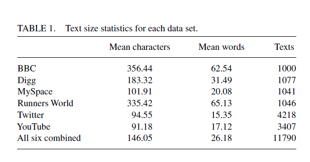
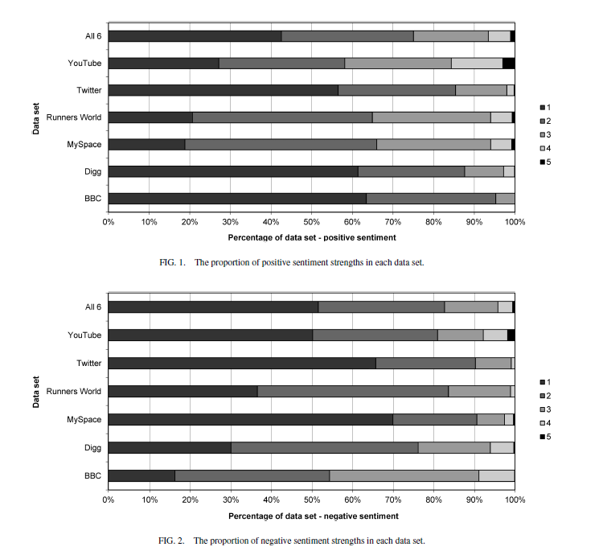

## Sentiment Strength Detection for the SocialWeb阅读笔记

* 本文评估了SentiStrength算法的一个改进版本，该算法主要使用直接的情感迹象来检测整个社交网络的情感强度。

### Introduction

* 然而，在社会科学研究中使用传统的情感分析方法分析社交网络文本是有问题的，原因有几个。
  * 第一个问题是，人类编码的数据（即一组由人类评估的情感文本）必须手动创建。因为作者或读者很少对非评论文本进行情感注释。而这是训练大多数机器学习情绪分析算法时的输入。
  * 第二，情绪分析是领域相关的，这意味着将分类器应用于不同于其训练对象的数据集通常会产生较差的结果
  * 最严重的是，误导性结果。可能使用情绪的间接指标，因此通过识别虚假模式，为社会科学研究提供误导性的结果。**不应该使用机器学习方法**，因为这可能表明他们有共同的主题，而不是共同的情感。

* 综上所述，有时关键是要有只允许**利用情感的直接指标**的分类器。这可以**通过词汇方法实现**
  * 要通过从已知的带有情感的单词或短语的词典中识别术语来进行情感分析。

* 因此，一篇文本被赋予两个分数:积极的情感强度分数和消极的情感强度分数。另一种方法是使用一个结合情感极性和强度的单一尺度(Taboada等，2011)。为了解决这两项情感强度检测任务，**情感术语也可以与默认强度相关联**，例如，赋予“爱”一个比“喜欢”更强的权重。

本文评估了一种主要依赖于情感直接指标的词法算法，它是MySpace情感强度检测程序感知强度的改进版本，对整个社交网络的积极和消极情感强度检测是否普遍有效。这是通过测试来自六个不同社会网络领域的人工编码文本的感知强度来实现的:不仅是MySpace，还有Twitter、YouTube、跑步者世界马拉松讨论论坛、Digg新闻识别网站和BBC论坛新闻讨论网站。

### 情绪分析

* 情感分析任务：
  * 主观性：预测给定文本是否主观
  * 极性检测：预测主观性文本整体是正面还是负面。
  * 不太常见的是情感强度检测：它预测文本中积极或消极情绪的强度。
* 本节主要处理**极性检测**
* 极性检测常见方法
  * 选择一种机器学习算法和一种从文本中提取特征的方法，然后用人工编码的语料库训练分类器。所使用的**特征通常是单词**，但也可以是词干词或词性标记词，也可能被组合成二元分词(例如，两个连续的单词)和三元分词，更复杂的变体也被开发出来。
  * 通过估计它们与一组已知且无歧义情感的种子词(例如，good, terrible)共现的频率来识别文本中单词可能的平均极性，通常使用网络搜索引擎来估计相对共现频率(Turney, 2002)。

事实上，机器学习方法通常是特定于领域的。不能很好地工作在主题或文本类型不同于他们所训练的领域。故需要领域迁移。

### 词汇算法

* 词汇方法是从一组已知情感倾向的现有术语开始，然后使用一种算法根据这些单词的出现来预测文本的情感。

* **SentiStrength**是SO-CAL，它使用词汇策略将文本编码为积极或消极。使用了以- 5 ~ +5的单一负向至正尺度编码的术语词典。
  * SO-CAL的词典是由人类编码员建立的，他们标记了来自几个语料库的500篇文本中的所有形容词、名词、动词和副词的强度和极性，以及一般询问者词典
  * 单词被编码为它们的“先验极性”——它们在所有上下文中假设的正常极性——而不是它们在发现它们的特定上下文中的极性。
  * SO-CAL也是至少有187个多词情感表达。
  * 它有一组强化表达，可以增加或减少后续词汇的情感强度(例如，异常)和处理否定的程序
  * 此外，还使用了诸如would之类的词来有效地中和后续的情绪
  * SO-CAL增强了文本中消极表达的强度，因为它们似乎比积极表达更不常见，并降低了频繁出现的术语的强度。
  * 最终的极性决定是由检测到的词语的平均情感强度决定的
  * 如果目标是情感强度检测而不是极性或主观性检测，那么词典很可能包含了人类估计的情感权重
  * 然而，这可能在不遵守标准语法规则的文本中不起作用，因此可能在高度非正式的社交网络中不起作用。

* 如前所述，我们还利用语言结构为**多种情绪**定义了情感强度算法。
  * 。一项研究比较了新闻标题情感强度检测的各种不同方法，发现朴素贝叶斯机器学习的效果不如使用来自WordNet、WordNet Affect和SentiWordNet的语言信息。
  * 然而，朴素贝叶斯方法不一定是该任务的最佳方法，因此这**并不能证明机器学习方法在情感强度检测方面一定劣于词汇方法**。

* 也有用表情符号直接表达情感。**表情符号**也有被用作情感标记，用于标注机器学习语料库。
  * 使用的其他特征包括重复使用标点符号、所有大写字母书写的单词和标准缩写
  * 情感强度也引入了新的功能，例如在一个单词中使用重复的字母来强调情感。

### SentiStrength 2

* 情感强度(SentiStrength)是一个**基于词典**的分类器，它利用附加的(非词汇)语言学信息和规则来检测短文非正式英语文本中的情感强度。

  * 对于每个文本，SentiStrength输出(对于版本1和版本2)是两个整数。
  * 1 ~ 5表示积极情绪强度，1 ~ 5表示消极情绪强度。这里，1表示没有情感，5表示每种类型的强烈情感。
  * 使用两个尺度是因为即使是短文本也可能包含积极和消极，目的是检测表达的情绪，而不是其整体极性

* SentiStrength 2的关键特征列表（有监督）

  

* 有监督版有以下组件：
  * 优化情感词强度并可能改变极性(即极性)的训练算法。该算法检查每个词的强度，以查看增加或减少1是否会增加人工分类文本语料库(即人工分类文本)的分类精度。算法不断重复，直到所有的单词都被检查过，而不做任何更改。

### 研究问题

* 本研究的目标是评估各种不同的在线上下文中的SentiStrength2，以确定它作为社交网络的通用情感强度检测算法是否可行。
* 由于生存能力是目标而非最佳性能，任务是情绪强度检测，因此要求SentiStrength 2结果应与所有数据集上的积极情绪和消极情绪具有统计上显著的正相关性
* 次要目标是评估SentiStrength2与其他利用间接情感术语的方法（标准的机器学习方法）相比的表现，以及它在哪些类型的社交网络数据上表现最好。

即：

1. SentiStrength2的无监督版本是否与所有类型的社交网络文本具有显著的正相关，无论是积极的还是消极的情绪?
2. SentiStrength2的监督版本是否与所有类型的社交网络文本都有显著的正相关，无论是积极的还是消极的情绪?
3. SentiStrength2在社交网络文本上的性能是否优于标准的机器学习算法?

### 方法和数据

* 数据集来源于BBC Forum posts，Digg.com posts，MySpace comments，Runners World forum posts，Twitter posts，YouTube comments以及上述所有被合并到一个大数据集，以评估SentiStrength2在混合环境中的表现，并看看显著增加的训练数据是否会给所选机器学习方法的性能带来相对较大的提高
* 
* 每个数据源中的文本由1 ~ 3名不同的人独立操作，但使用通用代码本(见Thelwall，Wilkinson等人，2010)编码超过20小时(每天最多1小时)。
* 保证了结果的**一致性**。三个人对数据集进行编码(使用每种情况的平均分数，而不是丢弃有分歧的文本)。
  * 没有任何编码器参与研究，也没有任何情感分析研究人员。
  * Krippendorff的α被用来**评估编码器间的可靠性**，因为它可以应对多个编码器和有序类别(Artstein & Poesio, 2008;Krippendorff, 2004)。
  * 情感分数的数值差异被用作此指标的权重。
  * 积极情绪的α值分别为0.5743(MySpace)、0.4293(BBC)、0.5011(Digg)和0.6809(跑者世界)。负性情绪的α值分别为0.5634(MySpace)、0.5068(BBC)、0.4910(Digg)、0.6623(跑者世界)。
  * 这些值表明了适度的一致性:两位编码员对情绪的感知大致相似但不完全相同。

* 选择了**一系列标准机器学习算法**与SentiStrength2进行比较，并按照之前的感知强度论文(Thelwall，Buckley等，2010)中的方法，在一组不同的特征和特征集大小上对每一个算法进行了评估。
  * 所采用的算法有:支持向量机(SVM;顺序最小优化变量(Sequential Minimal Optimization variant, SMO)、逻辑回归(Logistic Regression, SLOG)、ADA Boost、SVM回归、决策表、朴素贝叶斯、J48分类树和JRip规则分类器。
  * 每种算法都使用10折交叉验证测试了30次，使用10种不同的特征集大小(100、200、…1000)，并报告了每个数据集的最佳算法和特征集大小。
  * 更具体地说，报告的算法是在30次重复中具有最高相关性(如上所述计算)的算法。
  * 这种对各种算法和测试特征集的使用，使机器学习方法总体上比感知强度具有”不公平”的优势，因为由于数据中的随机因素，一些算法在统计上可能比正常情况下表现得更好。
  * 通过使用表情列表进行转换，机器学习使用的特征集比之前的实验(Thelwall，Buckley et al.， 2010)更强大

* 处理是由Weka进行的。

### 整体情绪分布

详细见图

* 图1和图2根据人类编码的平均值，报告了每个数据集中不同的积极和消极情绪强度的比例。
  * 跑步者世界和MySpace的评论中积极情绪的比例很高(约80%)，而Digg和BBC的评论中积极情绪的比例不到40%，是前者的一半。在MySpace和Twitter上，负面评论很少(70%，65%没有负面评论)，但在RunnersWorld和Digg上更常见(30-40%没有负面评论)这在BBC论坛中很常见(低于20%的论坛中没有负面信息)。

### 结果

* 情感强度在所有数据集上都超过了负面情绪强度的基线准确性，在除Digg和BBC论坛之外的所有数据集上都超过了正面情绪强度的基线准确性。
* 随机预测的相关系数为0，差预测的相关系数为负，但所有数据集的情感强度均达到约0.3或更高的正相关。因此，在表中报告的任何类型的数据中，使用情感强度来识别情绪模式是合理的。
* 尽管有监督的情感强度往往比无监督的情感强度更准确，但它们在关键相关性检验中大致相等。这表明，监督(即;，创建和使用训练数据来优化词条权重)对于与表中类似的应用领域来说是不必要的。
* 机器学习方法，特别是逻辑回归，往往略优于感知强度。对于正相关，传统机器学习在7个数据集中的5个上表现最好，无监督的Sen- tiStrength在其余2个数据集上表现最好。对于负相关，传统机器学习在七个数据集中的三个数据集上表现最好，有监督的感知强度在三个数据集上表现最好，无监督的感知强度在一个数据集上表现最好。然而，也许令人惊讶的是，尽管训练数据量很大，但Sen- tiStrength在“all 6”数据集上的表现相对较好。这凸显了传统机器学习方法的领域依赖性，由于涉及多个领域和流派，这些方法可能无法充分利用额外的训练数据。

### 局限性和讨论

* 该研究的一个关键局限性是，尽管使用了6个具有不同属性的社交网络数据集，但实验并不详尽，而且仍然可能存在感知强度不适用的社交网络环境类型。

* 第二个限制是，并非所有的数据集都是由三个不同的编码人员编码的，因此，黄金标准的编码的准确性可能在某些方面较弱。
* 虽然表2证明了在各种各样的社交网络文本上使用有监督和无监督的感知强度是合理的，但在大多数数据集上，机器学习方法在总体准确性方面表现得显著更好，更重要的是，在一小部分数据集上，它在相关性的关键指标上表现得更好。
* 在一些商业应用中，利用间接情感术语也可能是一个问题。
* 另一个限制是，情感强度不能保证只使用直接情感术语，因为它的索引中的一些术语是模糊的，比如like
* 最后，表2中机器学习算法的性能可能被夸大了，因为除了合并数据集之外，每种情况下只使用了110个算法中最好的结果。

### 结论

* 情感强度似乎适用于社交网络中的情感强度检测，即使是在无监督的版本中，也推荐用于仅利用直接情感词的应用。
* 机器学习方法可能优于情感强度，因为它识别了与情感间接相关的主题或话语特征，而不是直接识别情感。
* 对前两个研究问题给出了积极的答案。对于第三个问题在某些环境中，情感强度的表现不如一些机器学习技术:特别是逻辑回归。