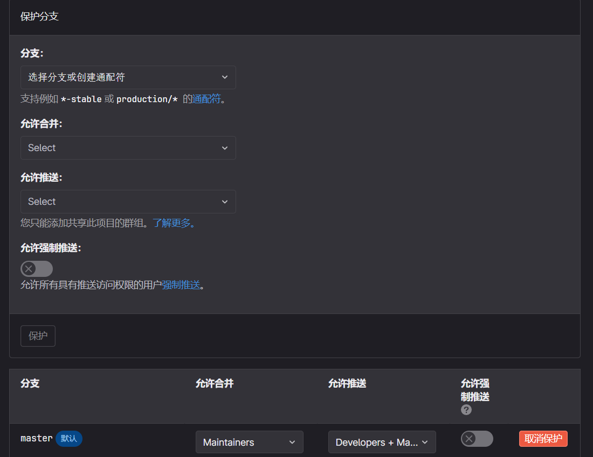
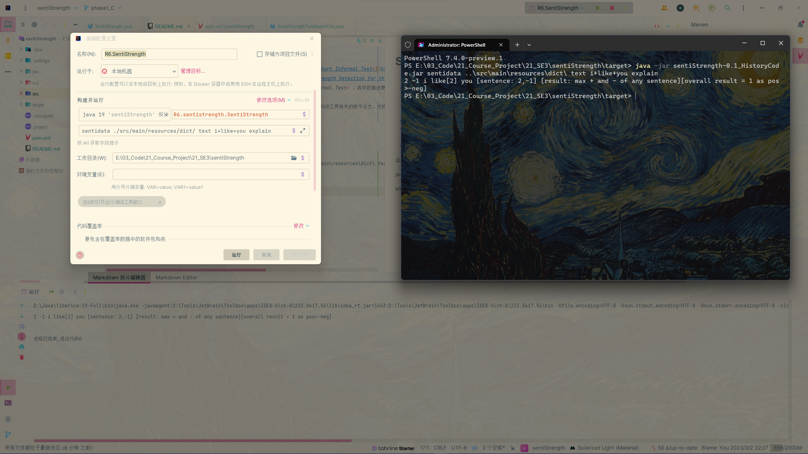
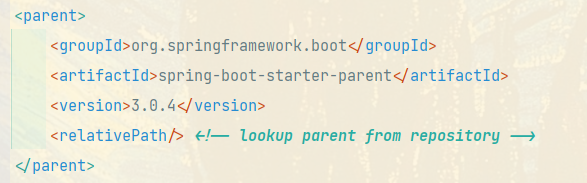
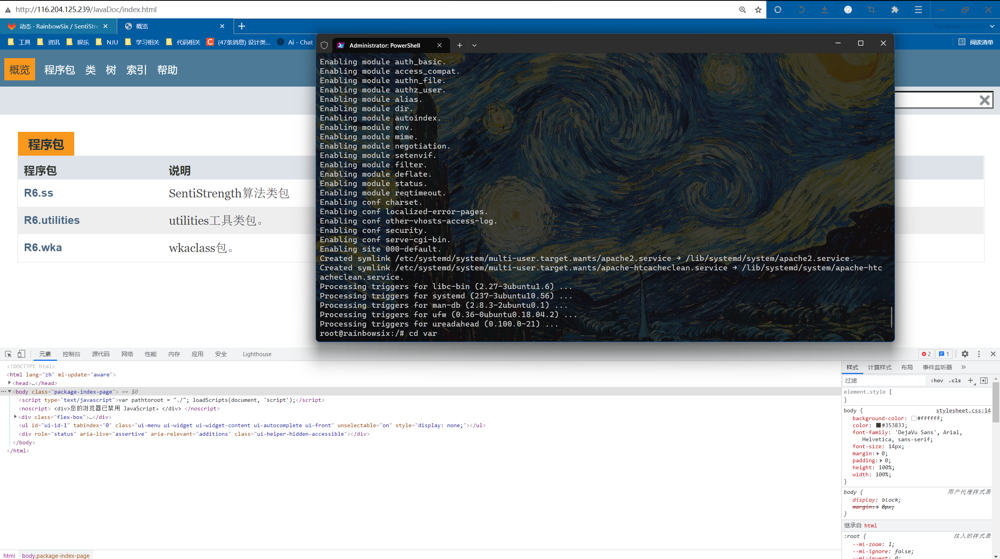

## 第三次会议纪要与安排

时间：2023-3-6 星期一 21:00		地点：教120

| 姓名-学号                          | 职责/贡献             |
| ---------------------------------- | --------------------- |
| 201250213-徐晨、201250134-朱甲豪   | 汇报第二次会议B组贡献 |
| 201250146-胡才轩、201250149-詹美瑛 | 汇报第三会议A组贡献   |
| 201250139-尹麒深                   | 撰写会议纪要          |
| 201250118-张笑恺                   | 汇报第二次会议C组贡献 |

本次会议主要讨论两个话题：JavaDoc\RTM，以及文档的写作。然后，下一阶段的（到3-10迭代一结束）目的主要是：文档写作，搭建云服务器与流水线、将JavaDoc推送到云服务器，利用CheckStyle初步优化代码和文档。

#### 1、文档相关

经过讨论，我们一致认为，我们应当重视并完成写作的文档包括：

- 项目启动文档。和第一次会议纪要高度重合。
- 项目计划文档。记录了项目大致的规划。
- 需求文档。我组没有直接使用需求文档，而是利用腾讯在线表格来规划需求和指派任务，它有着类似甘特图的效果。经实践后我们一致认为效率有很大的提高。另外，使用RTM跟踪需求，更正JavaDoc以展现每个类和功能点的关系。
- 会议纪要。每次会议都是我们安排项目和工作的重要时间，其中包括了分工以及规划表。
- 其他中间文档。例如，论文阅读笔记、SSH使用截图等。

经过徐晨、胡才轩、詹美瑛、朱甲豪四位同学的艰苦努力，JavaDoc和RTM的雏形已经在第三周完成。接下来的一周，我们主要需要完成文档的写作与整合、JavaDoc和RTM的优化、CheckStyle的引入。

#### 2、代码初步管理与优化

设置保护分支

修改了部分代码，成功在Java17版本下运行并套上了Maven。

- 运行参数：sentidata ./src/main/resources/dict/ text i+like+you explain
- jar包运行参数： java -jar sentiStrength-0.1_HistoryCode.jar sentidata ..\src\main\resources\dict\ text i+like+you explain
- MF需修改：Main-Class: R6.sentistrength.SentiStrength

引入的SpringBoot3：见Pom.xml文件。

YQS、ZXK组工作：

- 引入了maven-shade插件（pom中），可以帮助我们把依赖的插件放在jar包中。如外部库weka =\> Maven中的weka
- 废弃了3个old文件（工具包），使得jdk17版本可以正常运行，为后续springboot3的引入做准备
- 修改pom.xml，引入了SpringBoot3

在华为云成功部署了云服务器，初步先将javaDoc推送至服务器，为迭代二将代码部署至服务器做准备。开放了ssh访问并可以通过其他电脑连接。

JavaDoc访问网址：http://116.204.125.239/JavaDoc/index.html。后期可能会更改网址。

