# RainbowSix-迭代一总结文档

本文是对我组在迭代一项目阶段所有做的事的简单说明，内容不多，如果还嫌多就...**所有提交内容说明见文档3.1部分！！！**

[TOC]

## 1 项目总体介绍

### 1.1 文档说明

我们的文档由两部分组成，分别是**在线腾讯文档**和本项目中由Git管理的文档。

#### 1、在线腾讯文档

在线的腾讯文档充当简易的甘特图，用以说明项目与完成情况。实际上我们的在线需求矩阵也在这个网页中（需求矩阵的csv、电子表格存储在）。网址https://docs.qq.com/sheet/DVnNKd2pFV2FaVUVt。下面是截图：

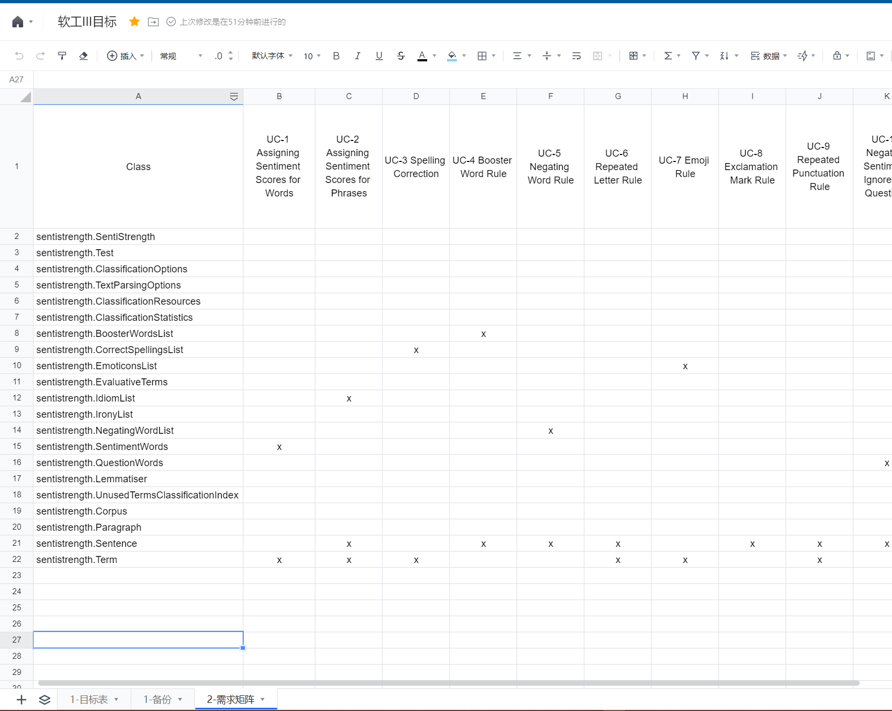

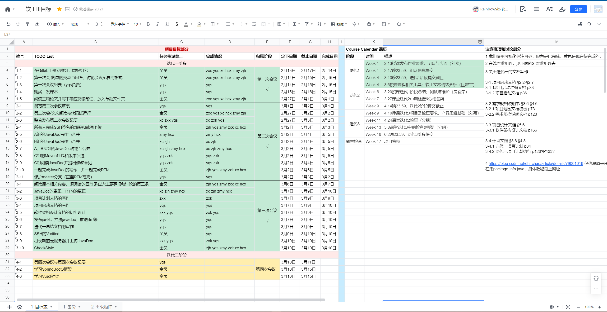

可以看到，我们的在线文档可以清晰地展现项目规划、日期、分派任务等内容，还能充当一个“公告栏”来放置注意事项、课历等内容，实际上比一个单一的甘特图项目归划效率更高，在实践中更适合本组。

#### 2、项目文档阅读说明

“项目文档”即ProcessDocs项目中的各类文档。

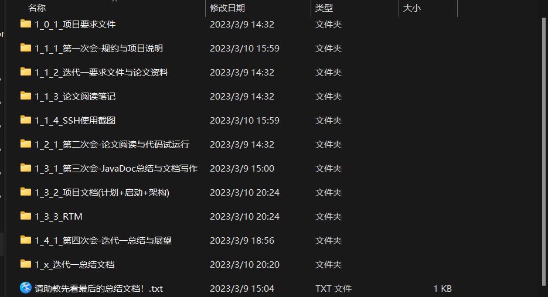

可以看到每个文件夹前都有3个数字。

- 第一位代表迭代阶段（1即迭代1）。
- 第二位代表本迭代中的阶段。如1_2代表迭代一的第二阶段。一般来说我们使用会议来划分阶段。
- 第三位代表本阶段中的第几个文档。

下面对上面的文档进行一一介绍：

1. 0-1：项目要求文件，是助教统一发放的项目要求。我们做的改动是：添加了“软工3需要的前序知识.txt”。
2. 1-1：**第一次会议文档**。主要是团队组建、组员的互相认识，以及对项目的共识、合作形式等的约束。
3. 1-2：论文的译文和原文。
4. 1-3：**6个人各自的论文阅读笔记**。
5. 1-4：全员的SSH使用截图，保证了所有人都使用安全提交。
6. 2-1：**第二次会议文档**。总结了论文阅读，汇总了全员代码试运行的问题和想法。另外，对下一阶段的任务提出了想法和规划（即第三周，完成JavaDoc等内容）。
7. 3-1：**第三次会议文档**。首先是第四周的周一到周五，我们将完成
8. 3-2：**项目文档**。主要包括**计划文档、启动文档、架构文档**。
9. 3-3：**RTM**。
10. 4-1：第四次会议文档。主要是对迭代一的总结和对下一阶段的粗浅规划。
11. x：即本文档，是为了总结迭代一而且**方便助教检查的目录式文档**。

### 1.2 各阶段简述

我们认真阅读了课本，仔细按照第一、第二循环的内容与要求来安排文档以及会议记录。我们将迭代一分为了3段时间：

1. 项目启动阶段：第一周至第二周结束（2-13到2-26）。这一阶段主要是组建并建设团队、阅读课本、下载并初步运行源码，当然因为考试影响整体贡献较少。第一次会议（启动会议）在此阶段。
2. 迭代一的第二阶段：第三周（2-27到3-5）。这一阶段我们有两个任务：任务一是使用SpingBoot3框架、Maven框架、云服务器等，初步管理和优化代码；任务二是写JavaDoc、RTM。
3. 迭代一的第三阶段：第四周（3-6到3-9迭代一截止）。文档写作、CheckStyle使用、JavaDoc和RTM的优化。

按上面的三段时间，接下来将一一介绍各段时间的内容。

## 2 各阶段详细说明

### 2.1 第一阶段-项目启动与团队建设

#### 1、分工表

| 姓名-学号        | 贡献简述                                         |
| ---------------- | ------------------------------------------------ |
| 201250118-张笑恺 | 阅读项目代码并运行                               |
| 201250134-朱甲豪 | 阅读项目代码并运行                               |
| 201250139-尹麒深 | 阅读项目代码并运行；第一次会议与记录，项目启动等 |
| 201250146-胡才轩 | 阅读项目代码并运行                               |
| 201250149-詹美瑛 | 阅读项目代码并运行                               |
| 201250213-徐晨   | 阅读项目代码并运行                               |

#### 2、事项描述与具体分工

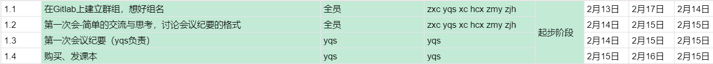

这一阶段里，我们约定了项目开发的准则，互相熟悉，初步运行代码，购买课本并阅读，为后续项目的正常发展打下基础。

### 2.2 第二阶段-JavaDoc与RTM

#### 1、分工

这一阶段，我们的目标是初步完成JavaDoc与RTM，顺带完成代码框架的封装等一系列杂活。

我们的设想是：AB小组各自完成一份完整的JavaDoc，然后两小组进行合并，有利于充分交换意见。我们也确实这样做了，从我们的**事项表格**上就能看出。

| 小组   | 成员           | 职责                                                         |
| ------ | -------------- | ------------------------------------------------------------ |
| Team A | 胡才轩、詹美瑛 | Javadoc编写                                                  |
| Team B | 徐晨、朱甲豪   | Javadoc编写                                                  |
| Team C | 尹麒深、张笑恺 | maven封装\SpringBoot依赖添加\java版本升级\流水线探索\服务器购买与架设 |

#### 2、事项描述与具体分工

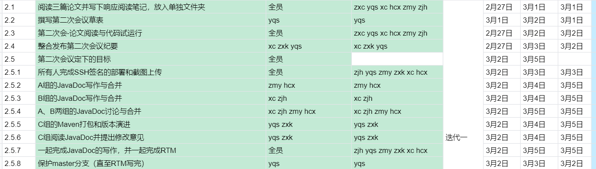

### 2.3 第三阶段-文档写作与优化

#### 1、分工

这一阶段，我们主要的目的是：

- 优化已经写过的JavaDoc，以及RTM。**借助CheckStyle**。
- 撰写启动文档、计划文档以及软件架构文档。
- 开第四次会，总结迭代一的内容，并讨论下一阶段计划。

| 小组   | 成员                         | 职责                     |
| ------ | ---------------------------- | ------------------------ |
| Team A | 胡才轩、詹美瑛、徐晨、朱甲豪 | Javadoc、RTM的优化       |
| Team C | 尹麒深、张笑恺               | 文档写作，研究CheckStyle |

这一阶段我们借助CheckStyle，改正了代码中较为浅显的错误，使得每个文件能修改的部分都被修改过。我们的CheckStyle文件放在了.setting中，是基于Sun的CheckStyle得到的。

#### 2、事项描述与具体分工

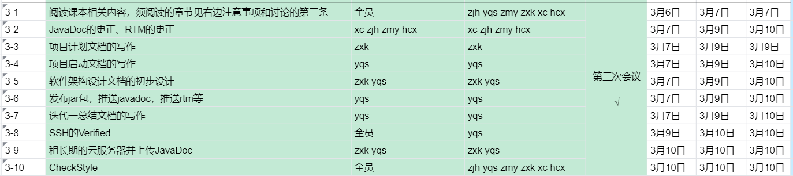

### 2.4 协作

我们利用Git分支，GitLab的合并请求，QQ群以及在线文档表格来进行合作。

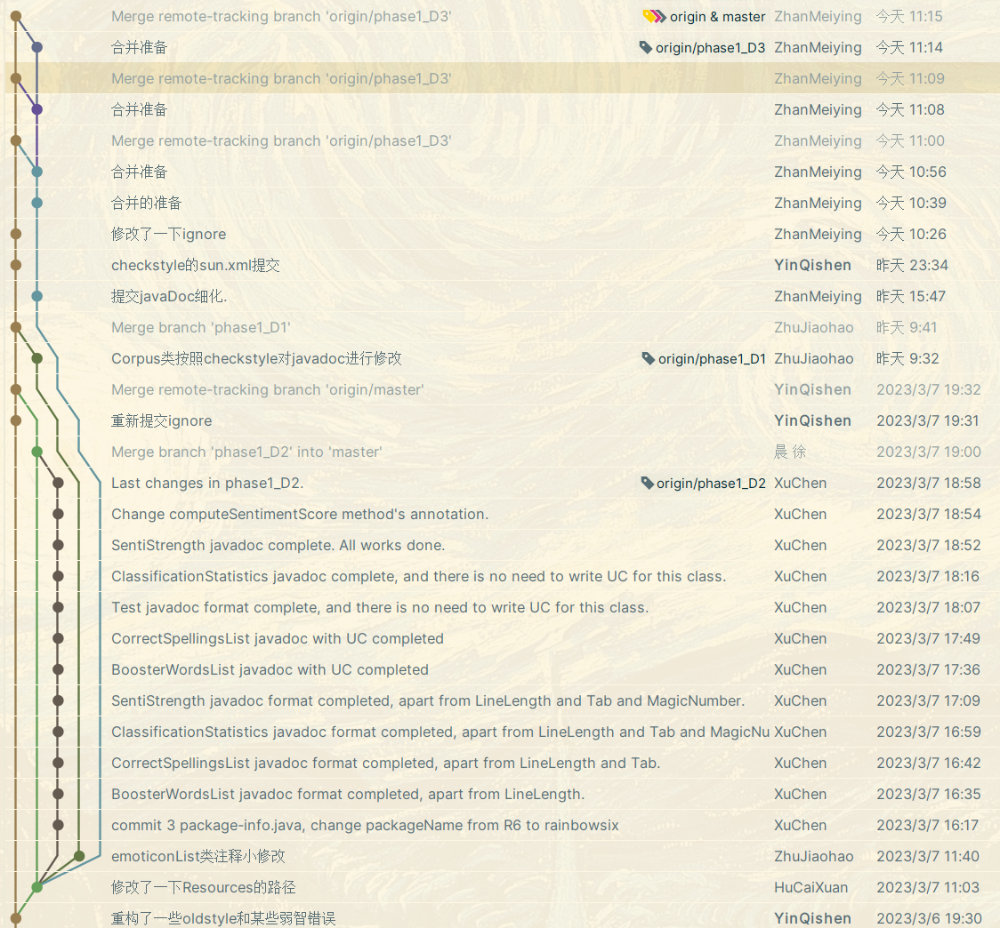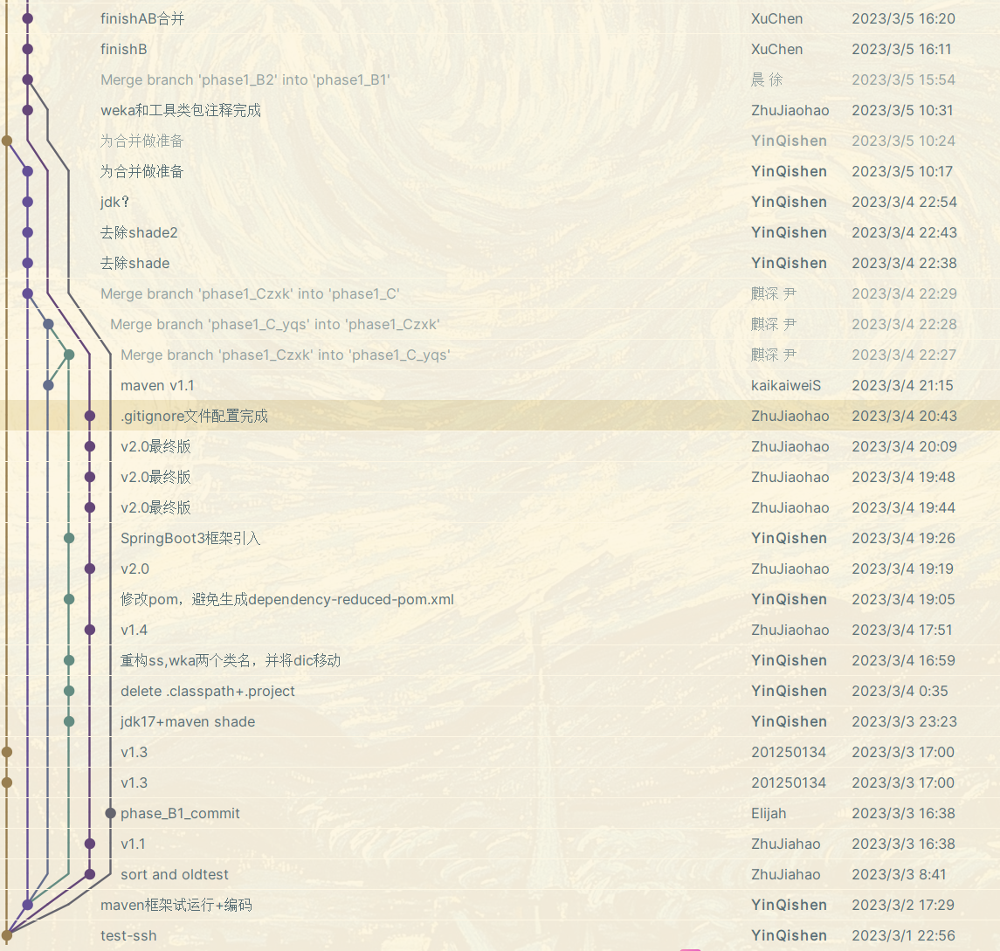

上面是部分Git分支利用情况。下图是我们创建的部分合并请求。

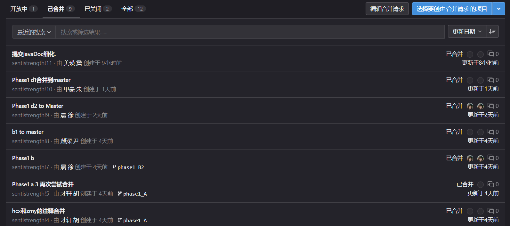

## 3 提交内容说明

### 3.1 提交内容说明

本次作业提交内容有：

1. 直接在本项目中的各类文件。主要内容如上所述，还包括了项目启动文档、项目计划文档等。
2. 需求矩阵。我们在此文件夹中附上了csv、excel版，也附上我们的在线需求矩阵网址https://docs.qq.com/sheet/DVnNKd2pFV2FaVUVt。
3. 发布的Jar包。我们将它直接上传到NjuBox中。下载链接为https://box.nju.edu.cn/f/33974f14d56d4f5c963a/。
4. JavaDoc。按助教的建议，我们新建了JavaDoc仓库；另外，我们将它上传到了云服务器上，网址为http://124.221.102.208/JavaDoc/。RainbowSix是我们的组织名；**一共添加了约4000行注释！**
5. CheckStyle。本次作业我们首先利用基于Sun公司的CheckStyle文件检测出了问题，并修复了大部分的Checkstyle问题；这也是一个比较大的工作量。

### 3.2 部分截图

CheckStyle刚安装时样子：

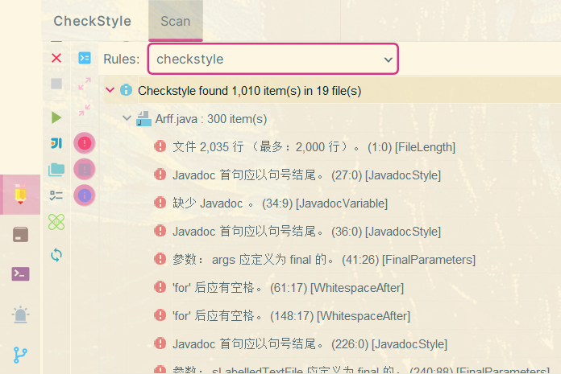

改正了1000多个错误之后仅剩极少部分问题（迭代二将继续精进）：

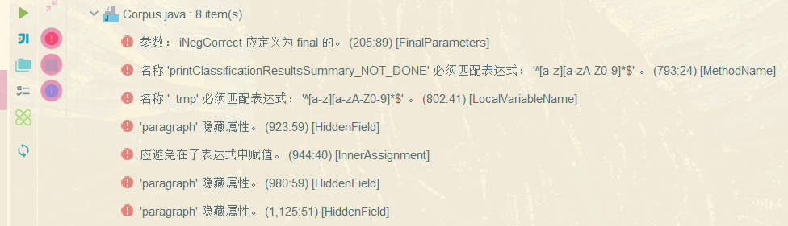

我们的JavaDoc网页：

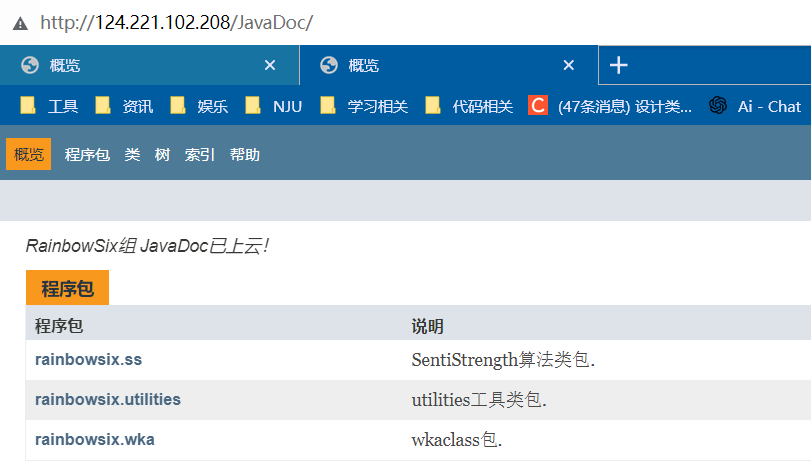

我们使用SSH和Verified后每个人的截图：见本项目中“1_1_4_SSH使用截图”文件。