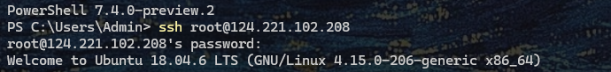
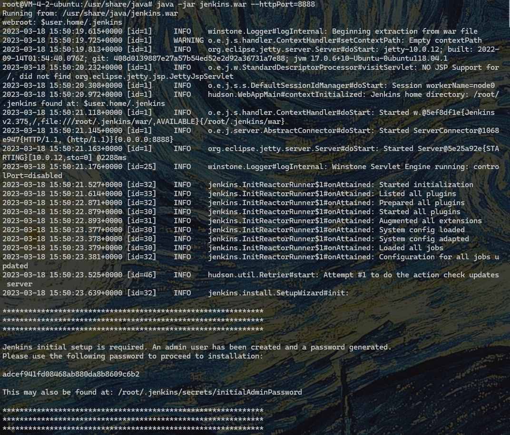
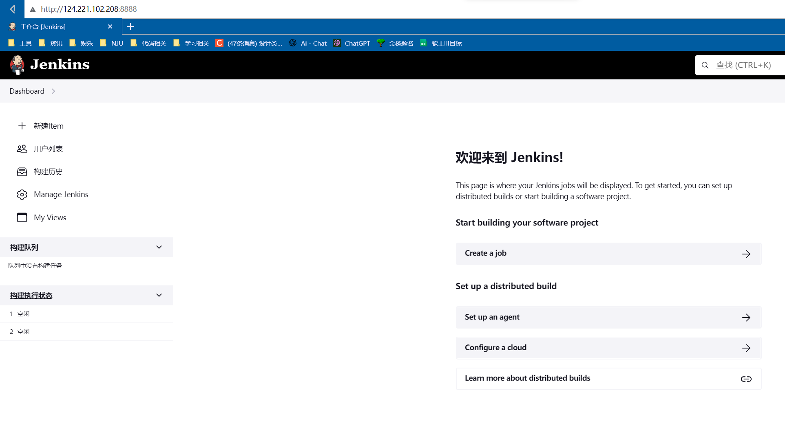
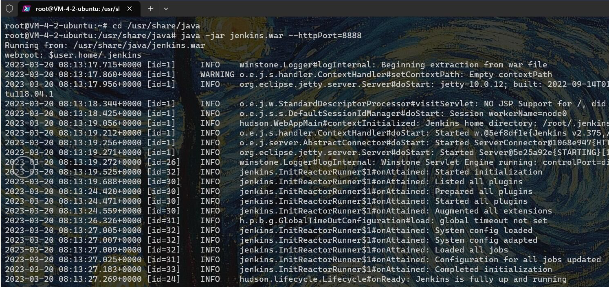

**Jenkins使用与项目持续集成**

我组（RainbowSix）使用Jenkins进行CICD，大致过程如下：

### 1 Jenkins安装与环境配置

第1步：ssh连接到主机。



第2步：安装jenkins 参考https://pkg.jenkins.io/debian/

This is the Debian package repository of Jenkins to automate installation and upgrade. To use this repository, first add the key to your system:

```shell
curl -fsSL https://pkg.jenkins.io/debian/jenkins.io.key | sudo tee /usr/share/keyrings/jenkins-keyring.asc > /dev/null
```

Then add a Jenkins apt repository entry:

```shell
echo deb [signed-by=/usr/share/keyrings/jenkins-keyring.asc] https://pkg.jenkins.io/debian binary/ | sudo tee  /etc/apt/sources.list.d/jenkins.list > /dev/null
```

Update your local package index, then finally install Jenkins:

```shell
sudo apt-get update
sudo apt-get upgrade
sudo apt-get install fontconfig openjdk-17-jre
sudo apt-get install jenkins
```

第3步：打开jenkins服务。初次打开可能遇到各种问题，如dpkg的ERROR等，除了网上提供的方案以外还可以考虑boot空间容量是否已满。



第4步：注册登录后，在本地浏览器中打开，端口为8888。

用户名：RainbowSix

密码：zxk1019@! ，和ssh密码一样

服务器URL：http://124.221.102.208:8888/



第5步：在系统环境变量中配置修改默认端口为8888。

### 2 Jenkins的使用与部署

第一步：启动Jenkins并登录。

启动指令：java -jar /usr/share/java/jenkins.war --httpPort=8888

登录账号密码：如上一部分所写。

