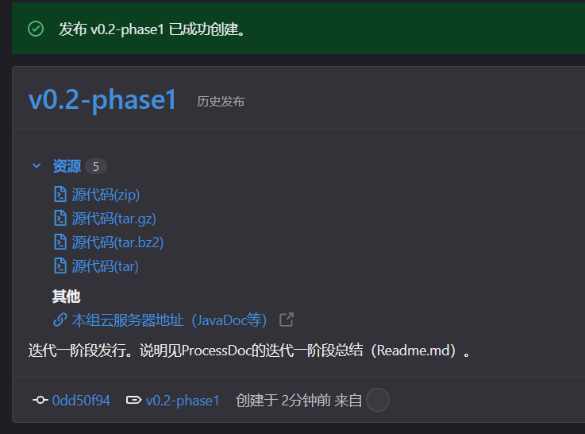

第五次会议纪要

时间：2023年3月23日 16:00 星期四

## 1 目标

在迭代一中，通过阅读论文和源码我们基本解了SentiStrength 的项目背景和项目代码结构。迭代二需要在迭代一的基础上，继续分析、维护开源软件并纠正其中的代码缺陷。

### 1.1 运行代码

#### 1、需求

1. 使⽤SentiStrength，分析助教提供的的软工文本和社交文本的情绪，并对比二者在情绪表达上的不同（必选）
2. ⾃行提供更多的软工文本和社交文本，并尝试对其分析，观察能否有更多发现。（核心不是新数据集的数量，而是分析结果的差异）（可选）

#### 2、提交要求

1. 将此步骤产物放在文档项目的 “迭代二/助教数据分析” 目录中。
2. 文本情绪结果请保存为 csv 文件（软工文本.csv ； 社交文本.csv），第一列为序号，第二列为文本，第三列为sentistrength 的 trinary 分析结果。请不要打乱文本顺序！
3. 分析报告保存为 “迭代二/助教数据分析/report.md” 。
4. 如果提供了更多数据，请保存到 “迭代二/小组数据分析” 目录中，同样分为两个文件。第一列为序号，第二列为文本，第三列为sentistrength 的分析结果，第四列为文本来源。同时在 “迭代二/小组数据分析/report.md” 提供报告。

注意：迭代二中的所有代码变更不应影响SentiStrength 的分析结果！

### 1.2 代码质量维护：迭代核心要求

#### 1、需求

1. 尝试找出系统功能bug 并修复；（必选）
2. 使⽤CheckStyle 检查SentiStrength 源代码，根据检查结果，优化源代码；（必选）
3. 对比CheckStyle 的检查和⼈工debug 的结果，即哪些问题是小组成员认为存在的，但CheckStyle 未检查出来，以及反之；（必选）
4. 可同时使⽤其他代码检查工具检查SentiStrength 源代码。若使⽤其他工具检查，需对比使⽤工具产出结果和CheckStyle产出结果的不同。（可选）

#### 2、提交要求

此步骤的1、2 部分在各位 git 提交记录中体现，注意各小组成员的分工。

工具检查报告请导出到 文档 项目的 “迭代二/项目代码分析/分析报告” 目录中，如果使⽤了多种检查工具，请在目录创建⼦文件夹，如果⽆法导出pdf、html 报告，请使⽤ markdown + 附图的形式。

对检查报告的分析保存为 “迭代二/项目代码分析/report.md”，如果小组内认为⾃⼰有发现点（例如发现了关键bug、CheckStyle 的结果有问题）请特殊说明，作为项目亮点。

### 1.3 代码设计优化

#### 1、需求

利⽤设计模式优化，重构代码，重构后需提供设计文档，并在文档中说明设计的逻辑（必选，迭代核心要求）

为SentiStrength 设计UI ,要求可以完成基本GUI 交互，UI 样式可参考官⽹。（必选）

#### 2、提交要求

文档保存在 “迭代二/项目文档/” 文件夹，请使⽤ markdown 文件。

代码优化请注意成员分工、git 提交情况。重构 SentiStrength 代码请继续在原始仓库进行；为SentiStrength 设计的 UI 过程中产⽣的代码请根据需要新建仓库完成。请尝试使⽤ jar 包、依赖的形式引⽤SentiStrength 项目，发布参考链接。

UI 要求是基于 web 的⻚⾯（注意：请不要在这⾥花费过多精⼒），并要求持续构建、持续部署，在助教检查项目时，请确保该⻚⾯是可以被访问的。

### 1.4 检查要求

参照迭代一文档要求。增量：

设计与代码（重构设计文档）

- 设计逻辑、设计分层
- 代码风格、代码分析工具

维护质量

- CheckStyle 检查
- 系统功能Bug

CICD | 数据集 | 可部署。

视频

- 介绍迭代二整体完成情况。5 分钟以内，链接放在迭代二根目录。
- 如果需要提交其他大型文件，以链接的形式提供，并在 “迭代二/readme.md ” 中对这些文件进行说明。

## 2 分工与任务

### 2.1 任务

设计一个简单的导航页面，作为一个HomePage。

CICD。

试运行数据集。

重构代码。重构代码和Bug修改、CheckStyle优化同步进行。

- 阅读代码；利用IntelliJ生成的类图，辅助理解代码的构造。
- 设计新结构，并商量进行重构。

跑数据集并分析。

去下载官网的应用并参考。后端和前端。SpringBoot，Vue。

视频、文档等。

### 2.2 第五次会议分工

hcx，zmy，zjh：run代码，跑数据集。

xc：写使用手册、参数手册。

yqs：前端界面。

zxk：CICD+维护云服务器。

