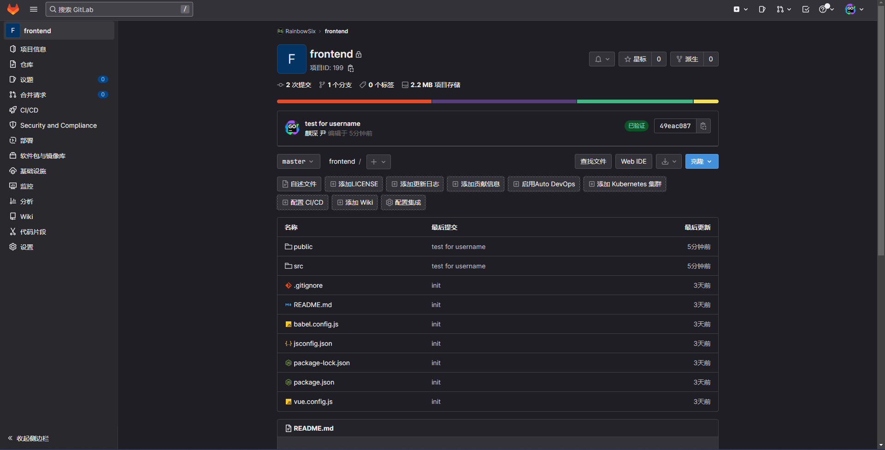

注：apache2使用8085端口，nginx使用8086端口。在/etc/apache2/ports.conf、/etc/nginx/sites-available/default中修改。

我们开放了8086

要在Linux服务器上使用Nginx部署Vue项目并允许其他人访问：

1. 生成生产构建：在本地计算机上运行 `npm run build` 命令以生成生产构建。这将创建一个优化过的、可部署的代码包。

   ```shell
   npm run build
   ```

2. 在服务器上安装Nginx，并启动它：

   ```shell
   sudo apt update
   sudo apt install nginx
   sudo systemctl start nginx
   ```

3. 上传编译后的代码：将刚生成的代码包中的所有文件上传到Linux服务器。

   ```shell
   scp -r /path/to/your/dist user@server:/var/www/html
   ```

4. 创建Nginx配置：创建一个名为`SE3.conf`的文件，用于配置Nginx服务器。在`/etc/nginx/conf.d/`目录中创建所需的配置文件。打开该文件，并将以下内容粘贴到文件中，以提供站点配置：

   ```shell
   server {
   	listen 8086;
   	server_name 124.221.102.208;
   	location / {
   		root /var/www/html/dist;
   		index index.html index.htm;
   		try_files $uri $uri/ /index.html;
   	}
   }
   ```

5. 重新启动Nginx，以使用新的配置文件。

   ```shell
   sudo systemctl restart nginx
   ```

6. 测试站点是否在浏览器中正常工作。在浏览器中输入服务器的IP地址，应该能够看到内容。

   ```shell
   http://124.221.102.208:8086
   ```

现在，我们已经在Linux服务器上成功部署Vue项目，并能够使用Nginx进行访问。今后，我们的前端内容都将会基于Nginx与现有框架修改。