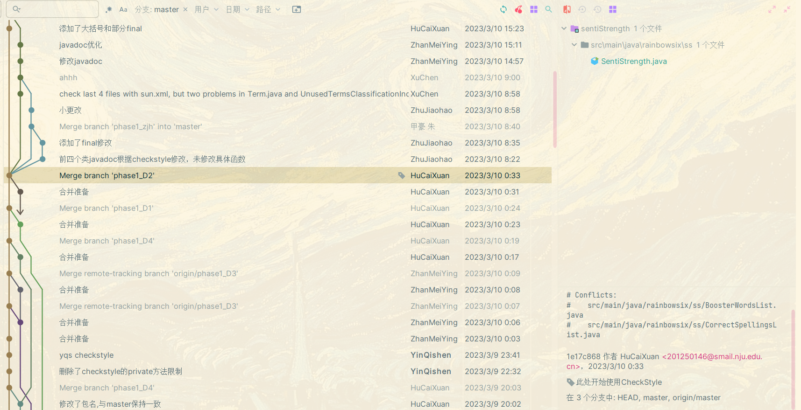
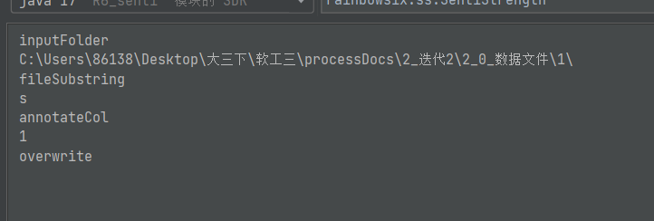
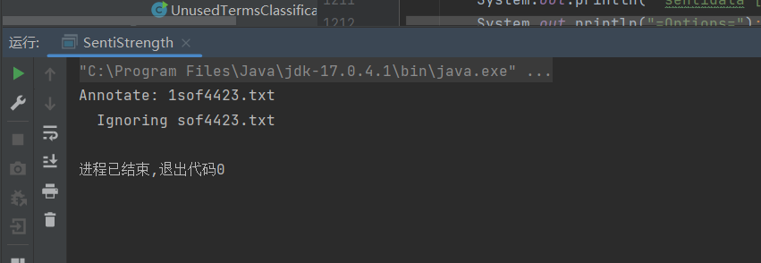

## 第六次会议纪要

本次会议为线上会议，时间为 2023年3月24日22:00。

汇报工作、上周进度。

### 1 CheckStyle

Checkstyle的利用：两种形式。Mvn+plugin。

checkstyle需要生成报告。引入mvn：checkstyle依赖。执行指令` mvn checkstyle:checkstyle `，则会在target/site中生成checkstyle.html。

```xml
<dependency>
	<groupId>org.apache.maven.plugins</groupId>
	<artifactId>maven-checkstyle-plugin</artifactId>
	<version>3.2.1</version>
</dependency>

<plugin>
	<artifactId>maven-checkstyle-plugin</artifactId>
	<version>3.2.1</version>
	<executions>
		<execution>
			<id>verify</id>
			<phase>verify</phase>
			<configuration>
				<configLocation>.settings/sun.xml</configLocation>
				<consoleOutput>true</consoleOutput>
				<failsOnError>false</failsOnError>
				<includeTestSourceDirectory>false</includeTestSourceDirectory>
			</configuration>
			<goals>
				<goal>check</goal>
			</goals>
		</execution>
	</executions>
</plugin>
```

checkStyle第一次报告：打了标签。看右下角的标签：“此处开始使用CheckStyle”。



### 2 代码重构

### 3 任务安排

这两天的任务：

- 生成checkstyle第一次和第二次报告。第二次报告主要是现在开始的更改，预计周日晚完成。
- 写从第一到第二次的分析。包括统计、分析，统计修改的（closed）、新增的（new）、一直存在的（open）的checkstyle中警告（包括警告的属性、数量等）。
- 后期使用SonarLint（第二款检测工具）
- CICD？
- 重构代码需要讨论与商量。
- 修改剩下的不多的CheckStyle能改的问题。


## bug



