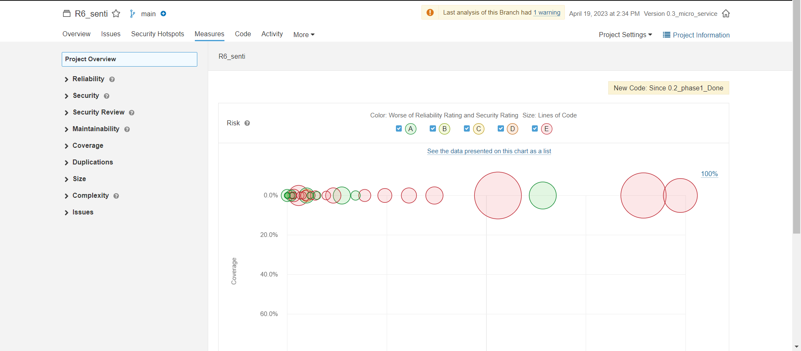

by 朱甲豪

## sonar检测工具

* 在对代码的检测维护中，除了助教推荐的checkstyle外，我们小组还使用了sonar检测工具，主要是sonarlint和sonarqube.
* sonarlint是一个**免费**的**开源**IDE 扩展，可识别并帮助我们在编写代码时解决质量和安全问题。像拼写检查器一样，SonarLint 会显示缺陷并提供实时反馈和清晰的**修复指导**，以便从一开始就提供干净的代码。
* SonarQube 是一个开源的代码分析平台, 用来持续分析和评测项目源代码的质量。 通过SonarQube我们可以检测出项目中重复代码， 潜在bug， 代码规范，安全性漏洞等问题， 并通过SonarQube web UI展示出来。而且能够与代码编辑器、CI/CD平台完美集成。

### 使用方法

1. 首先在IDEA的插件中找到并安装sonarlint插件。
2. 之后下载sonarqube。ps: 不同的java版本对应的sonarqube版本也不同，我用的java17不能使用最新版本的sonarqube，必须使用9.9版本
3. 下好对应版本的安装包后，只需要运行安装脚本（如果没出问题的话），SonarQube 的web就会自动部署到本地端口9000。
4. 之后在web上注册用户，生成token，配置数据库，链接IDEA本地项目的soanrlint，配置maven文件后就能将检测结果通过`mvn compile sonar:soanr`上传到web上进行分析。（注意：checkstyle和sonarlint不能同时使用，否则上述命令会报错，需要暂时将checkstyle的maven配置注释掉）
5. 如果需要生成pdf检测报告，则需要到sonarqube官方社区自行下载jar包，导入到web中

与checkstyle相比sonarlint更加灵活，更加智能，甚至能够检测出功能性bug，能够计算出每个方法的复杂度和耦合度，自动可视化，并以此提出重构建议。

以下是sonarqube的web页面以及生成的检测报告截图

