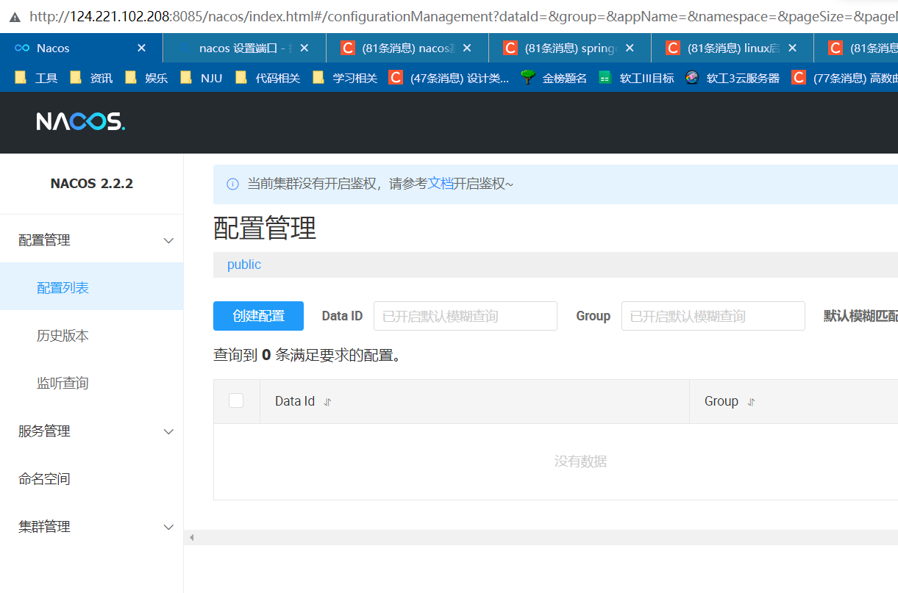
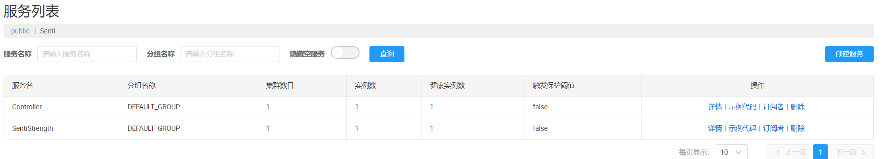

***微服务架构部署与计划***

执行人：尹麒深 		时间：2023年4月12日22:10:495

### 1 概念

#### 配置中心

系统配置的编辑、存储、分发、变更管理、历史版本管理、变更审计等所有与配置相关的活动。这个回答有点官方哈，其实就是当微服务较多时，管理每个服务的配置信息比较困难，尤其是当我们想要在服务启动过程中将新的配置信息生效时更加困难了，这时候就有了配置中心的概念，将每个服务的管理配置文件的功能抽离出来，专门交给一个服务去管理，这个服务呢就是配置中心。

#### 注册中心

注册中心可以说是微服务架构中的”通讯录“，它记录了服务和服务地址的映射关系。在分布式架构中，服务会注册到这里，当服务需要调用其它服务时，就到这里找到服务的地址，进行调用。

举个现实生活中的例子，比如说，我们手机中的通讯录的两个使用场景：
当我想给张三打电话时，那我需要在通讯录中按照名字找到张三，然后就可以找到他的手机号拨打电话。
李四办了手机号，那么他把手机号告诉我，我把李四的号码存进通讯录，后续，我就可以从通讯录找到他。
这就是注册中心的两个重要概念，服务注册和服务发现

### 2 操作

准备部署gateway和nacos。


java安装路径为：/usr/lib/jvm/java-17-openjdk-amd64/路径下。

nacos：/usr/local/nacos/。

在conf中的properties设置为8085端口。编写以下startup.sh脚本，通过`sh ./startup.sh`。

```sh
nohup java -Xms512m -Xmx512m -Xmn256m -Dnacos.standalone=true -Dnacos.member.list= -Xlog:gc*:file=/usr/local/nacos/logs/nacos_gc.log:time,tags:filecount=10,filesize=100m -Dloader.path=/usr/local/nacos/plugins,/usr/local/nacos/plugins/health,/usr/local/nacos/plugins/cmdb,/usr/local/nacos/plugins/selector -Dnacos.home=/usr/local/nacos -jar /usr/local/nacos/target/nacos-server.jar  --spring.config.additional-location=file:/usr/local/nacos/conf/ --logging.config=/usr/local/nacos/conf/nacos-logback.xml --server.max-http-header-size=524288
```

nacos访问：http://124.221.102.208:8085/nacos/index.html



此处踩坑：nginx重启后失效。

```sh
service nginx start
firewall-cmd --state
service firewalld start
service firewalld stop
```


### 3 相关配置

Nacos版本：2021.1；对应的Nacos Client：2.2.2；SpringBoot版本：2.4.2；Java版本：17。

现在，网关是80端口，重构后的SentiStrength占用8081端口，Controller占用8082端口。nacos占用8085端口。8086和8088端口属于nginx（8086是前端访问端口，8088是上传），8089是目前的后端（Backend）。

Gateway：80端口。

SentiStrength：

```properties
# Nacos服务注册中心地址
spring.cloud.nacos.discovery.server-addr=localhost:8085
# 服务名称（必须与nacos服务注册页面上的Server Name一致）
spring.application.name=SentiStrength
# 服务监听端口
server.port=8081
```


Controller：

```properties
spring.cloud.nacos.discovery.server-addr=localhost:8085
spring.application.name=Controller
server.port=8082
```


