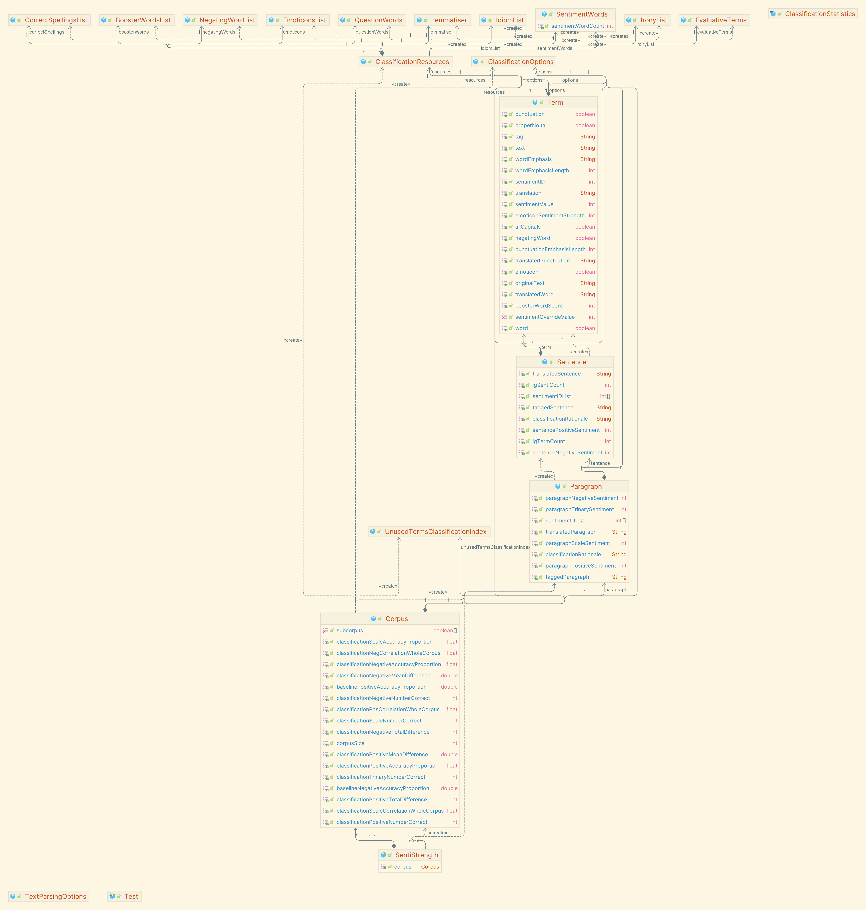
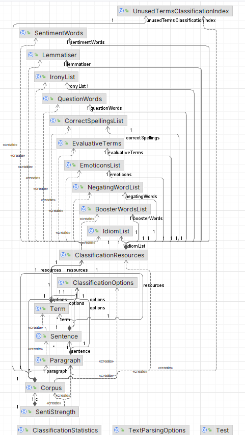

# 重构文档

## 策略模式 by XuChen

为了使添加新的分类方式更加方便，我们使用策略模式对代码进行了重构，添加了父类Mode以及它的子类NegPosMode、BinaryMode、TrinaryMode、ScaleMode，这样在之后若有新的分类方式则可以较为方便地加入其中而不用修改原有代码，只需使新mode继承Mode类即可，这体现了开闭原则；每一个子类都可以取代父类，这体现了里氏代换原则。


将Corpus和SentiStrength类中的由布尔值bgTrinaryMode、bgScaleMode、bgBinaryVersionOfTrinaryMode实现的分类模式更换为由策略构成的分类模式，SentiStrength和Corpus只需持有Mode引用，在处理参数时进行设置（或自行设置），不同的子类会根据实际情况执行相应的操作。

分别有根据现有的模式返回二元、三元、单指标还是积极消极的值的方法，根据现有模式优化字典权重的方法，根据现有的模式对Corpus进行分类、打印索引、设置Corpus选项、计算语料库情绪分数以及十折交叉验证的方法。

策略模式提供了管理相关的算法族（即我们这里的NegPos、Binary、Trinary、Scale以及后续可能的新的模式）的办法。策略类的等级结构定义了一个算法或行为族。恰当使用继承可以把公共的代码移到父类里面，从而避免代码重复。

使用策略模式也可以避免使用多重条件(if-else)语句。多重条件语句不易维护，它把采取哪一种算法或采取哪一种行为的逻辑与算法或行为的逻辑混合在一起，统统列在一个多重条件语句里面，比使用继承的办法还要原始和落后。

在之后若是想添加某个模式，这里不妨设为XMode，那么可以直接建立XMode类继承自Mode类，将对应的函数重写为所需样式即可，例如：

```java
package rainbowsix.ss;

public class XMode extends Mode {
    @Override
    public int getValue() {
        ...
    }

    @Override
    public String outputSpace() {
        ...
    }

    @Override
    public String outputTable() {
        ...
    }

    @Override
    public void optDictWeig(final int iMinImp, final boolean bTotDif) {
        ...
    }
}
```

## 包装 by HuCaixuan

原来的类图：



为了更好地管理`SentiStrength`需要的资源类所持有的各个字典类，我们将这些资源类添加到一个软件包`list`中，以形成更加清晰的类图和架构图。这样做的另一个好处是可以更方便地添加新的字典类或其他资源类所需要持有的类，例如：如果想要添加新功能，如识别需要分析的情绪文本中的敏感词，可以直接在包内添加新的类，并在Resources类中添加相关组合和初始化即可。将所有字典类放在一个包中，可以在分析整个软件的结构时，将所有资源类持有的词典类视作一个整体，或者是某种程度上的黑盒，从而可以忽略词典类内部的实现细节，专注于其他类的功能拓展和修改。

`list`软件包包含这些类：`SentimentWords`, `Lemmatiser`, `IronyList`, `QuestionWords`, `CorrectSpellingList`, `EvaluativeTerms`, `EmoticonsList`, `NegatingWordList`, `BoosterWordList`, `IdiomList` 。它们各自表示一种词典，并提供对应的初始化方法。该软件包中的所有类均与`ClassificationResources`为聚合关系，通过聚合复用的原则，支持包装并实现黑箱复用；当需要创建新的对象时，新对象存取成分对象的唯一方法是通过成分对象的接口，有良好的隔离性，且新对象只需要聚焦在自己的任务上。

除此之外，我们还将Mode及其派生类添加到一个软件包中`mode`中，封装成一个整体，供`sentistrength`使用。这样做同样也能一定程度上切断mode相关类与其他类之间不必要的关系，形成较为清晰的包层次关系，服务于之后的软件功能拓展和其他需求的变更。



## Bug修复 by XuChen

* Paragraph类中calculateParagraphSentimentScore()方法（778行）

  * ```java
    iPosTot = this.sentence[iSentence].getSentencePositiveSentiment();
    改为
    iPosTot += this.sentence[iSentence].getSentencePositiveSentiment();
    ```

* Use try-with-resources

  * 例如SentiStrength类中，1267行

  * ```java
    try {
        serverSocket = new ServerSocket(iListenPort);
    } catch (IOException var23) {
        System.out.println("Could not listen on port " + iListenPort + " because\n" + var23.getMessage());
        return;
    }
    改为
    try {
        serverSocket = new ServerSocket(iListenPort);
    } catch (IOException var23) {
        System.out.println("Could not listen on port " + iListenPort + " because\n" + var23.getMessage());
        return;
    } finally {
        CloseIoUtils.closeAll(serverSocket);
    }
    ```

* unnecessary  cast to "float"

  * 例如Corpus，2522行，删除不必要的(float)
  * 例如Corpus，2496行，删除不必要的(float)
  * 例如Corpus，1819行，删除不必要的(float)

* unnecessary  cast to "double"

  * 例如Corpus，1895行，删除不必要的(double)
  * 例如Paragraph，580行，删除不必要的(double)
  * 例如Paragraph，583行，删除不必要的(double)

* Replace this use of System.out or System.err by a logger.

  * 给每个使用了out和err输出日志的类添加logger，并修改了输出方式

  * ```java
    eg.
    private static final Logger logger = Logger.getLogger(String.valueOf(Corpus.class));
    ```

  * 例如Corpus，2534行

* Merge if statement

  * 例如Paragraph，417行

  * ```java
    if (this.igSentimentIDListCount != 0) {
        if(Sort.findIntPositionInSortedArray(iSentimentWordID,this.igSentimentIDList,1,this.igSentimentIDListCount)>=0){
            for (int iSentence = 1; iSentence <= this.igSentenceCount;++iSentence) {
                this.sentence[iSentence].reClassifyClassifiedSentenceForSentimentChange(iSentimentWordID);
            }
            this.calculateParagraphSentimentScores();
        }
    }
    改为
    if(this.igSentimentIDListCount != 0 && Sort.findIntPositionInSortedArray(iSentimentWordID,this.igSentimentIDList,1,this.igSentimentIDListCount)>=0){
        for (int iSentence = 1; iSentence <= this.igSentenceCount;++iSentence) {
            this.sentence[iSentence].reClassifyClassifiedSentenceForSentimentChange(iSentimentWordID);
        }
        this.calculateParagraphSentimentScores();
    }
    ```

* make this final field static too

  * 例如ClassificationOptions，1142行

  * ```java
    private static final int igCombineMax = 0;
    ```

* make sure this expression can't be zero before doing this division

  * 例如ClassificationStatistics类，305行

  * ```java
    return fAMeanPE / (double) iDataCount;
    改为
    if(iDataCount!=0){
        return fAMeanPE / (double) iDataCount;
    }else{
        return 0;
    }
    ```

* 0 is a valid index, but is ignored by this check

  * 例如Term，762行

  * ```java
    this.sgTranslatedWord.indexOf("haha") > 0
    改为
    this.sgTranslatedWord.indexOf("haha") >= 0
    ```

* add a nested comment explaining why this method is empty
  * 例如UnusedTermsClassificationIndex，158行

* 消除无尽循环

  * 例如SentiStrength，1278行

  * ```java
    while (true) {
        Socket clientSocket;
    
        try {
            clientSocket = serverSocket.accept();
        } catch (IOException var20) {
            System.out.println("Accept failed at port: " + iListenPort);
            return;
        }
    
        PrintWriter out;
        try {
            out = new PrintWriter(clientSocket.getOutputStream(), true);
        } catch (IOException var19) {
            System.out.println("IOException clientSocket.getOutputStream "
                               + var19.getMessage());
            var19.printStackTrace();
            return;
        }
    
        BufferedReader in;
        try {
            in = new BufferedReader(
                new InputStreamReader(clientSocket.getInputStream()));
        } catch (IOException var18) {
            System.out.println(
                "IOException InputStreamReader " + var18.getMessage());
            var18.printStackTrace();
            return;
        }
    
        String inputLine;
        try {
            while ((inputLine = in.readLine()) != null) {
                if (inputLine.indexOf("GET /") == 0) {
                    int lastSpacePos = inputLine.lastIndexOf(" ");
                    if (lastSpacePos < CUT_POSITION) {
                        lastSpacePos = inputLine.length();
                    }
    
                    decodedText = URLDecoder.decode(
                        inputLine.substring(CUT_POSITION, lastSpacePos),
                        StandardCharsets.UTF_8);
                    System.out.println("Analysis of text: " + decodedText);
                    break;
                }
    
                if (inputLine.equals("MikeSpecialMessageToEnd.")) {
                    break;
                }
            }
        } catch (IOException var24) {
            System.out.println("IOException " + var24.getMessage());
            var24.printStackTrace();
            decodedText = "";
        } catch (Exception var25) {
            System.out.println("Non-IOException " + var25.getMessage());
            decodedText = "";
        }
    
        int iPos;
        int iNeg;
        int iTrinary;
        int iScale;
        Paragraph paragraph = new Paragraph();
        paragraph.setParagraph(decodedText, corpus.getResources(),
                               corpus.getOptions());
        iNeg = paragraph.getParagraphNegativeSentiment();
        iPos = paragraph.getParagraphPositiveSentiment();
        iTrinary = paragraph.getParagraphTrinarySentiment();
        iScale = paragraph.getParagraphScaleSentiment();
        mode.setValue(iTrinary, iScale);
        String sRationale = "";
        if (corpus.getOptions().isBgEchoText()) {
            sRationale = " " + decodedText;
        }
    
        if (corpus.getOptions().isBgExplainClassification()) {
            sRationale = " " + paragraph.getClassificationRationale();
        }
    
        String sOutput = iPos + " " + iNeg + " " + mode.outputSpace()
            + sRationale;
    
        if (corpus.getOptions().isBgForceUTF8()) {
            out.print(new String(sOutput.getBytes(StandardCharsets.UTF_8),
                                 StandardCharsets.UTF_8));
        } else {
            out.print(sOutput);
        }
    
        try {
            out.close();
            in.close();
            clientSocket.close();
        } catch (IOException var21) {
            System.out.println("IOException closing streams or sockets"
                               + var21.getMessage());
            var21.printStackTrace();
        }
        if(iScale==1000){
            break;
        }
    }
    ```

  * 
