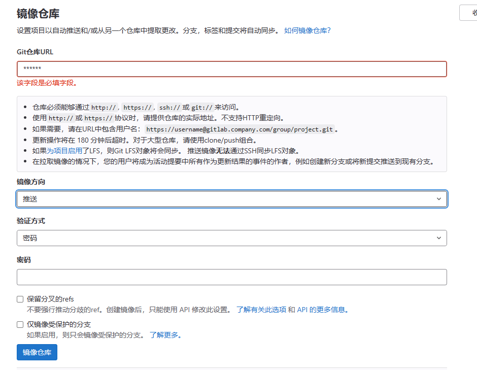
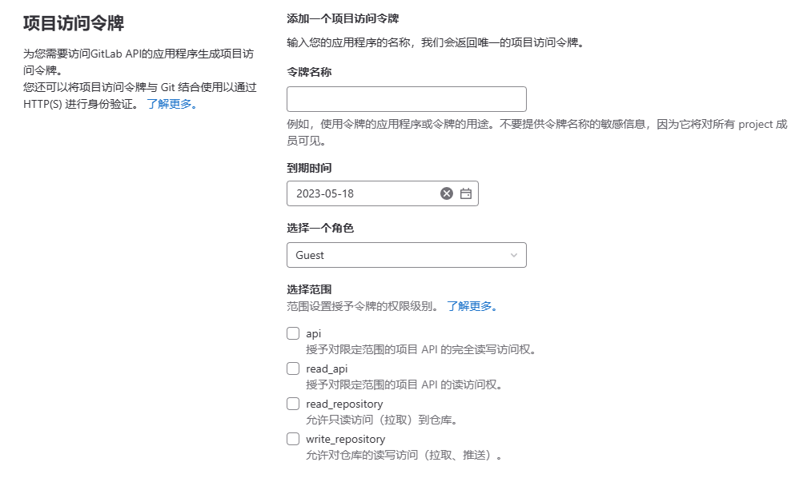
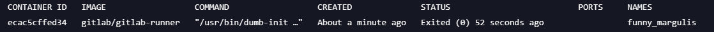
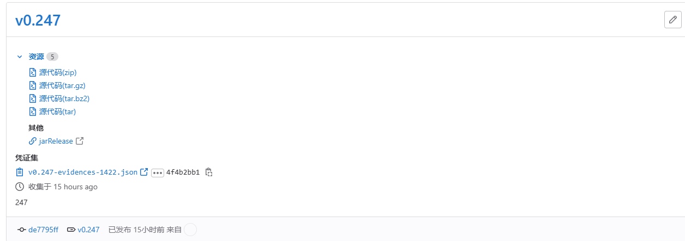
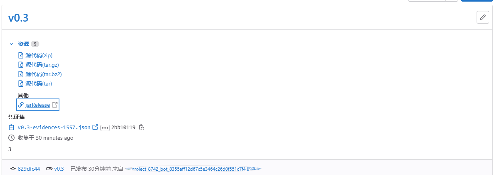
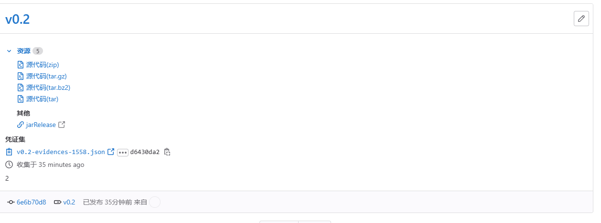

## 流水线部署相关文档

备注：以下流水线作业产物均在https://git.nju.edu.cn/服务器上。如果需要查看具体的部署或是发布情况，请联系我（201250118 张笑恺  qq:2430633233@qq.com）

##### 一、镜像仓库建立

1.在https://git.nju.edu.cn/网址建立一个空白项目，获得它的**URL**，类似如下：


2.进入172.29.4.49下的某个项目，点击设置->仓库->镜像仓库，对应输入Git仓库**URL**，镜像方向为**推送**，验证方式为**密码**。



其中密码在设置->访问令牌中获取：



##### 二、流水线部署（参考https://blog.csdn.net/weixin_43623871/article/details/120471604）

###### 1.在所购买的服务器（ubuntu18.04）上安装gitlab-runner

```shell
sudo apt-get install gitlab-runner
apt-cache madison gitlab-runner
sudo apt-get install gitlab-runner
sudo gitlab-runner run
```

###### 2.在docker中创建gitlab-runner镜像并进行注册

注册一个执行器是docker的runner

```shell
docker run -it   gitlab/gitlab-runner register
gitlab-runner start
```

随后依次填入

“http://172.29.4.49/”注册网址

对应网址的注册令牌

之后值默认，最后选择shell命名编写pipeline即可




###### 3.配置gitlab-runner中的git,maven和jdk（服务器也进行相应操作）

先换源：“docker cp /etc/apt/sources.list 镜像名：/etc/apt/sources.list”之后更新

安装git:apt-get install git

安装jdk17:apt-get install openjdk-17-jdk

安装maven：在服务器已经下载了maven3.8.6，在/usr/local/maven目录下

将文件复制入镜像：docker cp /usr/local/maven cb7027996eba:/usr/local/maven

之后将两文件建立软连接  ln -s /usr/local/maven/bin/mvn /usr/bin/mvn

并给予权限：chmod 777 ./mvn

记得换maven settings.xml的mirror

<!-- 在mirrors标签里添加mirror标签，并指定阿里云私服下载依赖会快点 -->
<mirror>
  <id>alimaven</id>
  <name>aliyun maven</name>
  <url>http://maven.aliyun.com/nexus/content/groups/public/</url>
  <mirrorOf>central</mirrorOf>
</mirror>

###### 4.实现对多个项目的Gitlab-runner注册

前后端同样建立镜像仓库，并完成gitlab-runner的注册。

gitlab-runner可以一对多，注册时进入容器使用

``gitlab-runner register``

###### 5.编写pipeline流水线脚本

SentiStrength 流水线编辑器如下：

```shell
workflow:
  rules:
   - if: $CI_COMMIT_TAG
     when: never
   - when: always

stages:

  - build
  - test
  - deploy
  - release

job1:
  stage: build
  script:

   - echo "This job compiles code."
   - mvn compile
   - mvn package

job2:
  stage: test
  script:

   - echo "This job tests the compiled code. It runs when the build stage completes."
   - mvn test

job3:
  script:

   - echo "This job also runs in the test stage".

job4:
  stage: deploy
  script:

   - echo "This job deploys the code. It runs when the test stage completes."

job5:
  stage: release
  script:

   - echo "asd".
     rules:
   - if: '$CI_PIPELINE_SOURCE == "merge_request_event"'
     when: manual
     allow_failure: true
       release:
         tag_name: v0.$CI_PIPELINE_IID
         description: '$CI_PIPELINE_IID'
         assets:
     links:
       - name: 'jarRelease'
         url: 'http://124.221.102.208:8091/'

  environment: production
```


实现对SentisSrength项目的持续集成和部署，并将所包含代码和jar包进行发布。

2.Frontend项目部署

```shell
workflow:
  rules:
    - if: $CI_COMMIT_TAG
      when: never
    - when: always

stages:
  - build

job1:
  stage: build
  script:
    - echo "This job runs in the build stage."
    - npm install
    - npm run-script build
    - ls
    - rm -rf /var/www/html/dist
    - mv dist /var/www/html/

```

npm install并重新构建项目，生成dist文件夹，删除原有的dist文件，将新生成的文件移动到指定位置

3.Backend项目部署

```shell
workflow:
  rules:
   - if: $CI_COMMIT_TAG
     when: never
   - when: always

stages:

  - build
  - test
  - deploy
  - release

job1:
  stage: build
  script:

   - echo "This job compiles code."
   - mvn compile
   - mvn package

job2:
  stage: test
  script:

   - echo "This job tests the compiled code. It runs when the build stage completes."
   - mvn test

job3:
  script:

   - echo "This job also runs in the test stage".

job4:
  stage: deploy
  script:

   - echo "This job deploys the code. It runs when the test stage completes."

job5:
  stage: release
  script:

   - echo "asd".
     rules:
   - if: '$CI_PIPELINE_SOURCE == "merge_request_event"'
     when: manual
     allow_failure: true
       release:
         tag_name: v0.$CI_PIPELINE_IID
         description: '$CI_PIPELINE_IID'
         assets:
     links:
       - name: 'jarRelease'
         url: 'http://124.221.102.208:8092/'

  environment: production
```

实现对Controller项目的持续集成和部署，并将所包含代码和jar包进行发布

4.Gateway项目部署

```shell
workflow:
  rules:
   - if: $CI_COMMIT_TAG
     when: never
   - when: always

stages:

  - build
  - test
  - deploy
  - release

job1:
  stage: build
  script:

   - echo "This job compiles code."
   - mvn compile
   - mvn package

job2:
  stage: test
  script:

   - echo "This job tests the compiled code. It runs when the build stage completes."
   - mvn test

job3:
  script:

   - echo "This job also runs in the test stage".

job4:
  stage: deploy
  script:

   - echo "This job deploys the code. It runs when the test stage completes."

job5:
  stage: release
  script:

   - echo "asd".
     rules:
   - if: '$CI_PIPELINE_SOURCE == "merge_request_event"'
     when: manual
     allow_failure: true
       release:
         tag_name: v0.$CI_PIPELINE_IID
         description: '$CI_PIPELINE_IID'
         assets:
     links:
       - name: 'jarRelease'
         url: 'http://124.221.102.208:8093/'

  environment: production
```


##### 三、发布部署结果展示

1.SentiStrength结果展示：



2.Backend结果展示：



3.Gateway结果展示：



