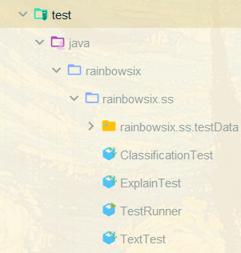
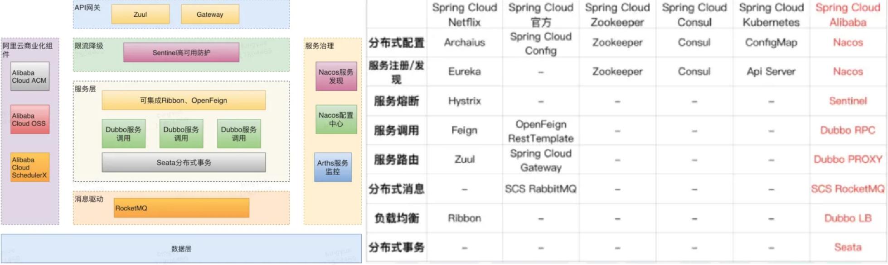

**迭代2 项目说明文档**

本文内容按照助教提供的任务清单顺序，加以我们自己完成的其他内容构成。

[TOC]

## 0  团队与项目说明

我们是RainbowSix，小组组号为第八组（Gitlab中URL为http://172.29.4.49/08/***）。

| 学号            | 姓名   |
| --------------- | ------ |
| 201250118       | 张笑恺 |
| 201250134       | 朱甲豪 |
| 201250139（PM） | 尹麒深 |
| 201250146       | 胡才轩 |
| 201250149       | 詹美瑛 |
| 201250213       | 徐晨   |

本文档是整体的**项目说明文档**，以及会议总结文档。


## 1 运行代码

本部分关于数据集、数据集分析等内容。产物见“助教数据分析”和“小组数据分析”。

### 1-1 分析助教提供的文本情绪，并对比二者的不同

这部分文档在`助教数据分析`中。


在本次实验的迭代二过程中，小组成员用senti-strength工具对助教提供两个文本集进行了情感检测，进而分析和比较两个文本集的情绪特征。这两个文本集分别是社交文本和软工文本。其中，社交文本来自myspace和bbc，两个文本集大小接近，软工文本则包含了来4423条自于 Stack Overflow论坛的问题、回答和评论和 341 条来自于应用商店的评论，两个文本集大小相差较大。

简要结论如下：

- 无论是社交文本集，还是软工文本集，就整体而言，其中的积极情绪和消极情绪其实是均衡的，总体并不表现出明显的积极或消极。

- 社交文本集中的大多数文本情绪强度都较低，且单个文本内积极和消极情绪强度接近；而软工文本集中的文本则多表现强度较高的积极情绪或消极情绪中的一种。


### 1-2 自行提供的更多文本及其分析

这部分文档在`小组数据分析`中。


在本次实验的迭代二过程中，小组成员搜集了两个额外数据集并用senti-strength工具对它们进行了情感检测，进一步对比分析社交文本和软工文本，探究以获得更多发现。其中社交文本集选用的是twitter文本集，而软工文本集则是与助教提供内容不同的新的Stackoverflow文本集。

简要结论如下：

- 在社交文本集中，总体上积极文本更多，即社交文本相比软工文本，更可能表现出积极情绪。
- 软工文本集的中性文本比重明显高于在社交文本集中的情况，即软工文本更可能表现出中性情绪。

我们做了一定的可视化分析。

### 1-3 Junit TEST

为了达到助教要求的**“迭代二前后输出内容不变”**，我们在SentiStrength项目写了4个Junit test，负责检查结果是否有变。




## 2 代码风格与质量维护

本部分介绍CheckStyle、SonarLint的相关内容。

### 2-1 CheckStyle的使用与格式xml

我们通过Maven的CheckStyle插件来进行检查，并生成HTML文档。我们的Checkstyle报告在`项目代码分析/人工代码分析`中。

我们一共写了**五份**Report报告，极尽详细地为每次我们认为的重要Commit都写了报告。

### 2-2 CheckStyle报告、统计与警告说明

这里分为两点：

- 代码检查工具生成的。见`项目代码分析/checkstyle报告`和`项目代码分析/sonarlint报告`中的各个HTML、PDF格式的错误报告。

- 每次新增、关闭、保持的错误我们都有记录，并将其可视化。我们以`项目代码分析/人工代码分析/Report.*.md`为例。

### 2-3 CheckStyle的自身缺陷（漏报、误报等）

我们找出了大量Checkstyle漏报、误报的缺陷，见`项目代码分析/人工代码分析/Report_Final.md`中第五部分。


1. 会产生误报，比如对于函数的形参都要求定义为final，但有些函数会对形参进行赋值，不能定义为final，但checkstyle还是会报出该警告。
2. 检测较为粗暴，对于size的检测如规定一行字符数不能超过80个。在检测的时候会算上制表符和空格，导致一些行就算什么都不写也以及超过了80个字符的限制。

### 2-4 SonarLint、SonarCube的使用

这部分的报告见`项目代码分析\sonarlint报告`中。

* 在对代码的检测维护中，除了助教推荐的checkstyle外，我们小组还使用了sonar检测工具，主要是sonarlint和sonarqube.
* sonarlint是一个**免费**的**开源**IDE 扩展，可识别并帮助我们在编写代码时解决质量和安全问题。像拼写检查器一样，SonarLint 会显示缺陷并提供实时反馈和清晰的**修复指导**，以便从一开始就提供干净的代码。
* SonarQube 是一个开源的代码分析平台, 用来持续分析和评测项目源代码的质量。 通过SonarQube我们可以检测出项目中重复代码， 潜在bug， 代码规范，安全性漏洞等问题， 并通过SonarQube web UI展示出来。而且能够与代码编辑器、CI/CD平台完美集成。


## 3 CICD相关

此处介绍CICD相关内容。这部分文档内容见`CICD文档`。

我们为Gateway，Controller，SentiStrength和前端代码都设置了流水线（Backend已废弃）。


大致步骤是：

- 在所购买的服务器（腾讯云，ubuntu18.04）上安装gitlab-runner
- 在docker中创建gitlab-runner镜像并进行注册
- 配置gitlab-runner中的git,maven和jdk（服务器也进行相应操作）
- 实现对多个项目的Gitlab-runner注册
- 编写pipeline流水线脚本


## 4  代码重构

此处介绍重构相关内容。

### 4-1 使用代码检查工具检查Bug

这部分内容见`项目代码分析/checkstyle报告`和`项目代码分析/sonarlint报告`中的各个HTML、PDF格式的错误报告。

我们通过查看Checkstyle生成的bug报告，基本修复了所有Checkstyle报告的BUG，并对未修复、新增的部分作出了详细解释。

### 4-2 人工Debug与CheckStyle的区别

人工Debug当然进度更慢、更加困难，所以我们选择了SentiStrength软件包中的类来进行对比。

我们找出了大量Checkstyle漏报、误报的缺陷，见`项目代码分析/人工代码分析/Report_Final.md`中部分。

### 4-3 重构思路、逻辑与重构说明

重构文档见`重构+架构+项目说明文档/重构文档`。

实际上，我们一直有一个这样的问题：为什么要重构？重构的目的是什么？

仅仅为了重构而重构是没有意义的，所以我们需要一个明确的目的：我们要让代码变得更松散。

举例：我们如果要在所有输出中添加一个4元模式，在原来几乎是不可能的。但是现在我们添加了策略模式，之后若是想添加某个Mode，这里不妨设为XMode，那么可以直接建立XMode类继承自Mode类，将对应的函数重写为所需样式即可，例如：

```java
package rainbowsix.ss;

public class XMode extends Mode {
    @Override
    public int getValue() {
        ...
    }

    @Override
    public String outputSpace() {
        ...
    }

    @Override
    public String outputTable() {
        ...
    }

    @Override
    public void optDictWeig(final int iMinImp, final boolean bTotDif) {
        ...
    }
}
```

具体来说，我们添加了策略模式，将Word、List相关代码进行封装，将原来庞大的SentiStrength软件包拆分出了Dict包。另外，我们也重新处理了部分接口的关系。可以看我们的类图，现在的代码结构变得更加清晰、结构变得更加松散。


### 4-4 代码功能性BUG举例

这部分Bug修复内容在`重构+架构+项目说明文档/重构文档`中的Bug修复部分。举例来说：

Paragraph类中calculateParagraphSentimentScore()方法（778行）

* ```java
  iPosTot = this.sentence[iSentence].getSentencePositiveSentiment();
  改为
  iPosTot += this.sentence[iSentence].getSentencePositiveSentiment();
  ```

消除无尽循环

* 例如SentiStrength，1278行

等等。


## 5 代码架构与设计说明

此处介绍我们的微服务架构后端、以及为 SentiStrength 设计的 UI。

### 5-1 前端展示

前端基于Vue3，初期利用Apache2进行Http转发，后期shiyongGateway后，即换为Nginx代理转发。

利用Bootstrap与Element UI组件，我们将网页尽可能地设计地更加合理。

另外，我们同样添加了一些纯CSS的动画效果，它们基于CSS3，效果很好，且内存容量占用都很低。


具体见http://124.221.102.208:8086。

此处的功能展示。


### 5-2 架构：从Spring Boot 到 Spring Cloud Alibaba

一方面，这是服务端开发的相关内容，已经学习过的内容当然便于使用；

另一方面，SpringCloudAlibaba作为国产框架，其实用性甚至已经超过了原版SpringCloud（且原版部分已经停止维护）。



介绍网址：https://zhuanlan.zhihu.com/p/98874444

- Nacos
- Gateway
- Dubbo（部署中）
- LoadBalancer（部署中）
- 为什么不使用Eureka、Zuul、Feign？


### 5-3 设计说明

这部分见`重构+架构+项目说明文档/项目整体架构文档`。


原来的设计：

- 前端，后端
- SentiStrength作为Jar包被调用，耦合过于紧密

现在的微服务架构：

- 翻译服务（迭代2结束即开始）
- SentiStrength服务（负责文件的上传下载，text的发送等）
- Controller：作为一个Coordinator协调者，统管一切与SentiStrength有关的微服务。目前的功能是记录SentiStrength的返回值，后续加入数据监控等功能。


## 6 项目阶段说明

此处借助重要会议划分，不重要的过程会议不计入在内。

### 1、第四次会议：迭代一总结与展望

第四次会议时间：2023-3-10 星期五 16:20。

#### 1、议题

- JavaDoc的优化和导出；
- 项目打包与发布；
- SSH重新设置（图片放在SSH那个文件夹的Verified文件中）；
- 下一阶段的规划。

#### 2、商讨结论与分工

本阶段的任务（都是个人任务，不包括分工）：

1. 完成项目的打包、发布
2. 优化并导出JavaDoc，将其推送到云服务器；
3. SSH截图（以及GPG）截图。
4. 学习SpringBoot，Vue。规划项目。
5. 尝试使用Jenkins进行CICD。

### 2、第五、六次会议：重构的重要讨论；迭代二规划与立项

第五次会议时间：2023年3月20日 16:00 星期四。第六次会议时间：本次会议为线上会议，时间为 2023年3月24日22:00。主要目的是：汇报工作、上周进度。

在迭代一中，通过阅读论文和源码我们基本解了SentiStrength 的项目背景和项目代码结构。迭代二需要在迭代一的基础上，继续分析、维护开源软件并纠正其中的代码缺陷。

#### 1、议题

- Checkstyle工具的使用以及标准。具体见助教的CheckStyle要求。
- 准备中期检查。

#### 2、商讨结果

设计一个简单的导航页面，作为一个HomePage。

写从第一到第二次的分析。包括统计、分析，统计修改的（closed）、新增的（new）、一直存在的（open）的checkstyle中警告（包括警告的属性、数量等）。

试运行数据集；跑数据集并分析。

重构代码。重构代码和Bug修改、CheckStyle优化同步进行。

- 阅读代码；利用IntelliJ生成的类图，辅助理解代码的构造。
- 设计新结构，并商量进行重构。

去下载官网的应用并参考；设计后端和前端。

CICD（Jenkins）尝试。

#### 3、分工

hcx，zmy，zjh：尝试运行代码，并跑数据集。

xc：写使用手册、参数手册。见`2_2_3_sentiStrength使用手册和参数说明`。

yqs：前端界面。效果见`2_2_2_创建并部署VUE前端项目`。准备中期检查文稿。

zxk：CICD+维护云服务器。

### 4、第七、八次会议：细化前后端与重构

第七次会议时间：3月27日；第八次会议时间：4月3日。

#### 1、议题与商讨结果

讨论重点内容：

- 细化前后端
- 重构代码：
  - 先写Junit，保证前后代码风格不变
  - 分组改动代码，重构Resources等内容
- 数据集：貌似已经很有成果了。

#### 2、分工

第七次：

- zxk：CICD 的具体实现和排错

- yqs：前后端框架

- xc，zjh，hcx，zmy ：Junit，思考重构，数据

第八次：

- XC：重构SentiStrength。

- ZXK：CICD

- YQS：Debug以及SentiStrength重构。

- ZJH，ZMY，HCX：前后端工作

- ZJH：再准备一个Explain的Junit。

### 5、第九次会议：决定建立微服务架构

第九次会议时间：

#### 1、议题

- 建立微服务架构

#### 2、商讨结果

使用SpringCloudAlibaba。使用Nacos而非Eureka；Gateway而非zuul；等等。

分类完成工作与文档。

#### 3、分工

本周先专心准备考试；考完后专心工作。

YQS：微服务部署以及相关文档。见`2_6_2_微服务架构部署`。

### 6、第十次、第十一次会议：准备提交内容与详细分工

#### 1、议题

画图：迅捷画图。https://www.liuchengtu.com/charts/

#### 2、分工

XC：重构文档中的例子，以及功能Bug文档。

ZXK：CICD与文档即将完成；项目架构文档。

HCX：Controller的重构；ZMY：Senti的合并。数据集与报告。

YQS：设计文档、说明文档、视频。

ZJH：Report。


## 7 文档说明、分工说明

本部分介绍所有小组产生的文档、会议记录等中间内容，并简单介绍分工相关内容。

### 7-1 PostCat——团队协作与接口文档

我们利用了PostCat来进行团队协作与接口测试，并在PostCat中一起写了接口数据。


另外，我们目前使用了接口文档来记录各接口，下一步可能使用其他开源工具来记录各接口数据。见`接口文档`文件夹内。


### 7-2 会议记录、检查文档位置

我们列出了每次重要会议的情况（非重要会议不特地记录）。


### 7-3 Git提交记录

此处列出了我们按日期为横坐标、提交次数为纵坐标的提交情况；并且还有CICD情况。


如上给出了小组在实现每个项目上的git提交情况折线图，可以发现，除了最一开始（因为要进行开会分工，提交次数可能会偏多）和最后几天（要提交产物，所以ProcessDocs提交次数较多），其他提交次数每周都比较均匀，而因为空闲时间不均匀，所以在每周中体现出的git提交次数不均匀，但每周横向对比可以发现，每周都会有git提交记录产出，说明小组在实现过程中是**稳步**推进的。


上图表明每一个项目git提交次数所占比，发现SentiStrength占了一半以上，说明我们小组在重构和checkstyle方面做了很大的功夫。FrontEnd和ProcessDocs比例几乎持平，文档是项目过程的必需品，而前端实现是为了更好的用户友好型设计。因为在SentiStrength中已经完成了部分关于控制层、业务逻辑，所以Gateway和Controller提交次数会偏少，但提交的都是必要操作。


除了第六周细琐的修复较多、文档合并导致提交次数明显较多之外，上图表明在项目实现的6周内git提交记录的分布情况，可以发现除了个别周（3.17-3.23）之外，其他每周的提交次数占比可以称得上是均匀，再次说明项目实现上的**稳步**推进性。


### 7-4 新技术栈学习心得的上传

我们小组一直将部署和学习内容上传到过程文档中，方便后面接触的同学进行了解。

一切新的技术栈，我们都会将学习内容保存到过程文档中。举例：微服务架构，Postcat，SentiStrength使用手册，SonarCube的介绍等等。


## 8 总结与展望

我们在完成助教代码要求的基础上，添加了基于我们自己的理解的内容，使用了微服务架构（尚未开发完成的部分：Dubbo、Sentinel、LoadBalancer、Seata）。我们进行了较为频繁的会议与讨论。

下一步，我们将会对Controller现在的桩进行实现，如进行分析数据的可视化；并且，我们会开启另一台处于不同网络内的服务器，进行分布式部署。我们将会基于Spring Cloud Alibaba来继续完善我们的服务架构。