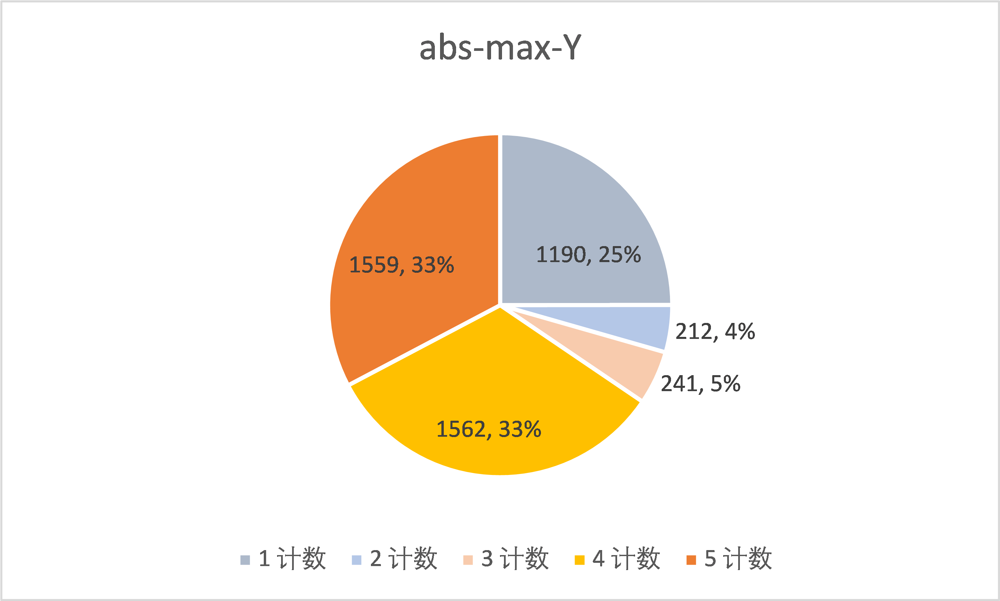
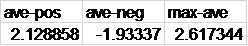

# 数据集分析报告

## 背景介绍和数据来源

在本次实验的迭代二过程中，小组成员用senti-strength工具对助教提供两个文本集进行了情感检测，进而分析和比较两个文本集的情绪特征。这两个文本集分别是社交文本和软工文本。其中，社交文本来自myspace和bbc，两个文本集大小接近，软工文本则包含了来4423条自于 Stack Overflow论坛的问题、回答和评论和 341 条来自于应用商店的评论，两个文本集大小相差较大。

## 指标设计

    小组优先采用迭代二中要求的trinay分类结果作为分析指标，但由于trinay分类结果包含的信息较少，无法体现积极或消极情感的强度，因此，我们增加了离散值数量最多的scale分类结果和pos-neg结果作为进一步分析的依据。

    为分析文本集的总体情绪表现，我们尝试使用了trianry分类结果的算数平均值(ave-trinary)作为文本集的总体情绪表现，它的取值范围为-1<=ave-trianry<=1，并且还会参考scale结果的算数平均值，其取值范围为-4<=ave-scale<=4。ave-trianry的值大于0表示总体积极，小于0表示总体消极。同时，我们还会从结果比例中进一步对比分析两文本集的情绪特征。

    scale值为文本中积极情绪与消极情绪的强度之和，当它的绝对值较大时，可以认为文本具有较高强度的某一种情感。当它的绝对值较小时，可以认为文本的两种情绪强度接近。

    pos-neg结果可以体现文本内的积极情绪和消极情绪强度，两个结果的绝对值会分别作为衡量两种情绪强度的指标，较大的那个绝对值会被作为文本的情绪强度，而绝对值的较大值平均值会被用来衡量文本集的总体情绪强度，其取值范围为1<=max-ave<=5。它们的比例和分布也会作为重要的分析指标来探究文本情绪的强度方面的特征。

## 描述分析

### 总体分析

以下分别是社交文本和软工文本的一部分统计特征。

图一-社交

图二-软工

从图一和图二中可以看出，虽然社交文本集和软工文本集的ave-trinary的平均值都大于0，但是社交文本对应的值更大，可以认为总体积极情绪更强。从情绪表示更加准确的ave-scale看，软工文本对应的值小于0，社交文本对应的值仍然大于0。

值得注意是，虽然社交文本在trianry的分类方式上总体表现为积极情绪，但是其平均值和scale平均值都十分接近于零，也就是说，总体积极情绪并不强烈。同理，社交文本的两个平均值也十分接近零，总体所表现的情绪也并不强烈。

通过统计各结果所占比例来进一步分析，展示为如下的扇形图。

图三-社交-trinary扇形图

图四-软工-trinary扇形图

从以上两个trinary的扇形图中可以看出，无论是社交文本集，还是软工文本集，在同一个文本集中，积极文本与消极文本所占比例其实都十分接近，尤其是软工文本集中，二者几乎持平，即使是社交文本，差距也只有3%。这至少可以说明，从trinary分类结果来看，不能将两个文本集判断为总体表现为积极或消极，因为这两种情绪都没有在文本集中占明显多数。另外，对于中性文本，从trianry分类结果看，软工文本集中的中性文本更多，这可能和相比社交环境，软工环境中的人们会表现得更加理性有关。

从以上的分析可以得出，无论是社交文本集，还是软工文本集中，积极情绪和消极情绪其实都是是均衡的，两种情绪都没有占明显的多数。

### 强度分析

根据以上结论，进一步从情绪的强度方面进行分析，首先从scale分类结果入手，展示为以下的扇形图和柱状图。

图五-社交-scale扇形图

图六-软工-scale扇形图

图七-社交-柱状图

图八-软工-柱状图

图九-绝对值平均值

结合两个scale扇形图和两个scale柱状图中可以看出，社交文本集文本的scale结果主要集中在-2,-1,0,1,2这几个值，占总文本数的90.20%；并且，从图九中得到社交文本scale结果的绝对值的平均值（socialAbsAve）为1.173444，这些说明在社交文本中，总体上，单个文本内的积极情绪和消极情绪强度其实比较接近。而在软工文本集中，scale结果大于2或小于-2的文本占比达到73.01%。在图九中，软工文本集 (softAbsAve) 对应为2.395886，这不仅可以说明在软工文本集的单个文本内两种情绪强度相差明显，还隐含了软工文本集中的文本倾向于在一种情绪上表现出较高的强度这一现象。

进一步，我们分析两个文本集中积极和消极情绪强度。相关数据展示如下。

图十-social-abs-max

图十一-soft-abx-max

图十二-social-abx-max-vol

图十三-soft-abx-max-vol

图十四-social-平均值

图十五-soft-平均值

在这里，我们采用pos-neg分析结果中绝对值较大的那个值作为一个文本的情绪强度。从从图十二和图十三可以看出，社交文本集的文本多表现出中低强度的情绪，对应值小于等于3，而软工文本集内的大多数文本则具有高强度的情绪，对应值大于等于4。结合两个扇形图，社交文本中，情绪强度为1，2，3的文本占总文本集的82%；软工文本中，情绪强度为4和5的文本占总文本集的66%。

更进一步统计，从图十四和图十五中可以看出，对于两种文本集，文本内积极情绪平均强度（pos-ave）和消极情绪平均强度（neg-ave）都是十分接近的，这进一步说明了两个文本集的总体情绪都是均衡的这一结论。值得注意的是，我们使用了文本的积极和消极强度的绝对值的最大值的平均值（max-ave）来衡量一个文本集的总体情绪强度，可以看出软工文本集的总体情绪强度明显大于社交文本集。

结合从前的结论可以得出，社交文本多表现出较低的情绪强度，且单个文本内消极和积极情绪强度接近；而软工文本则多表现较高的情绪强度，且单个文本内多是单一情绪的强度明显偏高。

## 结论

无论是社交文本集，还是软工文本集，就整体而言，其中的积极情绪和消极情绪其实是均衡的，总体并不表现出明显的积极或消极。

社交文本集中的大多数文本情绪强度都较低，且单个文本内积极和消极情绪强度接近；而软工文本集中的文本则多表现强度较高的积极情绪或消极情绪中的一种。

