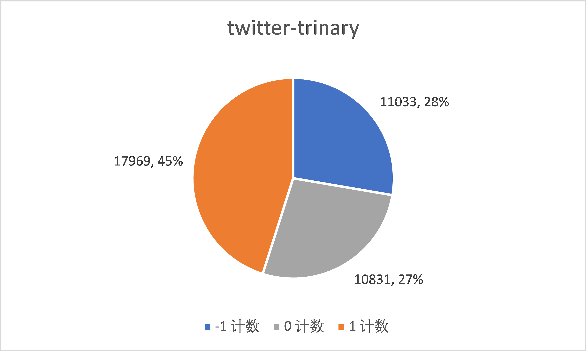
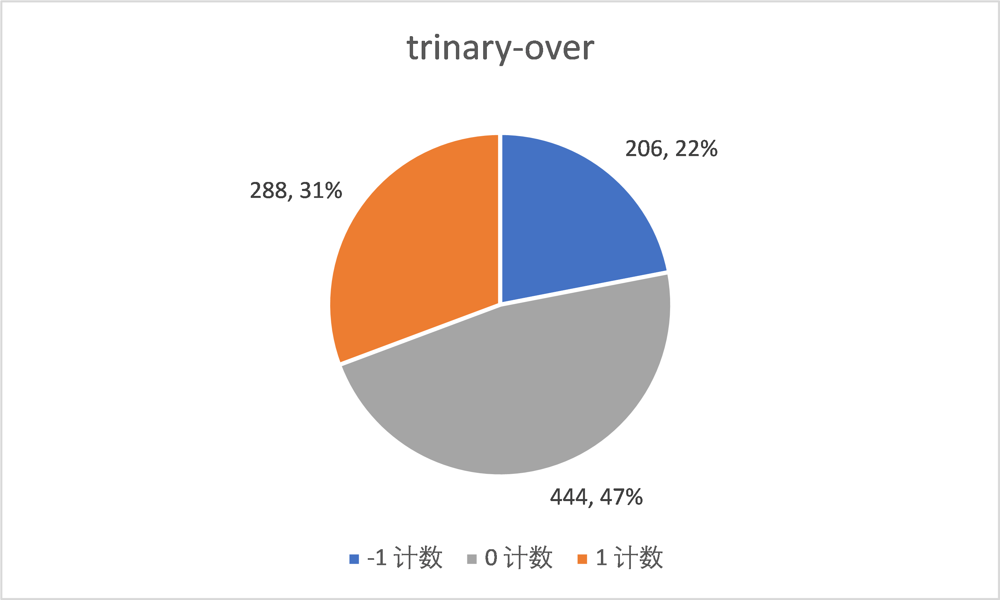
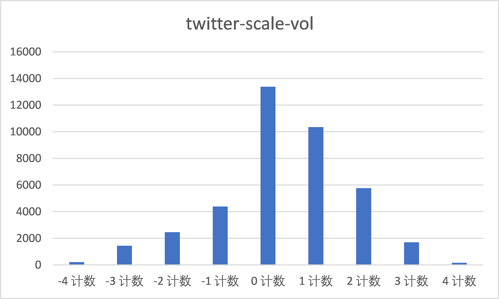
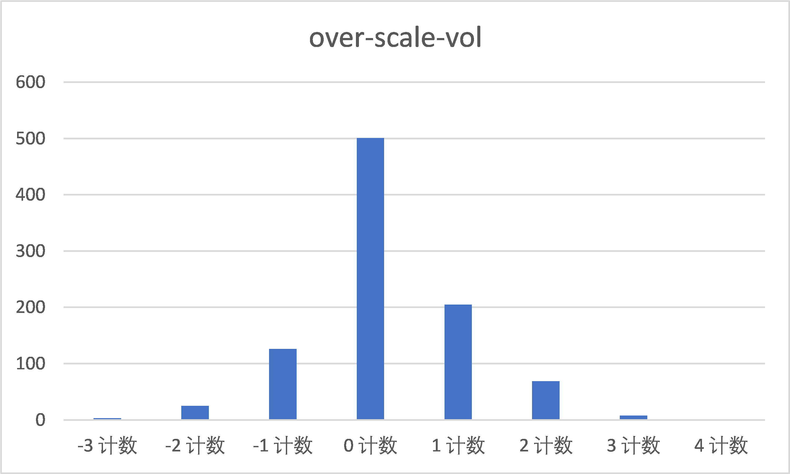
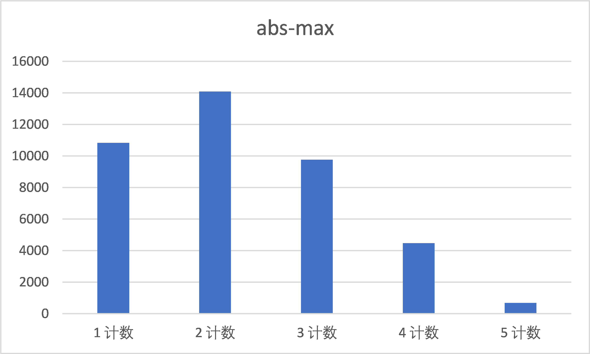
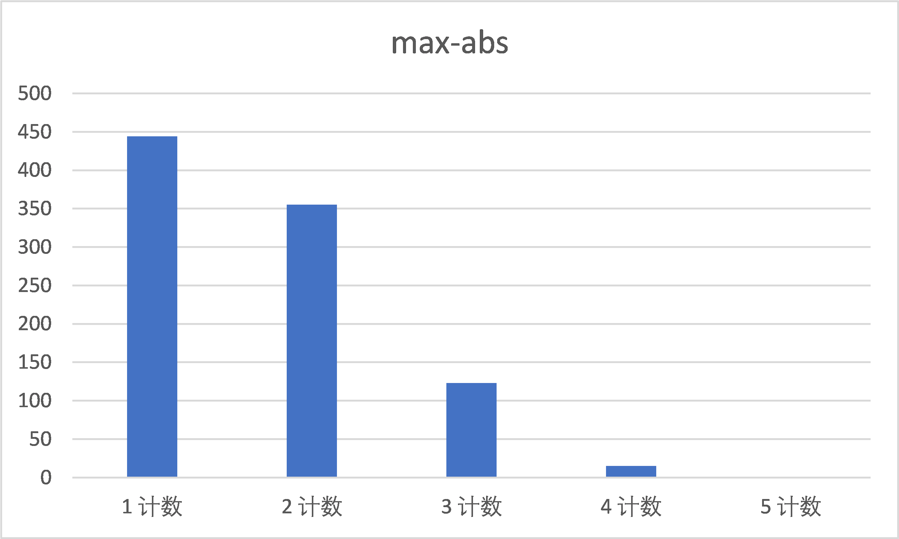
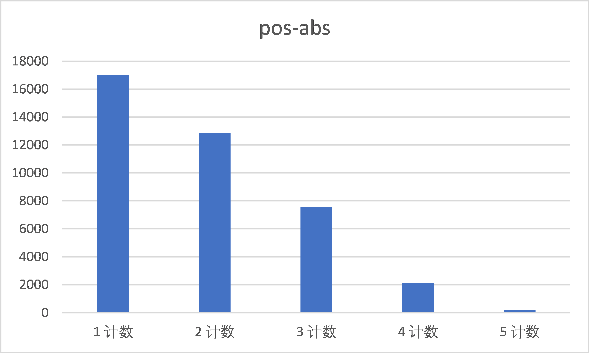
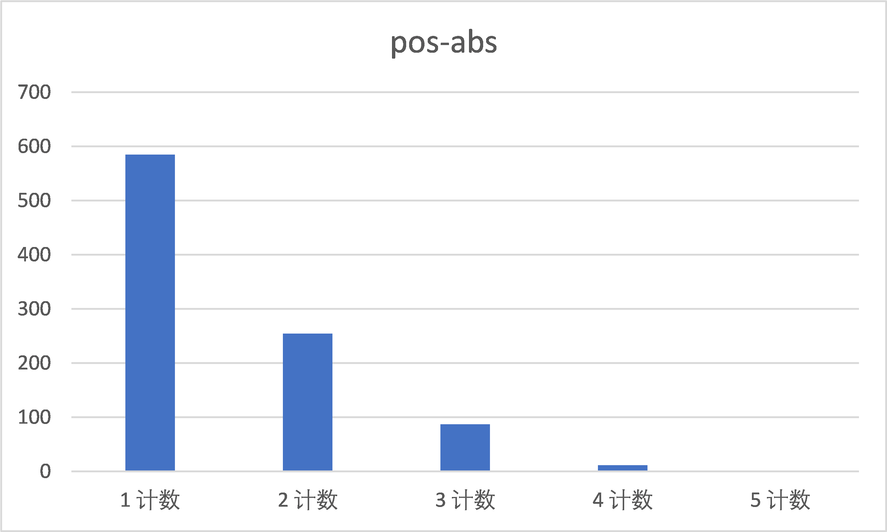
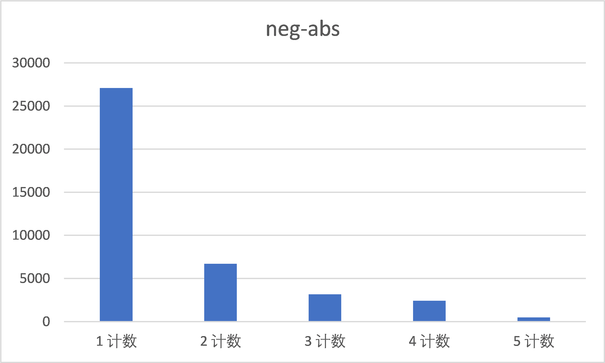
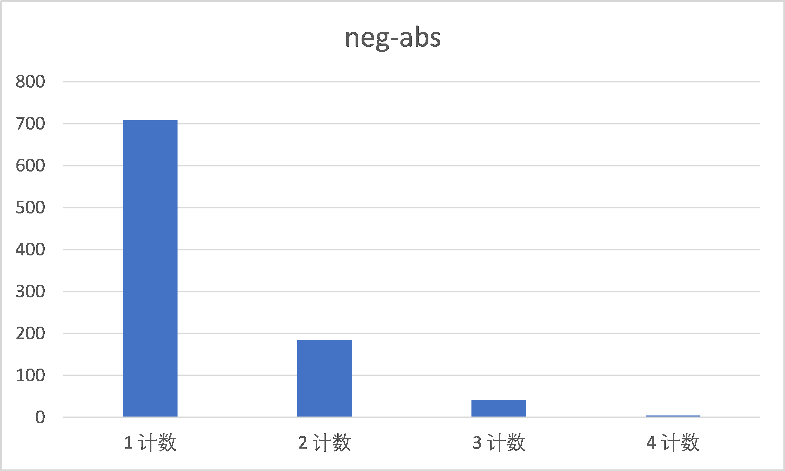

# 数据集分析报告

## 背景介绍和数据来源

在本次实验的迭代二过程中，小组成员搜集了两个额外数据集并用senti-strength工具对它们进行了情感检测，进一步对比分析社交文本和软工文本，探究以获得更多发现。其中社交文本集选用的是twitter文本集，而软工文本集则是与助教提供内容不同的新的Stackoverflow文本集。

## 指标设计

小组采用和在助教数据集分析过程中相同的分析指标，但是会更加注重对pos-neg结果的分析。

## 描述分析

### 总体分析

两个文本集的trinary分类结果展示如下。

图一-twitter

图二-stackOverflow

从图一和图二中可以看出，twitter文本集内的积极文本显著多于消极文本，可以认为twitter上的文本更容易表现出积极情绪。在stackOverflow文本集中，虽然积极文本仍然多余消极文本，但是不如twitter文本集那么显著，并且最明显的特征还是将近一半的文本都表现出中性。
事实上，在助教数据集分析中，社交文本集内的积极文本也稍微多于消极文本，但是并不显著，而比较值得注意的一点也是软工文本集内的中性文本比例明显高于社交文本集。
使用scale结果进行进一步分析，相关数据展示如下。

图三-twitter

图四-stackOverflow

从图三和图四中可以看出，对于单个文本内的情绪状况，twitter文本集内的积极情绪强于消极情绪的情况明显要多于弱于的情况。而在stackOverflow文本集中，两种情绪相等的文本占了最多数，这进一步说明了上面的结论。
使用pos-neg结果进行深入，相关数据展示如下

图五-twitter

图六-stackOverflow

图七-twitter

图八-stackOverflow

图九-twitter

图十-stackOverflow

从图五和图六可以看出，twitter文本集和stackOverflow文本集内的文本情绪强度其实都较低。尤其是stackOverflow文本集，比重最大的是强度值为1的文本。最大绝对值强度为1指该文本没有表现出积极和消极情绪，这样的文本都是中性的。对于twitter文本集，我们进一步统计了pos结果和neg结果的分布情况。从图七和图九可以看出，twitter文本集的中绝大对数文本的消极情绪强度都只有1，而积极情绪虽然也集中在中低强度，但有更多的文本分布在2和3的值上，这解释了为什么twitter文本集总体上积极文本更多。对于stackoOverflow文本集，无论是积极情绪还是消极情绪，强度值都集中在1，几乎没有强度值大于等4的情况，这进一步解释了该文本集内中性文本偏多的原因。

## 结论

在社交文本集中，总体上积极文本更多，即社交文本相比软工文本，更可能表现出积极情绪。

软工文本集的中性文本比重明显高于在社交文本集中的情况，即软工文本更可能表现出中性情绪。

