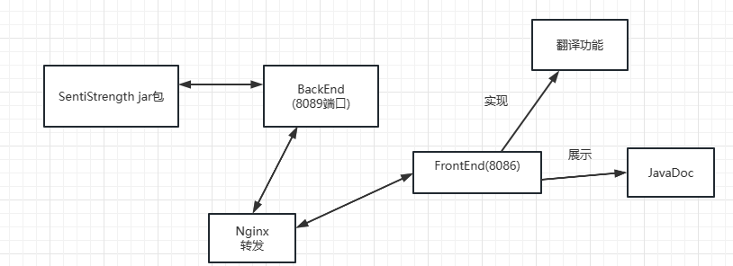
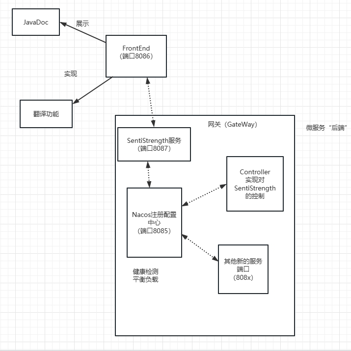

# 软件架构设计文档

团队名称：RainbowSix

[TOC]

#### 0续

##### 0.1文档更新记录：

| 版本 | 作者           | 版本描述                             | 日期          |
| ---- | -------------- | ------------------------------------ | ------------- |
| V1.0 | 张笑恺         | 为迭代二后续代码的优化和开发做准备   | 2023年3月9日  |
| V1.1 | 张笑恺，尹麒深 | 迭代二重构优化后项目架构设计说明整理 | 2023年4月19日 |
|      |                |                                      |               |

##### 0.2编写目的

本文档提供完整项目的软件架构概况，采用若干架构视图描述系统的不同方面，以便表示构造系统所需要的重要架构决策。

##### 0.3对象和范围

本文档的读者是RainbowSix团队内部的开发和管理人员，参照了骆斌主编的《软件工程与计算（卷三）》，用于指导迭代二的代码开发和测试工作。

##### 0.4参考文献

《软件需求规格说明》（未编写）

《软件工程与计算（卷三）》

##### 0.5名词和术语

待补充

#### 1.软件设计架构说明

###### 系统的分层架构

1.项目初期架构

项目实现初期架构设计为经典前后端设计，SentiStrength实现编译打jar包，后端通过调用jar包实现业务逻辑，通过Nginx代理将功能转发，前端静态页面每次npm build获取dist资源包，实现一系列类似情绪判断、翻译等功能，同时展示JavaDoc。

2.项目优化后架构

项目通过引入微服务架构优化设计，区别于传统的单体软件架构，更能适应当前互联网后台服务的三高需求：高并发、高性能、高可用。这样做降低了各个服务功能模块之间的强耦合性，利于后续拆分和扩容、软件维护和迭代更新。

首先，前端不需要很大的修改，仍然支持展示JavaDoc和可视化翻译、情绪判断的功能。

而后端则引入微服务后端的概念，添加网关（GateWay）做到统一入口和负载均衡，当然，认证授权、访问控制、路由、[负载均衡](https://so.csdn.net/so/search?q=负载均衡&spm=1001.2101.3001.7020)、缓存、日志、限流限额等等非业务性的功能也对项目有所增益。

SentiStrength仍提供情绪判断的功能，这一功能被Nacos注册配置中心统一管理，Nacos注册配置中心实现健康检查和平衡负载的功能，并向外提供服务获取方式。

Controller用来实现对情绪判断功能的控制，通过向Nacos注册配置中心发送请求获取服务。

同理后续添加的其他新的服务也是通过类似逻辑进行请求获取服务。

