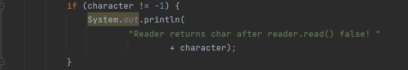
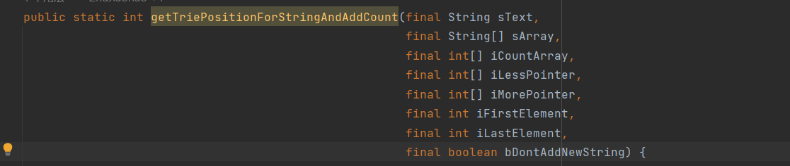
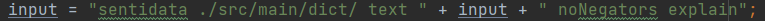

# 第四次根据checkstyle修改代码报告

## 一、报告概述

本次报告分析针对第四次checkstyle分析报告`分析报告\4\`至第五次checkstyle分析报告`分析报告\5\`的变化。

主要做了如下修改：

+ 对代码架构进行了改进，使用了微服务的架构，新建了application和controller两个类
+ 对所有代码的格式都进行了优化，优化了一些较长的行

## 二 、结果统计

|                                  | open | closed | new  |
| -------------------------------- | ---- | ------ | ---- |
| 总计                             | 226  | 1591   | 3    |
| SentiApplication.java （新建类） | 0    | 0      | 1    |
| SentiController.java （新建类）  | 0    | 0      | 2    |
| BinaryMode.java                  | 0    | 2      | 0    |
| Mode.java                        | 0    | 32     | 0    |
| NegPosMode.java                  | 0    | 2      | 0    |
| ScaleMode.java                   | 0    | 11     | 0    |
| TrinaryMode.java                 | 0    | 11     | 0    |
| BoosterWordsList.java            | 0    | 18     | 0    |
| ClassificationOptions.java       | 0    | 58     | 0    |
| ClassificationResources.java     | 0    | 11     | 0    |
| ClassificationStatistics         | 0    | 28     | 0    |
| Corpus                           | 33   | 341    | 0    |
| CorrectSpellingsList             | 0    | 6      | 0    |
| EmoticonsList                    | 0    | 7      | 0    |
| EvaluativeTerms                  | 5    | 15     | 0    |
| IdiomList                        | 1    | 22     | 0    |
| IronyList                        | 0    | 4      | 0    |
| Lemmatiser                       | 0    | 9      | 0    |
| NegatingWordList                 | 0    | 6      | 0    |
| Paragraph                        | 12   | 54     | 0    |
| QuestionWords                    | 0    | 7      | 0    |
| Sentence                         | 82   | 48     | 0    |
| SentimentWords                   | 11   | 45     | 0    |
| SentiStrength                    | 7    | 200    | 0    |
| Term                             | 3    | 66     | 0    |
| UnusedTermsClassificationIndex   | 0    | 45     | 0    |
| FileOps                          | 0    | 3      | 0    |
| Sort                             | 1    | 10     | 0    |
| StringIndex                      | 0    | 22     | 0    |
| Trie                             | 10   | 2      | 0    |
| Arff                             | 35   | 229    | 0    |
| PredictClass                     | 0    | 55     | 0    |
| Utilities                        | 1    | 1      | 0    |
| WekaCrossValidateInfoGain        | 4    | 88     | 0    |
| WekaCrossValidateNoSelection     | 8    | 70     | 0    |
| WekaDirectTrainClassifyEvaluate  | 5    | 48     | 0    |
| WekaMachineLearning              | 8    | 18     | 0    |

## 三、结果说明

### 3.1 open

| 严重程度 | 种类       | 规则            | 信息（举例）                                 | 原因                                                         |
| -------- | ---------- | --------------- | -------------------------------------------- | ------------------------------------------------------------ |
| Warning  | sizes      | LineLength      | 本行字符数 137个，最多：80个。               | 为了维持代码的可读性，保留一些无法修改（修改后代码非常丑）的警告。 |
| Error    | sizes      | ParameterNumber | 参数共： 8个，最多：7个。                    | 无法更改函数的参数个数。                                     |
| Warning  | sizes      | FileLength      | 文件 2,097 行 （最多：2,000 行）。           | 为了文件可读性，不去刻意压缩文件行数                         |
| Waring   | parameters | FinalParameters | 参数： sTextWithWildcard 应定义为 final 的。 | 此为错误警告，改为final后无法编译                            |

### 3.2 close

利用idea的代码编写设置，优化了代码的sizes，将可以修改的行长度缩小为80个字符以下

如：

而一些难以修改的则open，如：

已经将所有参数都换行，再对参数修饰词换行则会使得代码可读性下降，属于为了改而改，并不能提高代码质量。

### 3.3 new

本次新增的警告集中于SentiApplication和SentiController两个新建的类，主要警告共三个，如下：

1. 工具类应隐藏 public 构造器。    属于误报，该类并不是工具类
   

2. 参数： input 应定义为 final 的。    也属于误报，在后文中input进行了赋值操作，若改为final则无法编译。
   

3. 本行字符数 83个，最多：80个。    仍然是为了可读性考虑，并未修改。

   

### 3.4 checkstyle误报的警告

参数：xxx 应定义为 final 的。

