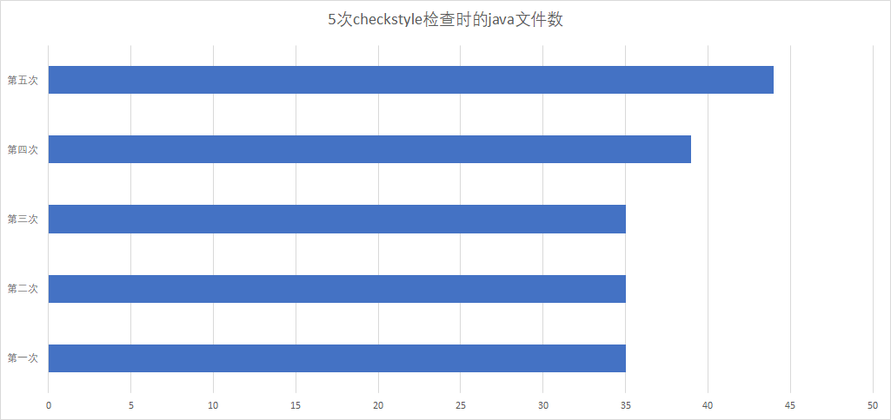
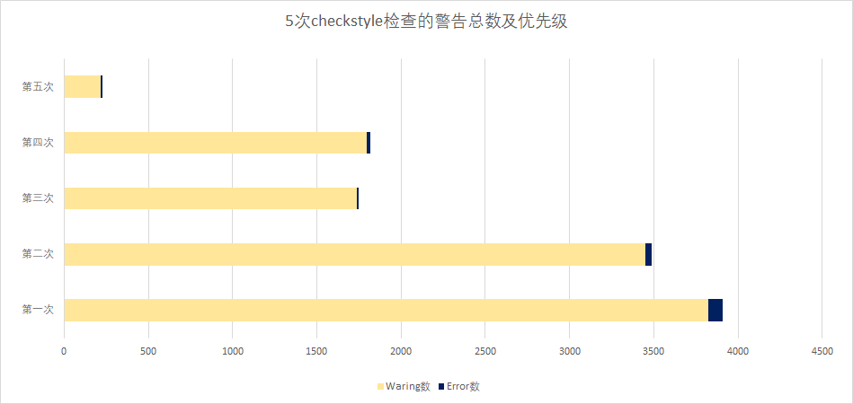
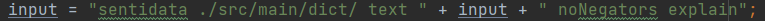

## checkstyle总结报告

### 一、报告背景

* 使用的checkstyle规则是在sun_check基础上自定义的规则，详见`\分析报告\checkstyle\sun.checkstyle\sun.xml`
* 除了checkstyle之外，我们还通过**sonarlint工具**来对代码进行检查和维护，检查结果详见`\分析报告\sonarlint\1\sonarlint分析报告.pdf 和 \分析报告\sonarlint\2\sonarlint分析报告.pdf`

* 本次报告是对从迭代一开始，到迭代二代码重构结束之间的5次checkstyle检查的总结。具体的更改详见`Report.1.md~Report.2.md`，本次报告不再赘述，主要对上述4次checkstyle相关的修改进行可视化分析。

### 二、结果统计

|                                 | open  | closed | new   |
|---------------------------------|-------|--------|-------|
| 总计                              | 226   | 3681   | 3     |
| SentiApplication.java （新建类）     | 0     | 0      | 1     |
| SentiController.java （新建类）      | 0     | 0      | 2     |
| BinaryMode.java                 | 0     | 2      | 0     |
| Mode.java                       | 0     | 32     | 0     |
| NegPosMode.java                 | 0     | 2      | 0     |
| ScaleMode.java                  | 0     | 11     | 0     |
| TrinaryMode.java                | 0     | 11     | 0     |
| BoosterWordsList.java           | 0     | 27     | 0     |
| ClassificationOptions.java      | 0     | 116    | 0     |
| ClassificationResources.java    | 0     | 39     | 0     |
| ClassificationStatistics        | 0     | 47     | 0     |
| Corpus                          | 33    | 769    | 0     |
| CorrectSpellingsList            | 0     | 6      | 0     |
| EmoticonsList                   | 0     | 19     | 0     |
| EvaluativeTerms                 | 5     | 33     | 0     |
| IdiomList                       | 1     | 49     | 0     |
| IronyList                       | 0     | 15     | 0     |
| Lemmatiser                      | 0     | 10     | 0     |
| NegatingWordList                | 0     | 14     | 0     |
| Paragraph                       | 12    | 87     | 0     |
| QuestionWords                   | 0     | 8      | 0     |
| Sentence                        | 82    | 61     | 0     |
| SentimentWords                  | 11    | 50     | 0     |
| SentiStrength                   | 7     | 306    | 0     |
| Term                            | 3     | 88     | 0     |
| ~~Test~~    （已删除）               | ~~0~~ | ~~16~~ | ~~0~~ |
| ~~TextParsingOptions~~ （已删除）    | ~~0~~ | ~~4~~  | ~~0~~ |
| UnusedTermsClassificationIndex  | 0     | 60     | 0     |
| FileOps                         | 0     | 22     | 0     |
| Sort                            | 1     | 72     | 0     |
| StringIndex                     | 0     | 83     | 0     |
| Trie                            | 10    | 39     | 0     |
| Arff                            | 35    | 684    | 0     |
| PredictClass                    | 0     | 129    | 0     |
| Utilities                       | 1     | 37     | 0     |
| WekaCrossValidateInfoGain       | 4     | 295    | 0     |
| WekaCrossValidateNoSelection    | 8     | 238    | 0     |
| WekaDirectTrainClassifyEvaluate | 5     | 156    | 0     |
| WekaMachineLearning             | 8     | 105    | 0     |

### 三、可视化统计结果



* 第一次到第三次检查基本都是没有代码变动
* 第四次检查是在我们重构完sentistrength代码后，利用了策略模式，新加了几个策略类
* 第五次检查是在我们重构设计架构之后，使用了微服务架构，增加了controller以及application等相关的类

------





* 由于第三次checkstyle检查是代码重构后的第一次检查，故由上图可看出，四次chekcstyle修改都close了一些警告，只有第三次修改closed警告较少，且new的警告较多。

### 四、具体警告分析

### 4.1 open

| 严重程度    | 种类         | 规则              | 信息（举例）                              | 原因                                |
|---------|------------|-----------------|-------------------------------------|-----------------------------------|
| Warning | sizes      | LineLength      | 本行字符数 137个，最多：80个。                  | 为了维持代码的可读性，保留一些无法修改（修改后代码非常丑）的警告。 |
| Error   | sizes      | ParameterNumber | 参数共： 8个，最多：7个。                      | 无法更改函数的参数个数。                      |
| Warning | sizes      | FileLength      | 文件 2,097 行 （最多：2,000 行）。            | 为了文件可读性，不去刻意压缩文件行数                |
| Waring  | parameters | FinalParameters | 参数： sTextWithWildcard 应定义为 final 的。 | 此为错误警告，改为final后无法编译               |

### 4.2 close

| 严重程度    | 种类            | 规则                          | 信息（举例）                                                                           | 解决办法                                              |
|---------|---------------|-----------------------------|----------------------------------------------------------------------------------|---------------------------------------------------|
| Warning | block         | NeedBraces                  | 缺少“{”，“}”                                                                        | 对于if else强制加上了大括号                                 |
| Warning | coding        | MissingSwitchDefault        | 代码缺少“default”分支                                                                  | 加上了switch代码的default                               |
| Warning | import        | AvoidStarImport             | 应排除*插入                                                                           | 将所有的星号插入转换为具体的文件插入                                |
| Warning | javadoc       | JavadocPackage              | 缺少javadoc (包要写javadoc)                                                           | 加上包信息相关的javadoc                                   |
| Warning | javadoc       | JavadocStyle                | javadoc第一行必须以'.'结尾                                                               | 在第一行加上句号                                          |
| Warning | javadoc       | MissingJavadocMethod        | 缺少javadoc (私有方法也要写javadoc)                                                       | 加上相应javadoc                                       |
| Warning | javadoc       | JavadocVariable             | 缺少javadoc (类的成员变量也要写javadoc)                                                     | 加上相应javadoc                                       |
| Warning | Miscellaneous | ArrayTypeStyle              | 应使用java风格的数组类型                                                                   | 全部改为java的ArrayType                                |
| Warning | regexp        | RegexpSingleline            | 存在多余的空格                                                                          | 删去了多余的空格                                          |
| Warning | design        | VisibilityModifier          | 变量 'bgSaveArffAsCondensed' 应定义为 private 的，并配置访问方法。                               | 将`public`的成员变量封装为`private`，并提供`getter`,`setter`方法 |
| Warning | coding        | MagicNumber                 | '1.5F' 是一个魔术数字（直接常数）。                                                            | 将MagicNumber声明为常量。                                |
| Warning | Miscellaneous | FinalParameters             | 参数： iNegCorrect 应定义为 final 的。                                                    | 直接添加`final`修饰符，如果会产生错误，利用局部变量接收参数的值。              |
| Warning | naming        | MethodName                  | 名称 'printClassificationResultsSummary_NOT_DONE' 必须匹配表达式： '^[a-z][a-zA-Z0-9]*$' 。 | 按照规则重构方法名称。                                       |
| Error   | design        | HideUtilityClassConstructor | 工具类应隐藏 public 构造器。                                                               | 将构造器禁用。                                           |
| Warning | sizes         | LineLength                  | 本行长度不能超过80个字符                                                                    | 通过适当的换行来减少一行的字符数                                  |

### 4.3 new

本次新增的警告集中于SentiApplication，SentiController和Mode几个新建的类，如下：

新增仍open的只有以下三个警告：

1. 工具类应隐藏 public 构造器。    属于误报，该类并不是工具类
   

2. 参数： input 应定义为 final 的。    也属于误报，在后文中input进行了赋值操作，若改为final则无法编译。
   

3. 本行字符数 83个，最多：80个。    仍然是为了可读性考虑，并未修改。

   

新增后close的警告如下：

| 严重程度    | 种类         | 规则                 | 信息（举例）                                                                                                                                        |
|---------|------------|--------------------|-----------------------------------------------------------------------------------------------------------------------------------------------|
| Warning | javadoc    | JavadocStyle       | Javadoc 首句应以句号结尾。                                                                                                                             |
| Warning | javadoc    | JavadocVariable    | 缺少 Javadoc 。                                                                                                                                  |
| Warning | design     | VisibilityModifier | 变量 'trinaryValue' 应定义为 private 的，并配置访问方法。                                                                                                     |
| Warning | design     | DesignForExtension | 類 'Mode' 看起來像是為擴展設計的（可以是子類），但方法 'setC' 沒有javadoc，解釋瞭如何安全地執行。如果類不是為擴展而設計的，請考慮創建類 'Mode' final或使方法 'setC' static/final/abstract/empty，或為方法添加允許的 |
| Warning | misc       | FinalParameters    | 参数： c 应定义为 final 的。                                                                                                                           |
| Warning | whitespace | WhitespaceAround   | '{' 前应有空格。                                                                                                                                    |
| Error   | coding     | HiddenField        | 'c' 隐藏属性。                                                                                                                                     |

### 五、checkstyle漏报的缺陷

以下缺陷是checkstyle没有检测到的但是sonarlint检测出的

* Paragraph类中calculateParagraphSentimentScore()方法（778行）

  * ```java
    iPosTot = this.sentence[iSentence].getSentencePositiveSentiment();
    改为
    iPosTot += this.sentence[iSentence].getSentencePositiveSentiment();
    ```

* Use try-with-resources

  * 例如SentiStrength类中，1267行

  * ```java
    try {
        serverSocket = new ServerSocket(iListenPort);
    } catch (IOException var23) {
        System.out.println("Could not listen on port " + iListenPort + " because\n" + var23.getMessage());
        return;
    }
    改为
    try {
        serverSocket = new ServerSocket(iListenPort);
    } catch (IOException var23) {
        System.out.println("Could not listen on port " + iListenPort + " because\n" + var23.getMessage());
        return;
    } finally {
        CloseIoUtils.closeAll(serverSocket);
    }
    ```

* unnecessary  cast to "float"

  * 例如Corpus，2522行，删除不必要的(float)
  * 例如Corpus，2496行，删除不必要的(float)
  * 例如Corpus，1819行，删除不必要的(float)

* unnecessary  cast to "double"

  * 例如Corpus，1895行，删除不必要的(double)
  * 例如Paragraph，580行，删除不必要的(double)
  * 例如Paragraph，583行，删除不必要的(double)

* Replace this use of System.out or System.err by a logger.

  * 给每个使用了out和err输出日志的类添加logger，并修改了输出方式

  * ```java
    eg.
    private static final Logger logger = Logger.getLogger(String.valueOf(Corpus.class));
    ```

  * 例如Corpus，2534行

* Merge if statement

  * 例如Paragraph，417行

  * ```java
    if (this.igSentimentIDListCount != 0) {
        if(Sort.findIntPositionInSortedArray(iSentimentWordID,this.igSentimentIDList,1,this.igSentimentIDListCount)>=0){
            for (int iSentence = 1; iSentence <= this.igSentenceCount;++iSentence) {
                this.sentence[iSentence].reClassifyClassifiedSentenceForSentimentChange(iSentimentWordID);
            }
            this.calculateParagraphSentimentScores();
        }
    }
    改为
    if(this.igSentimentIDListCount != 0 && Sort.findIntPositionInSortedArray(iSentimentWordID,this.igSentimentIDList,1,this.igSentimentIDListCount)>=0){
        for (int iSentence = 1; iSentence <= this.igSentenceCount;++iSentence) {
            this.sentence[iSentence].reClassifyClassifiedSentenceForSentimentChange(iSentimentWordID);
        }
        this.calculateParagraphSentimentScores();
    }
    ```

* make this final field static too

  * 例如ClassificationOptions，1142行

  * ```java
    private static final int igCombineMax = 0;
    ```

* make sure this expression can't be zero before doing this division

  * 例如ClassificationStatistics类，305行

  * ```java
    return fAMeanPE / (double) iDataCount;
    改为
    if(iDataCount!=0){
        return fAMeanPE / (double) iDataCount;
    }else{
        return 0;
    }
    ```

* 0 is a valid index, but is ignored by this check

  * 例如Term，762行

  * ```java
    this.sgTranslatedWord.indexOf("haha") > 0
    改为
    this.sgTranslatedWord.indexOf("haha") >= 0
    ```

* add a nested comment explaining why this method is empty

  * 例如UnusedTermsClassificationIndex，158行


### 六、checkstyle工具本身的缺陷

1. 会产生误报，比如对于函数的形参都要求定义为final，但有些函数会对形参进行赋值，不能定义为final，但checkstyle还是会报出该警告。
2. 检测较为粗暴，对于size的检测如规定一行字符数不能超过80个。在检测的时候会算上制表符和空格，导致一些行就算什么都不写也以及超过了80个字符的限制。

### 七、与Sonarlint比较

* sonarlint是一个**免费**的**开源**IDE 扩展，可识别并帮助您在编写代码时解决质量和安全问题。像拼写检查器一样，SonarLint 会显示缺陷并提供实时反馈和清晰的**修复指导**，以便从一开始就提供干净的代码。

* 与checkstyle相比sonarlint更加灵活，更加智能，甚至能够检测出功能性bug，能够计算出每个方法的复杂度和耦合度，并以此提出重构建议。而且sonarlint有与之配套的源代码审计工具sonarqube，能够做到持续分析和评测项目源代码的质量。通过SonarQube我们可以检测出项目中重复代码， 潜在bug， 代码规范，安全性漏洞等问题， 并通过SonarQube web UI展示出来。
* 而checkstyle则更像是一个轻量级的检测工具，能够让代码按照规定好的格式进行编写，检测出一些不符合规范的地方，较为死板且难以检测出一些功能性bug。