# "What Parts of Your Apps are Loved by Users?" Reading Note by Elijah Hsu

## introduction

提出新框架，SUR-Miner（Software User Review Miner，软件用户评论挖掘器）：不使用词包，而是将评论分为五类，基于模式的解析器提取句子；使用两个交互式图表将其可视化

SUR-Miner，可以总结用户对相应软件aspect的看法和意见的框架。分析每个句子的情感，将其与同一句子中的观点对联系起来。通过聚类具有相同aspect的aspect-opinion

通过FI-score来衡量关键过程（分类，aspect-opinion提取，情感分析）

两个交互图，方面热度图（aspect heat map）、方面趋势图（aspect trend map）

贡献：

利用一种分类技术，之中设计了文本特性来区分五种评审类别，如bug报告和新特性请求

提出基于模式的分析技术，可以对复杂的应用评论句子进行分析，提取出aspect和对应opinion

设计新颖的交互式可视化

实证评估

## related work

### app review filtering

普通：没有明确定义在什么情况下评论是有信息的，因为不同开发人员需要不同类型的评论

目标是区分不同的评论purpose（类别），以提取和总结软件的aspects

### aspect extraction from app reviews

普通：频繁词作为aspect，形容词作为opinion；频繁项挖掘或基于词袋假设的主题模型，不考虑句子结构语义，不能区分评论类别，不能区分aspect和opinion，比如一个词预测，不能知道是用户觉得现有预测feature好还是希望得到新的预测feature

我们不只识别feature，还区分feature的评估和请求；使用语义模式解析句子，可以识别复杂、新颖的feature；交互可视化

### review mining in other marketplaces

不只软件，商品、电影等同样可用。

但是app很难用其他市场的，因为评论完全不同，它们有不同的词汇和格式，现有工具很难解析；app评价不能简单用词云、词对来表示

可以分类一些特殊情况，如

*I love the fact that we can change themes* 缺形容词

*The blue screen after clicking the\text{} ‘ok’ button is annoying* bug报告，not opinion

*A simple UI would be better* 功能请求，not opinion

## Sur-Miner

输入用户评论（文本、评级），输出对app不同aspect的opinion和情绪

六个主要步骤

### A. 分句（预处理

比如“UI是丑陋的。我想要一个漂亮的UI。”第一句是对aspect UI的评估，第二句是对aspect UI的改进请求。不同目的和情感，最好分开

评论中许多错别字和缩写，自动理解困难

用CoreNLP解决上述两问题

### B. 对句子分类（aspect评价、赞扬、feature请求、bug报告、其他）

不同的类别针对不同的任务和开发人员

类别示例

![Table I- Definition of five review categories [31]](paperReading.assets/7372064-table-1-source-small.gif)

有监督机器学习

收集历史评论，手动标记，训练

分类器采用Max Entropy

#### text feature extraction（提取文本特征

两个维度，词汇特征、结构特征

不同的评论类别可能有显著不同的词汇，词汇很重要

选择N-Gram和trunk word作为两个词汇特征，因为其反映了不同类别的词汇

N-Gram是句子中所有连续的n个字母，如"I love you"的3-gram是Ilo, lov, ove, vey, eyo, you，我们采用2-4 gram

trunk word，语义依赖图的词根，如“the graphics are amazing”这个句子的trunk word是“are”

句子结构

不同的评论类别可能有不同的语法和语义，例如，对于aspect评价，用户倾向于使用描述性语法，如“The graphic (noun) is_ amazing (adjective)”，而对于功能请求，用户经常使用祈使句，如“please add more themes”和“It could be better to have more themes(名词)”

用三个结构特性：pos标记、解析树、语义依赖图

pos（part of speech），表示每个单词的属性，例如，句子“The user interface is beautiful”的POS标签为DT-NN-NN-VBZ-JJ。用CoreNLP生成词性标记，并将所有词性标记连接在一起作为文本特征

解析树，句子如何组成，每个节点代表一个语法单元

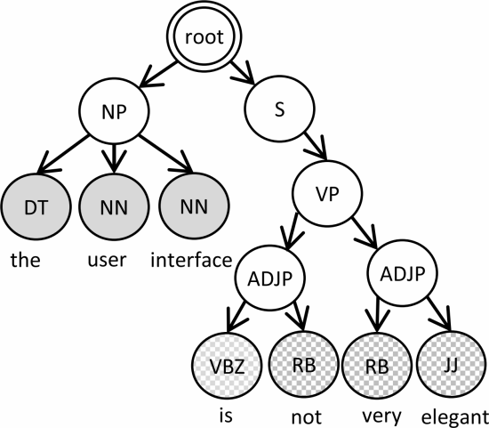

广度优先遍历树节点，选择前五个的pos连接起来作为文本特征，以上特征为ROOT-NP-S-DT-NN-NN

语义依赖图（SDG，Semantic Dependence Graph），表示句子中单词之间的语义依赖关系，有向图，节点表示单词和相应的pos tag。边表示词之间的语义关系（如名词主语和形容词修饰语）。每个sdg都有一个根节点，没有入边

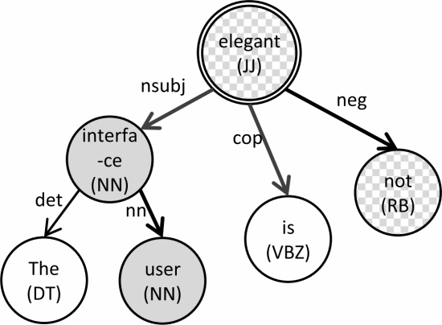

上面是The user interface is not elegant的sdg由Stanford Parser生成

为了将SDG转换为平面文本特征，以广度优先遍历，将边和pos标记连接（忽略没有链接到根节点的叶子），例如上面vbz - nsubject - nn -cop- vbz - negative - rb

### C. aspect-opinion extraction 观点提取

总结用户对应aspect的opinion

识别表达aspect的单词和表达对这些aspect的意见的单词

SUR-Miner从每个分类在aspect评价类别中的评论句子中提取aspect-opinion对，如the Prediction is accurate, but the auto-correct is annoying，结果是:(Prediction, accuracy)和(auto-correct, annoying)。

一般，通过频繁项目挖掘或主题模型提取aspect，该模型将评论视为词包，对于表现出多种目的和情感的软件评论，这样的假设存在问题

针对不同目的评论具有单调的模式，因此可以直接从句型确定aspect-opinion对。基于模式的分析，利用语法、语义，直接从评论中分析aspect和相应opinion。应用NLP解析器为句子注释sdg，然后构建一个模式解析器，从sdg中提取aspect-opinion对

#### 1）基于模式的解析

实现为一系列级联有限状态机，接受sdg并根据预定义的语义模板识别aspect-opinion对

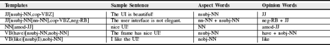

如图，开头的两个字母表示pos tag，圆括号中单词表示词根，根节点的子节点以边-pos对的形式在方括号中

将每个sdg与一个模板关联，选择10个以上句子关联的模板，确定了26个来设计有限状态机

### D. 面向情感分析

除了意见，总结感受

deep moving分析每个评论句的情感

如The interface is beautiful.   I don't like the theme.

这两个句子的情感评分是4和0，若总体评分是5，则将第二句调为1（0+1），若总体评分为1，将第一句情感调为3（4-1）

### E. aspect聚类和总结（aspect-opinion-sentiment对聚类

aspect-opinion对分组，总结每个方面组的情绪和典型opinion

对aspect分组，首先挖掘所有aspect词的频繁项，用常见频繁项聚类aspect-opinion对

如果一对有两个或更多的频繁项目，可以聚类到两个以上不同的组中，我们将其聚类到项目或单词频率最高的组中

例如，一对(背景颜色，漂亮)可以与(背景，漂亮)和(颜色，恶心)组合在一起。但是，如果我们已经知道aspect背景的频率比颜色的频率高，我们就会将第一对与第二对分组，而不是将第三对分组

如果两个aspect-opinion对中没有频繁项，则在其aspect有常用词时将其分组。

### F. 可视化

aspect heat map 和 aspect trend map

前者展示用户关心的受欢迎的aspect，帮助开发人员和管理人员掌握用户喜欢或不喜欢app的那些部分

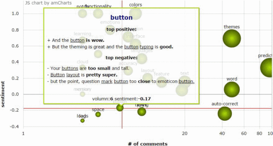

每个圆圈表示一个aspect，越大越受欢迎，size = log(#comments) + sentiment

横轴表示评论的数量，纵轴表示调整后的评分，所以右上方最受欢迎和喜欢

点击圆圈查看特定评论，每条评论aspect用下划线，opinion用粗体

后者显示了情绪随时间变化趋势

帮助开发者评估改变是否影响用户的满意度，使更好地估计预测用户偏好，以便未来改进

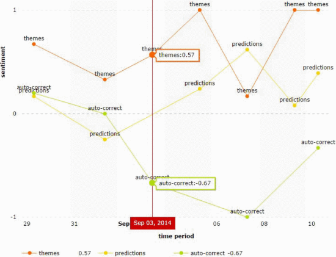

横轴日期，纵轴用户情绪

## Empirical Evaluation（实证评估

三个维度：有效性、可比性、有用性

RQ1(有效性):SUR-Miner如何有效地对评论进行分类，提取方面和观点，并分析应用评论的情绪?

RQ2(比较):SUR-Miner与最先进的应用程序评论总结技术相比如何?

RQ3(有用性):SUR-Miner的总结对开发人员有用吗?

### A. data collections

多种app的评论

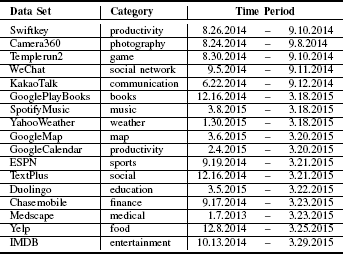

评论的时间戳、评分、标题、内容

### B. effectiveness

#### 1）评论分类

共识标签被选择，分歧重新标签，2000个

用F1-score来衡量分类的准确性

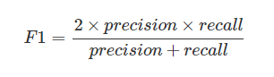

其中精度是正确分类为类的实例数(TP)与分类为类的实例数(TP+PP)之比

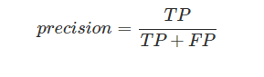

召回率是正确分类为类的实例数(TP)与类中的实例数(TP+ FN)之比

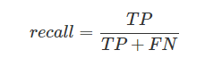

执行了100次5倍交叉验证

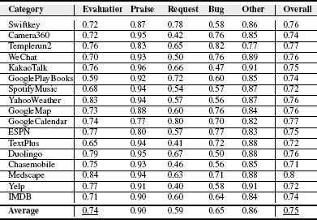

#### 2）aspect-opinion抽取

用FI-score衡量aspect提取和opinion提取的准确性

TP（true positives）是正确提取的aspect或opinion的数量

FP（false positives）是错误提取的数量

FN（false negtives）是未提取的aspect或opinion的数量

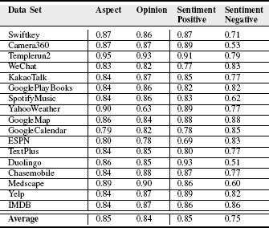

结果如前两列，可靠

#### 3）sentiment analysis

与黄金情感标签进行比较，简化估计，分为两个极性，正面（3-4）、负面（0-1）

FI-score衡量每个情感类别的准确性

TP（true positives）是正确分类的情绪数量

FP（false positives）是错误分类的情绪数量

FN（false negtives）是不属于该类别的情绪数量

结果如后两列

### C. Comparison

很多的比较。。。比较。。。比较。。。

### D. Usefulness

主观，17app

在收到的所有32个答案中，其中28个(88%)同意我们的工具可以帮助开发人员。持保守意见的只有2人(6.3%)，持反对意见的只有2人(6.3%)

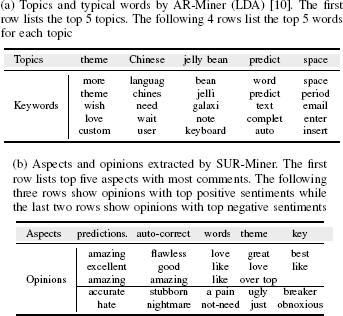

总而言之，开发人员觉得有用

## Treats to Validity（对有效性的威胁

实验对象都是免费的安卓app，无法代表收费app和其他市场

黄金标准tag只用了两个人，接下来邀请更多的开发人员tag

## Conclusion

为理想答案"What Parts of Your Apps are Loved by Users?"提供理想的答案

SUR-Miner结果可靠

开发者的反馈令人鼓舞
