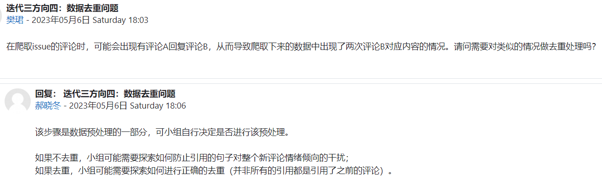
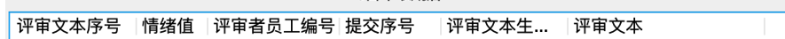

## 第十三次会议纪要

时间：2023年5月12日20:00		地点：线上腾讯会议

本次会议目的：探讨迭代三详细步骤

### 1 官方要求

主要目标：优化用户体验，形成成熟工具，试分析原生数据；

Step-1：获取数据。抓取GitHub上一个大型Apache项目的某一版本内的 issue + issue评论，及相关信息。`爬取的数据的格式`

Step-2：利用SentiStrength分析数据。

- 可按照不同的维度分析数据：按时间分析、按人分析；
- 分析需合理，并用合适的图表/工具美观的展示。

Step-3：进一步分析情绪指向：

- 标注情绪方面（200条+），如“This may be a **bug** with the **widget** itself.”。`bug是情绪，widget是对象。`
- 汇聚标注结果，聚焦的分析版本问题；

P.S.：可通过方向三的论文了解什么是情绪的方面（aspect）。

### 2 各人的思考

ZXK：主要是优化工具

1. 参考要求，不一定全部照搬；
2. 可能爬多个数据；可以思考爬淘宝京东评论等。
3. 项目开发者的情绪评价。
4. SentiStrength是否好用？怎么优化？

HCX：

1. 通过方向3的论文来指导，但发现不太相关。
2. 注重如何利用SentiStrength。
3. 按项目，按人都不太方便分析。
4. UI展示。
5. 分成多个类，分类标准？按方面？
6. 为什么要标注情绪方面？

XC：问题：Aspect如何分类？根据出现频率；难以应用到软件之外的？

1. 如何优化？
2. 注重的是Aspect-Opinion对。
3. Stanford CoreNLP。

ZMY：大道至简。

1. 爬虫工具。
2. 不是普遍适用的工具。淘宝方向要慎之又慎。
3. 第三个步骤有点迷糊。

### 3 需要注意的地方

### 4 分工

我先描述一下整体要达到的效果，然后进行Step1+Step2的分工：

总的来说，前后端这块呢就是我，ZJH，ZXK，XC四个人来写。要完成的功能如下：

1. 前端增加1个网页，添加一个按钮负责上传本地的数据（爬虫数据）。后期可以自动化，但现在需要先实现手动上传+处理功能。

  同时，该网页也需要能展示数据、进行可视化。可视化格式见PPT上方向四的介绍。
  建议先自己生造一点数据进行上传展示。
  上传功能的话，之前HCX和ZMY的前端里有文件上传、文件夹上传，如果遇到问题可以学习一下原来的解决方式，也可以和他们商量。

2. 爬虫组的目标暂时定为获取到数据即可。先不考虑自动化的事。
3. 后端需要能接收前端上传的数据，并且将前端上传的爬虫数据处理后展示在页面上。最好能提供一个下载功能，下载处理好的数据，作为加分项。

  可能需要用到Stanford CoreNLP工具进行分句。

初步是决定恺恺主写前端，我作为机动力量目前先给恺恺打下手，然后ZJH和XC负责后端，月月主要负责分词、朱甲豪主要负责框架和数据处理，当然你们可以商量决定。后端要处理的就是一些爬虫那边获取的数据，需要和爬虫对接一下、约定功能。爬虫写好、获取到完整的数据以后，再加入前后端即可。

大家看一下，我们的目标是下周末左右完成Step1+Step2，可能有一点累。然后呢这个分工也是我在地铁上想的，可能有些没考虑的地方，如果有什么想法就随意在群里提就好。