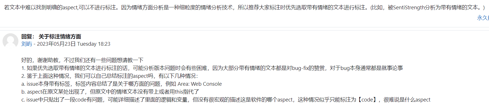

## 第十四次会议纪要

时间：2023年5月27日22:30		地点：线上腾讯会议

本次会议目的：总结第一二步以及讨论遇到的问题，探讨第三步详细步骤

### 1 官方要求

说明：有以下几个非代码任务需要额外完成：

1. 情绪标注，需要放到一个文件中提交。为了方便后续更改，我们先放到在线表格里。
2. 分析：我们在网页上展示一部分，在md文件中展示更详细的分析结果和图。

### 2 分工

那这两天zmy就来前端这边，和恺恺一起搞一下那个表格问题吧，我们明天周日三个人再商量下需要做些啥

然后后端先歇一两天，先做一下其他事，后面分析报告啥的可能会交给zjh和xc写

最后，爬虫把剩下数据全爬上去以后，通知zjh一下，然后zjh那边把情绪都分析好放在数据库里，我把数据库内容导出放在网页上，大家就可以分析aspect了，这个活尽快，希望明天晚上之前弄好可以吗？

对了，爬虫hcx考虑一下去重问题，如果实在没法解决可以直接导出为excel手动去重好了再导入进去，助教说过可以手动去重的。

就这三个安排，这是这两天的，周一晚上我们再详细说说step3怎么搞。