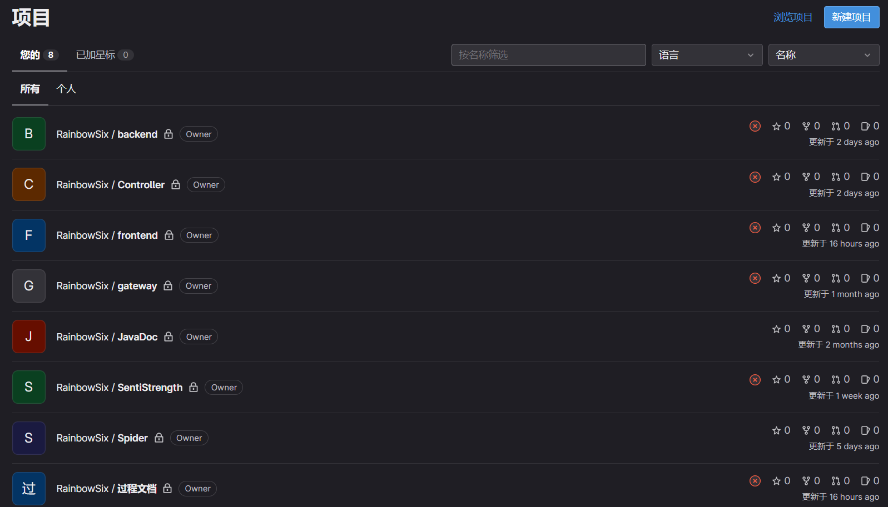

**迭代3 项目说明文档**

本文内容按照助教提供的任务清单顺序，加以我们自己完成的其他内容构成。

[TOC]

## 0  团队与项目说明

我们是RainbowSix，小组组号为第八组（Gitlab中URL为http://172.29.4.49/08/***）。

| 学号      | 姓名   |
| --------- | ------ |
| 201250118 | 张笑恺 |
| 201250134 | 朱甲豪 |
| 201250139 | 尹麒深 |
| 201250146 | 胡才轩 |
| 201250149 | 詹美瑛 |
| 201250213 | 徐晨   |

本文档是整体的**项目说明文档**，以及会议总结文档。


## 1 项目整体结构说明

本部分从总体上介绍我们的项目的结构。

### 1-1 项目的构成

我们的项目共包含以下9个仓库。这9个仓库是依托于http://172.29.4.49/的。我们所有的项目均在此处。



### 1-2 CICD与镜像仓库

在迭代2中，我们对frontend、controller、Gateway、SentiStrength四个项目建立了CICD。在迭代3中，我们主要对Controller和Frontend两个项目进行修改，继续沿用之前的CICD内容。下面给出地址：

- https://git.nju.edu.cn/kaikaiweiS/sentistrengthmirror（最近修改为5月初）
- https://git.nju.edu.cn/kaikaiweiS/gatewaymirror（最近修改为5月初）
- https://git.nju.edu.cn/kaikaiweiS/frontendmirror
- https://git.nju.edu.cn/kaikaiweiS/controllermirror/


### 1-3 新增的爬虫项目

本次新增了爬虫（Spider）项目，该项目负责将数据爬取并存入我们服务器中的数据库内。

- 只需要更改项目名、版本名，我们就可以利用该爬虫爬取其他项目和版本的数据，考虑到了通用性和普适性。
- 将数据存入数据库，保证了数据持久化，方便后续取用。
- 爬虫中添加了去重功能，保证了助教提出的问题不再会出现。


## 2 数据

数据来源与总览情况如下。

### 2-1 数据源

我们选取了Apache项目“Superset”中的最新一个版本。

编写爬虫时，我们决定将原始数据爬取后直接放在了数据库中。数据库是建立在云服务器上的MySQL数据库，如下图所示：


共1800条左右的评论（经过去重）。时间跨度为2022-05月到2023年5月底。

### 2-2 数据地址

我们将所有数据导出为电子表格，放在我们的`项目文档-迭代3-原数据与标注的Aspect`中。


## 3 亮点

### 3-1 SonarLint、SonarCube的使用

在迭代2中我们利用SonarLint等工具来辅助Checkstyle进行代码风格检查。在迭代3中，我们认识到了SonarLint系列工具的强大，在该工具的辅助下，写下的代码大多符合我们约定的规范，保证了代码的下限。

### 3-2 微服务架构风格的利用

我们基于SpringCloud Alibaba的微服务架构在后期为我们添加服务提供了大量的方便。

- 可以轻易用Nacos检查服务是否健康，并查看状态。如果有必要，进行集群化、分布式的改造中，Nacos也可以提供极大便利。
- 利用Gateway，不仅保护了端口没有轻易暴露，而且还实现了使用服务名访问服务，大大简化了服务器中Controller为主控的架构与其他服务进行交互的代码写作。 
- 原定使用Sentinel熔断控制与弹性机制等，但由于方向四和此关系不大，便没有推送。

### 3-3 PostCat接口工具的利用与接口文档

我们继续利用PostCat来进行团队协作与接口测试，并在PostCat中写下了一些接口数据。它们有利于我们的团队协作与交流。


我们使用了接口文档来记录各接口。见`接口文档`文件夹内。


## 4 项目阶段说明

此处借助重要会议划分，不重要的过程会议不计入在内。

我们吸取了上阶段会议过多，导致每阶段进展不大的教训。另外，非阶段性重要会议，允许线上参加。在迭代3阶段，一共有三次重要会议。

### 4-1 第12次会议：迭代二总结与方向探究

第12次会议时间：2023年4月27日08：30。

商讨内容：

- 迭代2结项，完成部分为分布式项目而遗留的桩问题。
- 选定方向。一致同意排除方向2后，每两人负责一个方向并撰写方向展望。

我们就三个方向各总结了需要的流程、需学习的内容等，总结放在了以下几个文件夹中。


### 4-2 第13次会议：方向确定与第一二步的规划

时间：2023年5月12日20:00。本次会议为线上会议，主要目的是：确定方向，并进行要执行步骤的详细规划。

这次会议文档中，清晰地记录了我们的分工安排、个人的思考，对于后续确定详细目标有很大帮助。

另外，我们还在此处约定了接口传输的数据，方便后续工作。

### 4-3 第14次会议：最后一步与收尾工作

时间：2023年5月27日22:30		地点：费彝民楼

讨论重点内容、本次会议目的：总结第一二步以及讨论遇到的问题，探讨第三步详细步骤。

我们在此步骤确定了第三步的图表格式，以及考虑到了各种文档的写作等详细功能。


## 5 代码设计考量

此部分内容包含了：

1. **对数据的处理，与Aspect的说明**。包括取数据的步骤等。
2. 整体的设计与架构。
3. 前端，后端，各个子项目的说明。

应助教要求，此处内容迁移至“`设计考虑与Step3展示.md`”中。


## 6 取数据与Aspect分析（重点）

### 6-1 取数据：爬虫

爬虫（Spider）项目负责将数据爬取并存入我们服务器中的数据库内。

- 只需要更改项目名、版本名，我们就可以利用该爬虫爬取其他项目和版本的数据，考虑到了通用性和普适性。
- 将数据存入数据库，保证了数据持久化，方便后续取用。
- 爬虫中添加了去重功能，保证了助教提出的问题不再会出现。

去重功能特别重要，如果不去重，则会出现多次重复引用的情况，而且会增加Reviewer的出现次数。我们通过爬虫中的设计实现了：

- 直接将爬取的数据装入数据库，省去了将数据手动装入数据库的麻烦；
- 去除了非英语评论（便于SentiStrength分析）
- 去除了重复。

总之，在这一部分我们初步完成了数据的预处理。

### 6-2 存数据：数据库

我们在云服务器上建立了MySQL数据库，如下图所示。


我们将爬取的数据分为9栏，分别是问题编号、问题中的文本编号、提交者、评审者、时间、文本，以及需要通过SentiStrength来进行计算的情绪值。

初期爬取时，我们将所有情绪值都设置为9，方便后续SentiStrength将每个Text的情绪值计算出。

### 6-3 计算数据：利用SentiStrength

这一步的主要内容是，利用SentiStrength，将数据库中Senti值为9的文本重新计算Senti值，并存入数据库中。

这一步的主要内容是，利用SentiStrength，将数据库中Senti值为9的文本重新计算Senti值，并存入数据库中。

1. 首先通过JDBCTemplate获取数据库中senti值未计算的数据（即senti值设为9的数据），将其保存为列表。Comment为自定义的数据库中存放的评论类。

```java
String sql = "select * from superset where senti=9";//SQL查询senti为9的数据
List<Comment> comments = jdbcTemplate.query(sql, new BeanPropertyRowMapper<>(Comment.class));
```

2. 遍历上述列表，将Comment中的Text的空格替换为加号。

   ```java
   String text = comment.getText().replace(" ","+"); //如果不replace，遇到带“”的字符串会报错
   ```

3. 循环调用sentistrength，计算出上述列表每个Comment的Text的senti值，之后通过JDBCTemplate，使用sql语句将该senti值更新在数据库中。

   ```java
   String[] cmd = {"java", "-jar", "senti/R6_senti-0.2_phase1_Done.jar", "sentidata", "senti/dict/", "text", text, "scale"};
               // 调用外部jar包
   ProcessBuilder builder = new ProcessBuilder(cmd);
   builder.directory(new File("."));
   builder.redirectErrorStream(true);
   Process process = builder.start();
    InputStream is = process.getInputStream();
   BufferedReader reader = new BufferedReader(new InputStreamReader(is));
   
   // 读取外部jar包输出并返回
   String line = reader.readLine();
   int senti = Integer.parseInt(line.split(" ")[2]);
   
   String updatesql = "update superset set senti=? where TextNo=?";
   Object[] args = {senti, comment.getTextNo()};
   jdbcTemplate.update(updatesql,args);
   ```


### 6-4 人工处理：Aspect标注

我们从接近1800条数据中选取出约700条情绪值不为0的文本进行人工分析。此处利用的是腾讯在线表格进行数据标注。

标注标准：需要有明确的Aspect，最好是论文中所描述的Aspect-Opinion对。如果没有符合要求的则删除，有则利用中括号标注。

此处标注数据见`原数据与标注的Aspect\superset_433条aspect.xlsx`中。


最后，标注好的数据一共有433条。

### 6-5 汇聚数据

下面我们要做的是将数据汇聚。比如，两条Text分别在关注ClickHouseDB和H2DB，但这实际上都是数据库方面，所以在汇聚时我们将其统一汇聚为数据库方面的数据。

这一部分的详细说明，见`情绪方面说明文档\Aspect分析报告.md`。

汇聚的结果是，我们得到了大量统计信息，并将其记录于上述分析报告中，以便后续使用。

### 6-6 分析总结

我们经分析认为，该版本主要问题集中于数据库连接、前端UI两个部分，另外还有安装与驱动配置的问题是关注的热点。总体来说，积极评论与消极评论大体持平，但在具体的某个汇聚类上，我们认为有较大的出入。比如，前端UI相关反馈几乎全部是负面情绪，但驱动支持等评论更多是正面评论。虽然如此，总体评论中情绪值为0的评论占据总数据的百分之70以上，可以认为大多数文本都是中性的。

由于Superset是一个开源的大数据探索分析、可视化报表平台，开发重心也在数据探索与分析上、前端UI的优化上，进行数据分析前，我们认为大多数Review应当是以前端、数据库连接两部分，这与我们的分析情况符合。

此处内容较多，迁移至`情绪方面说明文档`中。在该文档中，我们对得到的数据进行了详尽分析。


## 7 总结与展望

我们在完成助教给出的PPT上方向四代码要求的基础上，添加了基于我们自己的理解的内容，使用了基于Springcloud Alibaba的微服务架构，便于后续添加功能与服务。

- 我们的架构设计是为分布式而准备的，如果需要后期添加大量负载，可以很容易的通过Sentinel和Nacos、Gateway实现。
- 爬虫针对于复用而设计，如果想要爬取其他项目和版本内容，只需要更改项目地址和项目名即可。
- 我们的数据库设计是为多版本、多项目设计的。如果不止需要展示一个版本，那么可以轻松地展示。

总之，我们的项目充分考虑了可扩展性，为后续可能的工作提供便利。
