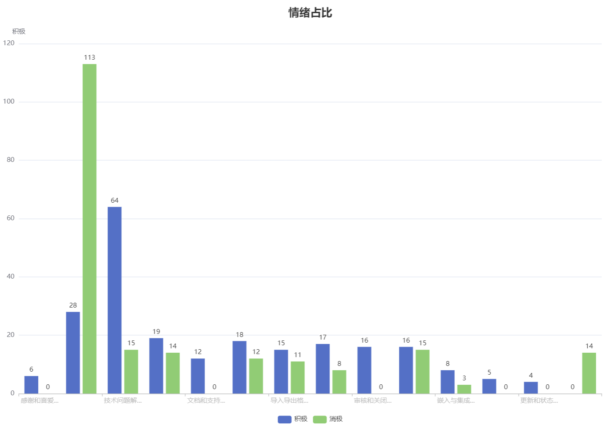

***Aspect分析报告***

### 一、简介

本环节对爬取的评论进行情绪方面标注，并汇聚标注结果，进行数据统计，依据统计好的数据分析该项目这一版本下用户所关注的情绪方面。在保证样本尽可能具有代表性的前提下，经过分层抽样抽取出可以标注的共433条评论，其中积极评论228条，消极评论205条。接着汇聚为“感谢和喜爱”、“请求帮助、问题反馈与提出贡献”等14类。

### 二、数据统计

#### 类名1：感谢和喜爱

概要：这部分包括对插件、功能的赞扬以及感激的评论，同时涵盖对某个功能或特性的赞赏和期待的评论

积极评论：6

消极评论：0

#### 类名2：请求帮助、问题反馈与提出贡献

概要：包括寻求协助、寻找解决方案、询问关于特定功能或问题以及提出贡献的评论。用户报告了一些bug、错误的行为或不正常的功能表现，并期望得到解决或解释，涉及时间范围过滤、时间粒度、CORS错误、权限问题、错误的数据显示、数据排序问题、导入导出问题、Superset警报功能与错误、警报无法正常工作、出现未注册任务错误、身份验证错误、使用Apache Drill处理Parquet文件时遇到问题，列的类型不正确等。

积极评论：28

消极评论：113

#### 类名3：技术问题解决

概要：包括问题解决、错误修复、更新和测试成功的评论（如关于函数用法、API数据连接、数据格式转换等方面的问题）

积极评论：64

消极评论：15

#### 类名4：需求和建议

概要：包括对新功能的请求和建议的评论（如用户对Superset功能的建议和需求），提出一些功能的改进或增加（如对特定数据库的支持、界面调整、报表功能、改善性能、修改图表链接行为，添加HTTP/HTTPS API数据源等）

积极评论：19

消极评论：14

#### 类名5：文档和支持

概要：与查找文档、寻求支持和对文档更新相关的评论，以及对驱动程序变更和支持的评论

积极评论：12

消极评论：0

#### 类名6：安装和配置

概要：包括安装问题、配置指南和环境设置的评论，同时有用户报告了一些与Docker安装、依赖包冲突、数据库初始化、环境变量配置等方面的问题

积极评论：18

消极评论：12

#### 类名7：导入导出格式

概要：与导出数据、格式化和生成报表相关的评论，以及数据集导入出现重复键等问题相关的评论

积极评论：15

消极评论：11

#### 类名8：数据库和连接、身份验证、数据源访问问题

概要：与数据库（如Denodo、ClickHouse、InfluxDB）支持和连接、数据库类型、身份验证和驱动程序相关的评论，用户询问了关于特定数据库连接、API连接、数据源配置等方面的问题

积极评论：17

消极评论：8

#### 类名9：审核和关闭

概要：包括审查和关闭问题、合并请求的评论

积极评论：16

消极评论：0

#### 类名10：可视化和图表、报表可视化问题

概要：与图表、可视化和图表配置相关的评论，以及图表排序功能评论。用户询问了一些与柱状图、折线图、水平轴等可视化元素相关的问题，以及对间距、显示格式等方面的调整，同时也有用户提出一些与图表、数据排序、轴数据点等可视化元素有关的问题，以及对值标签位置、样式调整等方面的需求，CSV报告损坏、仪表板缩略图失败等

积极评论：16

消极评论：15

#### 类名11：嵌入与集成

概要：包括关于嵌入式功能和集成的评论，Doceker构建失败，Slack集成问题

积极评论：8

消极评论：3

#### 类名12：查询和数据处理

概要：包括关于查询、数据处理和属性的评论

积极评论：5

消极评论：0

#### 类名13：更新和状态

概要：包括更新、状态和问题跟踪的评论

积极评论：4

消极评论：0

#### 类名14：前端代码问题

概要：该类别涵盖了与前端代码相关的问题，包括再前端代码中添加内容以解决问题。

正面评论：0

负面评论：14

### 三、可视化

### 四、分析

从种类上来看，issue评论种类比较纷杂，从前端代码到后端查询和数据处理，再到数据库的连接，底层有安装配置、更新状态问题，宏观上也有嵌入与集成相关的问题。

从数量上来看，在该项目这一版本下，用户最关心的还是提出项目相关问题（共141条，占32.6%）和问题解决分享（共79条，占18.2%），剩余相关汇聚项分布较为均匀。

从情绪值上来看，“感谢与喜爱”、“问题解决”、“文档与支持”有很强的积极情绪，“问题反馈”、“导入导出格式”、“前端代码问题”则负面情绪居多，剩余的例如“需求与建议”、“数据库连接与访问”、“可视化图表”等则积极评论和消极评论数量相近，因为不能百分百保证样本的完美性，为了调查实验的严谨性，我们视这些标签的评论为接近中性（事实上，根据统计计算各标签所有senti值得平均值，这些剩余标签得均值都在0到1之间，且极差不超过0.4）。

### 五、总结

总之，我们经分析认为，该版本主要问题集中于数据库连接、前端UI两个部分，另外还有安装与驱动配置的问题是关注的热点。总体来说，积极评论与消极评论大体持平，但在具体的某个汇聚类上，我们认为有较大的出入。比如，前端UI相关反馈几乎全部是负面情绪，但驱动支持等评论更多是正面评论。虽然如此，总体评论中情绪值为0的评论占据总数据的百分之70以上，可以认为大多数文本都是中性的。

进行数据分析前，由于Superset是一个开源的大数据探索分析、可视化报表平台，开发重心也在数据探索与分析上、前端UI的优化上，所以我们认为大多数Review应当是以前端、数据库连接两部分，这与我们的分析情况符合。

