此处介绍我们的微服务架构的“后端”，爬虫，数据库的设计，以及前端UI设计。

[TOC]

### 1 整体设计与架构

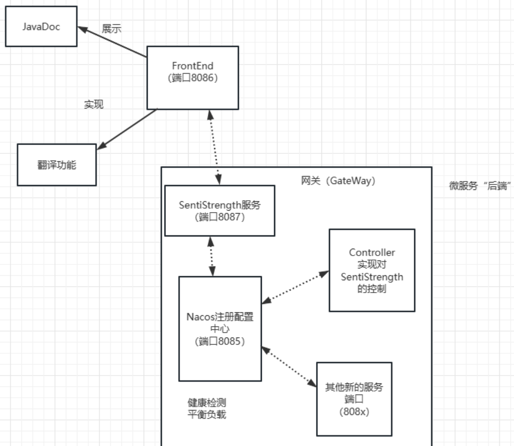

从整体上，我们的项目分为三个部分：数据库部分；前端UI部分；微服务后端部分。我们以Gateway和Nacos为主要工件，以Controller为核心调度各服务。

- 后端架构：本次添加功能主要是在Controller中，当然Gateway和SentiStrength也稍有修改。
- 接口与合作：我们利用Postcat工具代替了Postman，利用此工具进行接口的约定与调试，为合作与各服务的沟通提供了便利，更便于分配任务。
- 数据库：使用MySQL数据库和JDBC，便于读与取以及修改。我们的数据库架构同样有利于多个版本的数据（立足于此设计）。


### 2 取数据与Aspect分析（重点）

#### 2-1 取数据：爬虫

爬虫（Spider）项目负责将数据爬取并存入我们服务器中的数据库内。

- 只需要更改项目名、版本名，我们就可以利用该爬虫爬取其他项目和版本的数据，考虑到了通用性和普适性。
- 将数据存入数据库，保证了数据持久化，方便后续取用。
- 爬虫中添加了去重功能，保证了助教提出的问题不再会出现。

去重功能特别重要，如果不去重，则会出现多次重复引用的情况，而且会增加Reviewer的出现次数。我们通过爬虫中的设计实现了：

- 直接将爬取的数据装入数据库，省去了将数据手动装入数据库的麻烦；
- 去除了非英语评论（便于SentiStrength分析）
- 去除了重复。

总之，在这一部分我们初步完成了数据的预处理。

#### 2-2 存数据：数据库

我们在云服务器上建立了MySQL数据库，如下图所示。

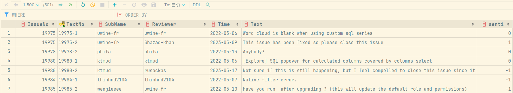

我们将爬取的数据分为9栏，分别是问题编号、问题中的文本编号、提交者、评审者、时间、文本，以及需要通过SentiStrength来进行计算的情绪值。

初期爬取时，我们将所有情绪值都设置为9，方便后续SentiStrength将每个Text的情绪值计算出。

#### 2-3 计算数据：利用SentiStrength

这一步的主要内容是，利用SentiStrength，将数据库中Senti值为9的文本重新计算Senti值，并存入数据库中。

1. 首先通过JDBCTemplate获取数据库中senti值未计算的数据（即senti值设为9的数据），将其保存为列表。Comment为自定义的数据库中存放的评论类。

```java
String sql = "select * from superset where senti=9";//SQL查询senti为9的数据
List<Comment> comments = jdbcTemplate.query(sql, new BeanPropertyRowMapper<>(Comment.class));
```

2. 遍历上述列表，将Comment中的Text的空格替换为加号。

   ```java
   String text = comment.getText().replace(" ","+"); //如果不replace，遇到带“”的字符串会报错
   ```

3. 循环调用sentistrength，计算出上述列表每个Comment的Text的senti值，之后通过JDBCTemplate，使用sql语句将该senti值更新在数据库中。

   ```java
   String[] cmd = {"java", "-jar", "senti/R6_senti-0.2_phase1_Done.jar", "sentidata", "senti/dict/", "text", text, "scale"};
               // 调用外部jar包
   ProcessBuilder builder = new ProcessBuilder(cmd);
   builder.directory(new File("."));
   builder.redirectErrorStream(true);
   Process process = builder.start();
    InputStream is = process.getInputStream();
   BufferedReader reader = new BufferedReader(new InputStreamReader(is));
   
   // 读取外部jar包输出并返回
   String line = reader.readLine();
   int senti = Integer.parseInt(line.split(" ")[2]);
   
   String updatesql = "update superset set senti=? where TextNo=?";
   Object[] args = {senti, comment.getTextNo()};
   jdbcTemplate.update(updatesql,args);
   ```


#### 2-4 人工处理：Aspect标注

我们从接近1800条数据中选取出约700条情绪值不为0的文本进行人工分析。此处利用的是腾讯在线表格进行数据标注。

标注标准：需要有明确的Aspect，最好是论文中所描述的Aspect-Opinion对。如果没有符合要求的则删除，有则利用中括号标注。

此处标注数据见`原数据与标注的Aspect\superset_433条aspect.xlsx`中。

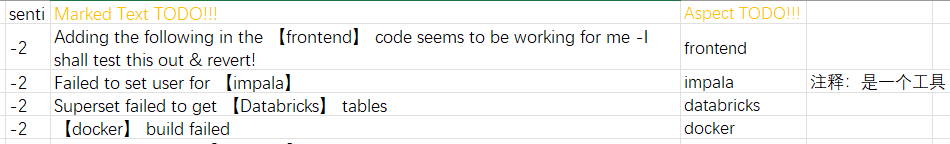

最后，标注好的数据一共有433条。

#### 2-5 汇聚数据

下面我们要做的是将数据汇聚。比如，两条Text分别在关注ClickHouseDB和H2DB，但这实际上都是数据库方面，所以在汇聚时我们将其统一汇聚为数据库方面的数据。

这一部分的详细说明，见`情绪方面说明文档\Aspect分析报告.md`。

汇聚的结果是，我们得到了大量统计信息，并将其记录于上述分析报告中，以便后续使用。


### 3 前端UI与功能

#### 3-1 首页

前端URL：http://124.221.102.208:8086。此处我们新增1个按钮：左侧的Senti Tool是迭代2的工具，右侧的是本次的分析工具。本次图标总体利用Echarts制作。

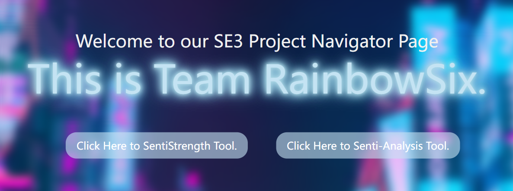

我们提供了4个Tab，点击即可切换。


#### 3-2 总数据

**由于数据量较多，首次进入可能会卡顿！**

点击右侧按钮进入我们的主页面，可以看到总数据。这些数据是数据库中的Superset表中的数据，为的是方便查看。另外还绘制了消极、积极情绪占比。

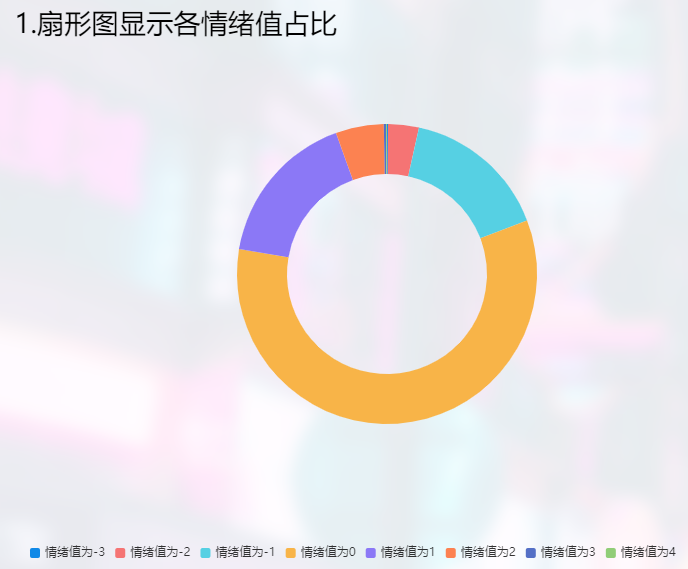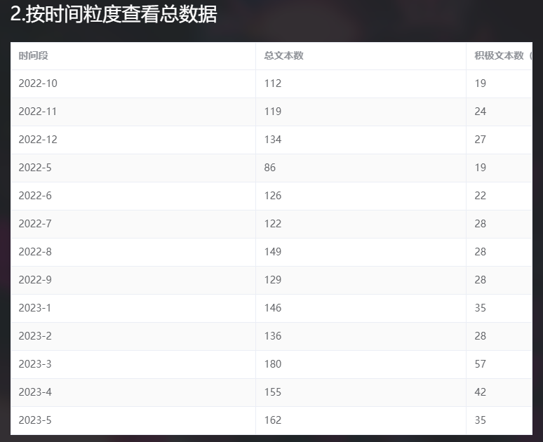

另外，在此我们提供了时间升序、时间降序、情绪值升序、情绪值降序4种排序规则。点击后，会触发Controller的Handler函数，利用JDBC调取数据。

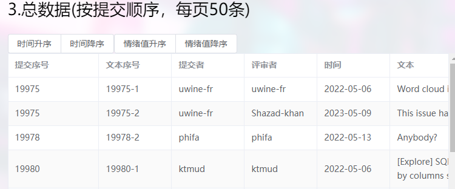

#### 3-3 按评审者查看

首先我们输入一个评审者姓名并点击查询。

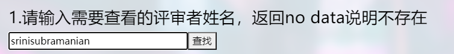

如果评审者存在，则会显示其所有Review内容，同样提供4种排序方法。另外还有按时间粒度查看的图与表。

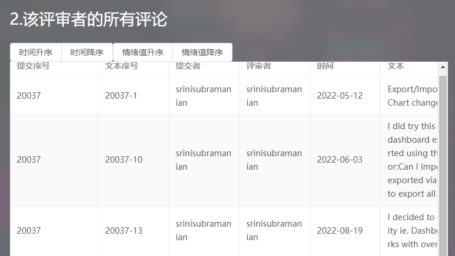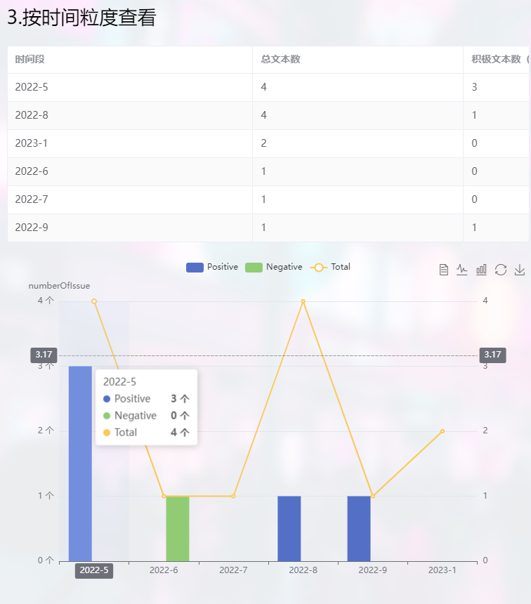

#### 3-4 按日期查看

此处我们默认显示2022年5月至今的所有内容的分布图。如果输入一个时间段，那么就会显示这个时间段内所有评论内容。同样提供四种排序方法。

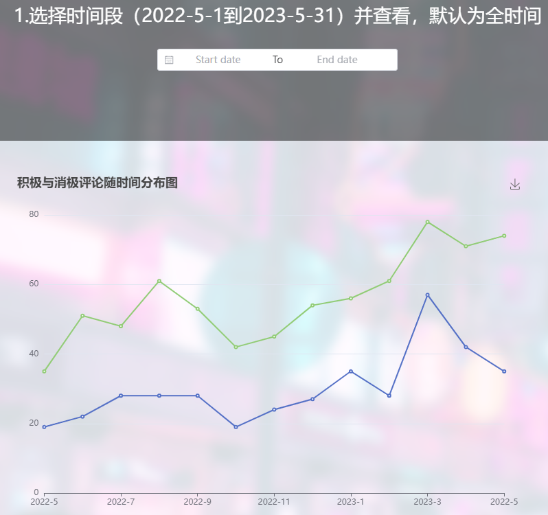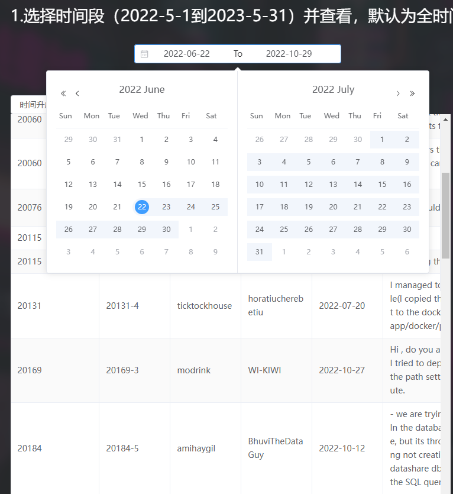

#### 3-5 Aspect数据

此处展示一张Aspect分布情况表，并对该版本分析情况作出简单说明。

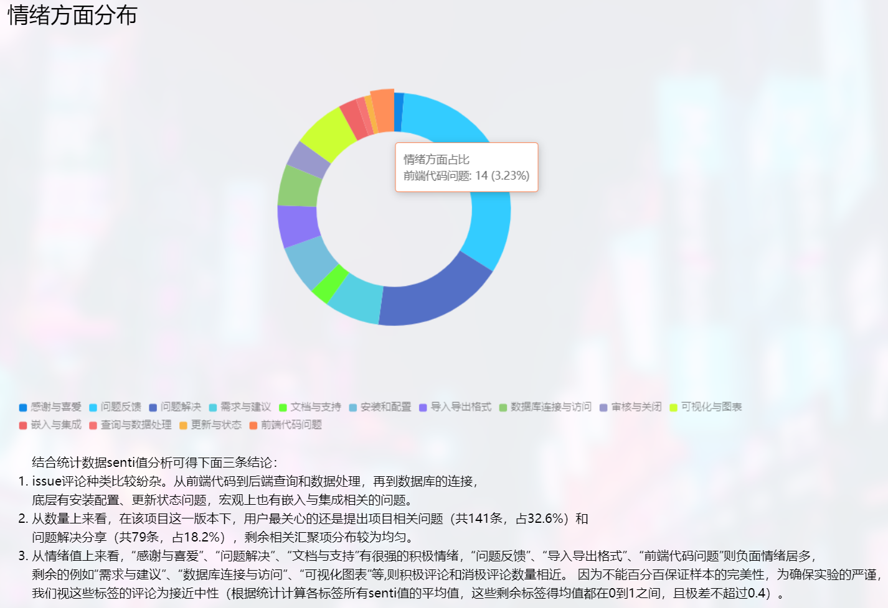

